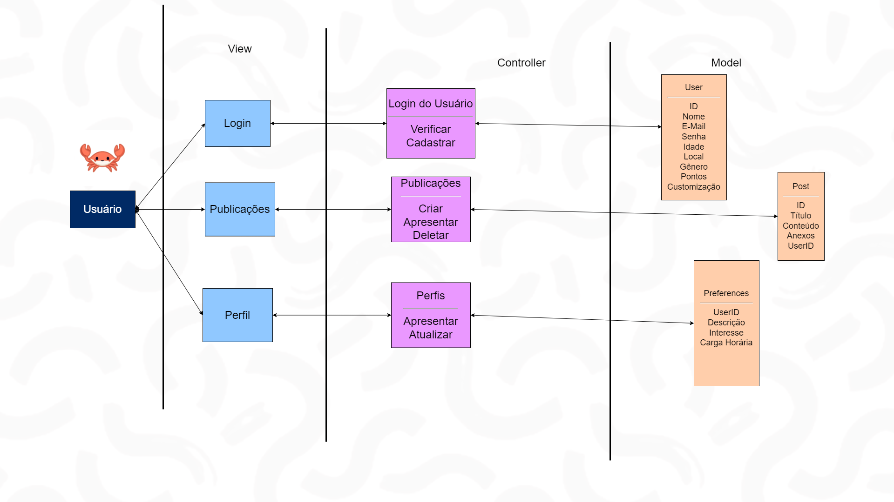
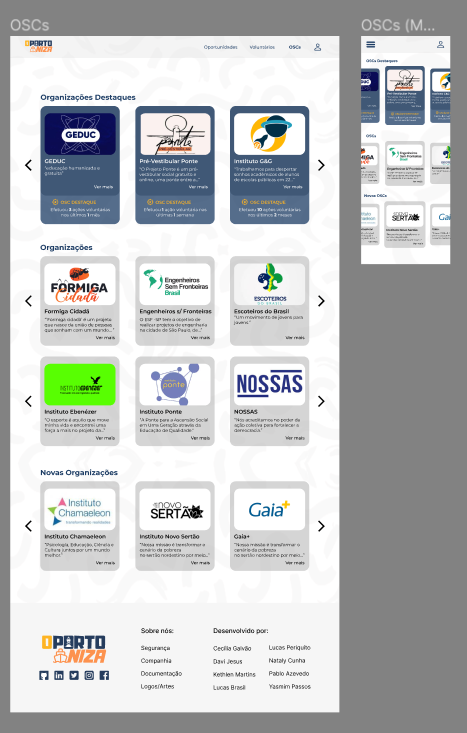

# WAD - Web Application Document - Módulo 2 - Inteli

## Tripulação Voluntária

- **Cecília Beatriz Melo Galvão**
- **Davi Nascimento de Jesus**
- **Kethlen Martins da Silva**
- **Lucas Paiva Brasil** 
- **Lucas Periquito Costa**
- **Nataly de Souza Cunha**
- **Pablo de Azevedo**
- **Yasmim Marly Passos**

## Sumário

[1. Introdução](#c1)

[2. Visão Geral da Aplicação Web](#c2)

[3. Projeto Técnico da Aplicação Web](#c3)

[4. Desenvolvimento da Aplicação Web](#c4)

[5. Testes da Aplicação Web](#c5)

[6. Conclusões e trabalhos futuros](#c6)

[7. Referências](#c7)

[Anexos](#c8)

<br>


# <a name="c1"></a>1. Introdução (sprints 1 a 5)

&nbsp;&nbsp;&nbsp;&nbsp;A Parceiros Voluntários é uma instituição sem fim lucrativos voltada à criação de uma rede entre as Organizações de Sociedade Civil (OSCs), nova denominação atribuída às Organizações Não-Governamentais (ONGs), integrando as instituições que desejam trazer a cultura de voluntariado para seu ambiente e as pessoas que desejam assumir uma posição de voluntariado.

&nbsp;&nbsp;&nbsp;&nbsp;Com 27 anos de história, a Parceiros vem intervindo significativamente na popularização e divulgação das atividades voluntárias pelo Brasil, porém, entre os desafios que a instituição enfrenta desde sua formação, destacam-se a ausência da identificação dos brasileiros como voluntários — apesar de desenvolverem um trabalho social sem benefício individual —, bem como a dificuldade de engajamento de uma maior parte da população do país nessas atividades. Esse panorama se mantém, já que, segundo a Pesquisa Voluntariado no Brasil 2021, embora 57% da população — aproximadamente 95 milhões de pessoas— diz fazer ou já ter feito uma atividade de voluntariado, uma baixa parcela dessa porcentagem se identificou como voluntário e continua ativamente desenvolvendo essas ações sociais (12%, 20 milhões). Essa porcentagem de 57% alcançada, entretanto, é extremamente relevante, tendo em consideração que, em 2011, esse público era de menos da metade, apenas 25%.

&nbsp;&nbsp;&nbsp;&nbsp;Nessa lógica, a solução proposta pelo grupo visa potencializar a divulgação dessas oportunidades através da criação de uma plataforma do Voluntariado Transformador Massivo, aplicação *web* que deseja, através da criação de um sistema de gamificação através da progressão de nível, bem como a centralização de oportunidades de voluntariado remotas e presenciais na plataforma, trazer a cultura de voluntariado de forma cada vez mais enfática no Brasil.

&nbsp;&nbsp;&nbsp;&nbsp;Portanto, o desenvolvimento dessa plataforma visa desestruturar diretamente a dificuldade de acesso ao conhecimento dessas oportunidades, já que, segundo a Pesquisa Voluntariado no Brasil (2021), é apontado que cerca de 84% dos voluntários desconhecem as plataformas/sites de promoção de voluntariado e, principalmente, as oportunidades digitais. Além disso, a solução pretende fomentar a conexão cada vez maior entre as organizações de sociedade civil, as instituições sociais e os indíviduos.


# <a name="c2"></a>2. Visão Geral da Aplicação _Web_ (sprint 1)

&nbsp;&nbsp;&nbsp;&nbsp;A seção 2, Visão Geral da Aplicação _Web_, relata o entendimento do negócio e do usuário e demonstra como que as análises desenvolvidas serão aplicadas de maneira a garantir o desenvolvimento eficiente do projeto.

## 2.1. Escopo do Projeto (sprint 1)

&nbsp;&nbsp;&nbsp;&nbsp;O escopo de projeto descreve o que acontecerá em um projeto, bem como as ideias principais que serão seguidas no mesmo, sejam de ordem acadêmica, tecnológica ou de negócios. Assim, é esperado que esta seção contemple os limites do projeto, a quem ele se dirige, suas principais metas e datas.

### 2.1.1. Contexto da indústria (sprint 1)

&nbsp;&nbsp;&nbsp;&nbsp;A *Parceiros Voluntários* é uma organização não governamental fundada em 1997 no Rio Grande do Sul que promove a cultura de voluntariado entre instituições variadas e indivíduos. Com alcance nacional, a *Parceiro Voluntários* se encontra no terceiro setor - nome dado à classificação de instituições que não fazem parte do Estado ou do mercado - e disputa espaço de atuação com outras organizações que também conectam voluntários a oportunidades, como a *Atados*, *Conecta Brasil*, *Freehelpers* e *World Packers*. <br> 

&nbsp;&nbsp;&nbsp;&nbsp; Estas outras organizações, por sua vez, tendem a ter o foco voltado para o voluntariado; Isto é, as plataformas se baseiam em anunciar as posições necessárias em organizações de voluntariado, e o interessado se conectando com essa para participar.<br>

&nbsp;&nbsp;&nbsp;&nbsp;Apesar de sem fins lucrativos, a *Parceiros Voluntários* mantém sua captação de recursos por meio de 2 dinâmicas principais: patrocínios de outras empresas por meio de subsídios e assesoria para a criação de programas de voluntariado empresarial. Além disso, o atual terceiro setor se encontra em um momento que o leva a novas tendências, como a adição crescente de novas tecnologias em seus processos e a priorização de práticas ESG - critérios que determinam se um negócio traz bons resultados quanto à sustentabilidade e responsabilidade social - em empresas. <br>

&nbsp;&nbsp;&nbsp;&nbsp;Portanto, a *Parceiros Voluntários* é uma organização versátil, pois atua em todo o Brasil e com diferentes tipos de ONGs, voluntários e instituições, bem como possui grande potencial de crescimento por conta do crescimento do terceiro setor e alta procura dos serviços executados pela mesma. <br>


### 2.1.2. Modelo de 5 Forças de Porter (sprint 1)

&nbsp;&nbsp;&nbsp;&nbsp;As 5 Forças de Porter, modelo desenvolvido por Michel Porter nos anos 70, oferecem um formato estratégico para examinar a dinâmica competitiva de um mercado específico. Este *framework*, voltado à contextualização setorial, permite uma análise abrangente dos concorrentes, fornecedores, consumidores e outros atores-chave (Casarotto, 2020). Nesse quesito, ele inclui cinco aspectos primordiais: rivalidade entre concorrentes, poder de negociação dos fornecedores, influência dos consumidores, ameaça de novos concorrentes e ameaça de produtos substitutos.

<div align="center">

<sub>Figura 1 - Modelo das 5 Forças de Porter</sub>


<sup>Fonte: Material produzido pelos autores (2024)</sup>
</div>

&nbsp;&nbsp;&nbsp;&nbsp;Confira a imagem exposta acima por meio do _link_: (<https://bit.ly/3Qmpsj8>). 

&nbsp;&nbsp;&nbsp;&nbsp;Diante desse contexto, é  de suma importância desenvolver essa análise para que seja possível observar o posicionamento de determinada empresa em relação ao setor que ela participa. Assim, no contexto da Parceiros Voluntários, que se vincula ao segmento de conscientização sobre a importância de se voluntariar e divulgação de oportunidades de voluntariado, tem-se que:

**Rivalidade entre concorrentes existentes**

&nbsp;&nbsp;&nbsp;&nbsp;No que concerne ao panorama obserado pela Parceiros Voluntários e seus concorrentes, a rivalidade entre eles é evidente no esforço para conquistar voluntários e organizações parceiras. A Parceiros Voluntários, com sua longa história e presença estabelecida, pode ter uma vantagem em termos de credibilidade e confiança da comunidade. No entanto, a Atados, a WorldPackers e a TransformaBrasil também estão ativamente  relevantemente envolvidas na mobilização de voluntários e na conexão com organizações.

&nbsp;&nbsp;&nbsp;&nbsp;A disputa se dá em diversos aspectos. Como exemplos, cita-se a competição que ocorre na diversidade e qualidade das oportunidades de voluntariado oferecidas, na eficácia da plataforma em centralizar as oportunidades, na capacidade de promover engajamento significativo entre voluntários e organizações, e até mesmo na inovação em termos de modelos de voluntariado. Essa concorrência leva, progressivamente, a uma melhoria contínua dos serviços oferecidos por todas as partes, beneficiando assim as comunidades atendidas.

**Poder de negociação dos fornecedores**

&nbsp;&nbsp;&nbsp;&nbsp;Para a Parceiros Voluntários e seus concorrentes, dentre o grupo de fornecedores se enquadram as organizações sociais que necessitam de voluntários e disponibilizam as oportunidades para exibição na plataforma. Nesse cenário, a Parceiros Voluntários, devido a sua história e alcance estabelecidos, pode ter mais facilidade em atrair organizações sociais como fornecedoras de oportunidades de voluntariado. No entanto, fornecedores especializados ou com demandas específicas podem ter mais poder de negociação.

&nbsp;&nbsp;&nbsp;&nbsp;Como instância, cita-se o exemplo de organizações que buscam voluntários com habilidades técnicas específicas, as quais podem ter uma influência maior na negociação com todas as partes envolvidas. Portanto, embora a Parceiros Voluntários tenha uma base de fornecedores estabelecida, e parcerias bem consolidadas, ela ainda precisa manter uma relação positiva e colaborativa com eles para garantir os direitos de exibição de uma ampla variedade de oportunidades de voluntariado.

**Poder de barganha dos consumidores**

&nbsp;&nbsp;&nbsp;&nbsp;Os consumidores, no que se refere à proposta da Parceiros Voluntários, são os próprios voluntários que desejam oferecer seu tempo e habilidades para causas sociais e que utilizam de plataformas, como a da instituição, para conhecê-las. Grandes empresas, inclusive, podem, também, ter um considerável poder de negociação, pois têm recursos e muitas vezes programas de voluntariado corporativo estruturados. No entanto, pequenas empresas e indivíduos contribuem no desempenho de um papel importante na oferta de voluntariado.

&nbsp;&nbsp;&nbsp;&nbsp;Como as oportunidades de voluntariado precisam ser extremamente atrativas para os consumidores para que eles dediquem, voluntariamente, o seu tempo, a Parceiros Voluntários e seus concorrentes precisam garantir que ofereçam uma ampla variedade de oportunidades de voluntariado que atendam às diferentes necessidades e interesses dos voluntários. Além disso, estratégias de marketing e engajamento podem ser empregadas para atrair e reter voluntários, demonstrando o impacto positivo do voluntariado e a importância do trabalho realizado.

**Ameaça de novos entrantes**

&nbsp;&nbsp;&nbsp;&nbsp;Embora a Parceiros Voluntários já tenha uma marca consolidada, a entrada de novos concorrentes na conjuntura de voluntariado, principalmente com a popularização de voluntariados remotos (Pesquisa de Voluntariado no Brasil, 2021). Isso se põe, tendo em vista que plataformas digitais e tecnologias emergentes podem facilitar o surgimento de novas iniciativas de voluntariado. Outrossim, organizações que apresentem um específico em certas seções da população ou causas sociais podem encontrar nichos não atendidos pelo mercado atual.

&nbsp;&nbsp;&nbsp;&nbsp;Em vistas a se manter competitiva, a Parceiros Voluntários busca continuar inovando, expandindo suas ofertas de serviços, melhorando a experiência do usuário e fortalecendo suas redes de parcerias. Isso pode incluir o uso de tecnologia para facilitar a conexão entre voluntários e organizações, a criação de programas de voluntariado mais flexíveis e adaptáveis, e o investimento em campanhas de conscientização e marketing. Isso se reflete na proposta da criação de um Voluntariado Transformador Massivo, processo atendido pelo presente projeto.

**Ameaça de produtos e seviços substitutos**

&nbsp;&nbsp;&nbsp;&nbsp;No campo do voluntariado, a ameaça de produtos e serviços substitutos pode vir na forma de outras formas de contribuição para a comunidade que não envolvam diretamente o trabalho voluntário. Por exemplo, doações financeiras para organizações de caridade ou participação em campanhas de sensibilização podem ser consideradas alternativas ao voluntariado tradicional.

&nbsp;&nbsp;&nbsp;&nbsp;Nesse sentido, embora a presença de plataformas com alto reconhecimento nesses nichos paralelos, como a Vakinha, a Parceiros Voluntários segue demonstrando o valor único do voluntariado e os benefícios tanto para os voluntários quanto para as comunidades atendidas. Incluindo tanto o compartilhamento de histórias de sucesso, quanto a criação de oportunidades de voluntariado significativas e a promoção de uma cultura de voluntariado, que agrega valor à identificação de ser voluntário. Ademais, é importante para essas organizações adaptarem-se às mudanças nas preferências e comportamentos dos voluntários, garantindo que continuem a oferecer experiências relevantes e gratificantes.

&nbsp;&nbsp;&nbsp;&nbsp;Portanto, o desenvolvimento da análise disposta é importante para não somente apresentar o mercado e o nicho setorial que é ocupado pela Parceiros Voluntários, mas também apresentar as suas únicas contribuições que a fazem ser relevante nesse setor.

### 2.1.3. Análise SWOT (sprint 1)

&nbsp;&nbsp;&nbsp;&nbsp;A matriz SWOT é uma ferramenta de análise estratégica fundamental que permite examinar os pontos fortes e fracos internos, bem como as oportunidades e ameaças externas enfrentadas por uma empresa ou organização. É composta por quatro elementos principais, voltados ao ambiente empresarial e o contexto da organização, cada um representado por uma letra na sigla SWOT: Forças (*Strengths*), Fraquezas (*Weaknesses*), Oportunidades (*Opportunities*) e Ameaças (*Threats*). 

&nbsp;&nbsp;&nbsp;&nbsp;Nesse sentido, Bjorn (2008) atesta que as forças e fraquezas se referem ao ambiente interno do fator analisado, ou seja, aquilo que depende de ações internas para ser melhorado. Além disso, as ameaças e oportunidades dizem respeito a elementos que não estão sob controle direto dos gestores para aprimorar um projeto, pois são influenciados pelo ambiente externo. Nesse sentido, as forças e fraquezas são avaliadas em conjunto com as oportunidades e ameaças, a fim de identificar áreas de atuação e potenciais vantagens que possam ser exploradas para melhorar o desempenho do negócio. Esses elementos oferecem uma visão abrangente do ambiente em que a organização opera. 

&nbsp;&nbsp;&nbsp;&nbsp;Diante do exposto, é de suma importância desenvolver essa análise para que seja possível observar o posicionamento de determinada organização em relação aos seus aspectos internos e externos. Assim, no contexto da Parceiros Voluntários, tem-se esses aspectos delimitados conforme a imagem a seguir:

<div align="center" width="100%">
 
 <sub>Figura 2 - Análise SWOT da Parceiros Voluntários</sub><br>
 
 
 
 <sup>Fonte: Material produzido pelos autores (2024)</sup>

</div>

&nbsp;&nbsp;&nbsp;&nbsp;Confira a imagem exposta acima por meio do _link_: (<https://bit.ly/44jJ3Gr>). 

&nbsp;&nbsp;&nbsp;&nbsp;A seguir, são justificados cada um dos quatro pontos elucidados na figura acima, de modo a aprofundar a análise da parceira deste projeto. 

**Forças**

- Instituição descentralizada em todo o Brasil: No voluntariado da região, assim como em todo o país, desenvolvemos iniciativas que operam em formato descentralizado. Apesar da importância das ações específicas, para alcançar uma maior abrangência, o foco na descentralização ocorre para abrangir estratégias que potencializem a iniciativa do voluntário independente: aquele que deseja contribuir, possui energia para isso, mas pode não estar certo de como iniciar ou mobilizar outras pessoas;

- Marca consolidada - 27 anos de história com ações em todo o Brasil: A ONG Parceiros Voluntários foi estabelecida há 27 anos em Porto Alegre. E durante a sua trajetória, tem incentivado, promovido e apoiado a prática do voluntariado, bem como a disseminação da cultura do trabalho voluntário como um meio de promover mudanças sociais no Brasil;

- Cultura e objetivos bem delineados: A Parceiros Voluntários possui a missão bem definida de  “Potencializar a cultura do voluntariado e a educação para cidadania com o objetivo de gerar um impacto positivo nas comunidades”, buscando atribuir um novo significado à palavra e o conceito do voluntariado para algo atrativo que proporcione valor a quem se declara um voluntário.


**Oportunidades**

- Maior contato com possíveis parceiros: A abrangência nacional da instituição potencializa o contato com possíveis parceiros, enquanto permite à ONG expandir sua rede de apoio e recursos, propiciando uma maior eficácia na realização de seus projetos e iniciativas;

- Popularização dos voluntariados remotos pós período pandêmico: Com a popularização do voluntariado remoto, a ONG conseguiu alcançar um público mais amplo, incluindo pessoas que anteriormente não podiam se envolver devido a restrições geográficas ou de tempo. Isso resultou em uma base atual de voluntários mais diversificada e engajada, de forma a refletir, melhor, a pluralidade voluntária brasileira;

- Alta demanda da sociedade brasileira por iniciativas voluntárias: A crescente demanda por iniciativas voluntárias indica um forte apoio da sociedade civil a causas sociais. Isso significa que há um grande potencial para a ONG atrair voluntários e mobilizar recursos para suas atividades, aproveitando o interesse e a disposição das pessoas em se envolverem em ações de impacto social positivo.

**Fraquezas**

- Ausência de programas de *crowdfunding* (Financiamento coletivo): A Parceiros Voluntários não desenvolve nenhuma iniciativa que permite às OSCs parceiras desenvolver um sistema de arrecadação financeira pela plataforma de contato com voluntários;

- Ausência de curadoria das atividades de voluntariado exibidas: A organização não desenvolve mais a curadoria de oportunidades para os voluntários, o que compromete, em parte, a vinculação de um conteúdo direto e objetivo sobre alguma atividade específica que o voluntário poderia participar em sua comunidade;

- Dependência de subsídios de outras empresas para sustentação financeira: A instituição possui como uma das suas únicas estratégias de monetização a formação dos programas de voluntariado de empresas. Estratégia que, apesar de ser rentável, com a popularidade do trabalho voluntário entre as empresas de grande porte, pode gradativamente não encontrar mais público-alvo.

**Ameaças**

- Ausência de parcerias com OSCs em todos os estados do Brasil: Apesar da abrangência nacional da Parceiros Voluntários, a lacunar presença de parcerias com OSCs em todos os estados e munícipios acaba por restringir o acesso de pessoas que desejam se voluntariar de forma, exclusivamente, presencial;

- Indíviduos não se reconhecerem como voluntários: Tendo em vista a missão de atribuir valor à declaração individual sobre ser voluntário, a inviabilidade de se reconhecer como tal impacta significativamente no propósito e no desenvolvimento das ações da Parceiros Voluntários;

- Resistência social contra voluntariado. Predominantemente, em situações de vulnerabilidade social: A resistência contra ambientes em que há determinado tipo de vulnerabilidade social inviabiliza o protagonismo de pessoas para desenvolvimento de uma intervenção nesses espaços. O que é crítico, considerando que eles são contextos que realmente precisam de atividades voluntárias. Não somente isso, mas muitas vezes o voluntariado é visto como apenas vinculado a essa conjuntura. O que potencializa esse estigma e acaba por, também, inviabilizar o desenvolvimento de ações em outros nichos.


&nbsp;&nbsp;&nbsp;&nbsp;Portanto, o desenvolvimento da análise SWOT disposta é importante para contextualizar o cenário da organização tanto em relação aos âmbitos internos, com a atribuição de suas forças e fraquezas, como também o delineamento dos aspectos externos, que se destrincham em oportunidades e ameaças.

### 2.1.4. Solução (sprints 1 a 5): 

&nbsp;&nbsp;&nbsp;&nbsp;Tendo em vista a importância de se registrar os processos idealizados para a resolução do problema e realização da plataforma, descrever sucintamente a solução em resposta a 6 principais perguntas, dispostas abaixo, é uma estratégia que garante a esposição direta do que se pretende desenvolver a partir do entendimento do negócio exposto anteriormente.

1. **Qual é o problema a ser resolvido?**

&nbsp;&nbsp;&nbsp;&nbsp;O problema a ser resolvido pelo projeto é a dificuldade de acesso ao conhecimento de oportunidades de voluntariado no Brasil, que inviabiliza o desenvolvimento eficiente de atividades sociais para as problemáticas que existem ao redor do país. Outrossim, busca-se intervir, também, no abismo comunicativo que se expande entre as organizações de sociedade civil, as instituições sociais e os indivíduos voluntários.

2. **Quais os dados disponíveis?**

&nbsp;&nbsp;&nbsp;&nbsp;Segundo a Pesquisa Voluntariado no Brasil (2021), aponta-se que cerca de 84% dos voluntários desconhecem as plataformas/sites de promoção de voluntariado e as oportunidades digitais, mostrando a necessidade de potencialização do alcance da Parceiros. Outrossim, o alcance de 14 estados e 155 municípios, descrito pelo relatório institucional de 2022, colabora na significação do impacto buscado pela expansão da iniciativa.

3. **Qual a solução proposta?**

&nbsp;&nbsp;&nbsp;&nbsp;A solução proposta é a criação de uma plataforma, Oportuniza, que exiba oportunidades de atividades sociais, postadas por instituições e voluntários. E que, também, com um sistema de gamificação, apresente organizações, histórias de voluntários que impactaram através de suas ações, tanto individuais, quanto das ONGs cadastradas. Essas iniciativas seriam voltadas ao propósito de promoção de uma cultura de voluntariado.

4. **Como a solução proposta deverá ser utilizada?**

&nbsp;&nbsp;&nbsp;&nbsp;A plataforma Oportuniza poderá ser utilizada com três principais intuitos: encontrar e se conectar com voluntários para a sua ação, encontrar oportunidades para se voluntariar e encontrar organizações que tenham propostas de voluntariado que se assemelhem aos interesses cadastrados pelo voluntário. Apesar do foco de usuário ser o voluntário, a plataforma poderia abarcar também, assim, as ONGs e diferentes entidades.

5. **Quais os benefícios trazidos pela solução proposta?** 

&nbsp;&nbsp;&nbsp;&nbsp;A Oportuniza oferece uma maneira fácil e eficiente para conectar voluntários e organizações, propiciando que os voluntários encontrem oportunidades alinhadas aos seus interesses, simultaneamente, permitindo que ONGs e outras entidades encontrem voluntários para suas necessidades. O projeto, com a gamificação e a cultura de voluntariado, fortalece o engajamento à missão da Parceiros Voluntários e a expansão do voluntariado no Brasil.

6. **Qual será o critério de sucesso e qual medida será utilizada para o avaliar ?**

&nbsp;&nbsp;&nbsp;&nbsp;As medidas e os critérios de sucesso são baseadas, principalmente, nos dados voltados ao engajamento dos voluntários na plataforma, já que espera que a plataforma potencialize o crescimento do alcance da Parceiros Voluntários ao redor do Brasil e a divulgação da cultura de voluntariado. Nesse contexto, algumas das métricas observadas irão consistir em:

&nbsp;&nbsp;&nbsp;&nbsp;• Quantidade de voluntários cadastrados;

&nbsp;&nbsp;&nbsp;&nbsp;• Quantidade de voluntários participando ativamente na plataforma;

&nbsp;&nbsp;&nbsp;&nbsp;• Quantidade de cidades brasileiras atingidas;

&nbsp;&nbsp;&nbsp;&nbsp;• Quantidade estimada de pessoas beneficiadas;

&nbsp;&nbsp;&nbsp;&nbsp;• Quantidade de ações desenvolvidas por voluntário;

&nbsp;&nbsp;&nbsp;&nbsp;• Quantidade de entidades atingidas pelo voluntariado.

&nbsp;&nbsp;&nbsp;&nbsp;Assim, o projeto buscará aplicar e desenvolver o que foi proposto nos tópicos de solução dessa seção, de forma a intervir significativamente na problemática disposta.


### 2.1.5. Proposta de Valor (sprint 1)

&nbsp;&nbsp;&nbsp;&nbsp;A proposta de valor de um produto é uma análise de como ele pode auxiliar o usuário, resolvendo problemas ou agregando à experiência do usuário em ocasiões de seu próprio dia a dia. Uma das formas de examinar esse aspecto é por meio do desenvolvimento de um Canvas Proposta de Valor, ou Value Proposition Canva, uma ferramenta visual criada por Alex Osterwalder e Yves Pigneur. O Canvas Proposta de Valor mostra o público alvo e tarefas diárias, bem como suas dores durante tais atividades e os ganhos que gostariam de obter durante suas experiências; e o produto ou funcionalidades, bem como esses aspectos podem gerar os ganhos que os clientes gostariam de obter ou aliviar as dores atuais do usuário.

<div align="center">

<sub>Figura 3 - Canvas Proposta de Valor</sub>


<sup>Fonte: Material produzido pelos autores (2024)</sup>

</div>

&nbsp;&nbsp;&nbsp;&nbsp;Confira a imagem exposta acima por meio do _link_: (<https://bit.ly/3QjA6au>). 

&nbsp;&nbsp;&nbsp;&nbsp;A seguir, são elucidados cada um dos pontos dispostos na figura acima, de modo a aprofundar a análise desenvolvida.

**Tarefas**

- A priori, as tarefas são as ações que o usuário precisa desempenhar diariamente ou problemas que estão tentando resolver. Nesse sentido, as tarefas identificadas para o público alvo - voluntários - são a inscrição em voluntariados, o convite a pessoas para ações sociais, o compartilhamento de experiências pessoais e a avaliação de organizações nas quais já trabalhou antes.

**Dores**

- Ademais, as dores são desafios ou obstáculos que o usuário encontra nas atividades e que o acompanham desde o início até o fim do processo pela falta de algo que as alivie. Com efeito, As dores das personas são a participação de um processo entendiante durante a inscrição em seus voluntariados, a necessidade de efetuar buscas complexas e demoradas por ONGs antes da decisão de se voluntariarem e a dificuldade em mobilizar outras pessoas para a ação voluntária.

**Ganhos**

- Além disso, os ganhos do cliente são vantagens ou facilidades que o usuário pode adquirir ao utilizar o produto e que agregariam à experiência vivida nas tarefas e atividades diárias. Os ganhos elencados são a conexão com outros voluntários, a facilidade na busca por ações sociais para voluntariado, a criação de senso de comunidade entre pessoas voluntárias e escolhas mais conscientes sobre as organizações nas quais se pode trabalhar.

**Produtos e serviços**

- Depois, são adicionadas as características do produto que podem aliviar as dores do cliente e gerar maiores ganhos para o mesmo. O produto escolhido foi a criação de uma aplicação _web_ que conecte voluntários entre si e com organizações sociais para que a cultura de voluntariado cresça no Brasil, desenvolvendo o chamado Voluntariado Transformador Massivo (VTM).

**Analgésicos**

- Os aspectos da solução que aliviam as dores da pessoa voluntária são funcionalidades da aplicação _web_, como sistema de avaliação em tempo real das organizações sociais por voluntários dentro das mesmas, de modo a avaliar como o tratamento e o trabalho ocorre; a gamificação da experiência de voluntariado, por meio do ganho de pontos a cada ação voluntária; e a linha do tempo com posts inspiradores e histórias de sucesso de outros voluntários, para que um maior engajamento social possa ser gerado.

**Criadores de ganhos**

- Por fim, os geradores de ganho são particularidades da solução que agregam à experiência que o usuário tem ao executar suas tarefas ou resolver problemas de seu contexto diário. Para o projeto, os geradores de ganho reconhecidos foram as funcionalidades de chat em grupo com outros usuários, facilitando o contato entre voluntários; os filtros presentes na busca por organizações e ações sociais, para otimização dos resultados; e o sistema de avaliação de voluntários, que mostra como pessoas em ações anteriores indicam pontos bons e ruins de cada organização.

&nbsp;&nbsp;&nbsp;&nbsp;O Canvas Proposta de Valor é, então, uma ferramenta de extrema relevância para o projeto, já que ele permite diretamente relacionar os aspectos da solução com as características do usuário, promovendo a descrição de uma relação de geração de ganhos e amenização de dores.

### 2.1.6. Matriz de Riscos (sprint 1)

&nbsp;&nbsp;&nbsp;&nbsp;A matriz de risco é uma ferramenta visual utilizada para elencar os principais riscos do projeto com base na probabilidade de ocorrência e seus impactos no projeto, de modo que prevenções sejam planejadas para cada um dos possíveis impasses. Para tal, é necessário identificar todos os possíveis problemas que podem acontecer durante o projeto sem a classificação de impacto ou probabilidade, para depois realizar a categorização de forma mais clara. Nesse sentido, os riscos encontrados para o presente projeto são:

1. Desenvolvimento de _design_ não intuitivo;
2. Mau desenvolvimento da persona;
3. Baixo engajamento dos integrantes por motivos exteriores ao grupo;
4. Atraso nas entregas esperadas para cada sprint;
5. Falta de voluntários para testes de aplicação;
6. Falta de ONGs para testes de aplicação;
7. Necessidade de refatorar funcionalidades já desenvolvidas nas sprints futuras;
8. Falta de conhecimento técnico dos integrantes.

&nbsp;&nbsp;&nbsp;&nbsp;Dessa forma, ao utilizar a matriz de risco, é possível entender como os desafios supracitados podem afetar o projeto e delimitar planos de ação para cada um dos mesmos.

<div align="center">

<sub>Figura 4 - Matriz de Risco</sub>


<sup>Fonte: Material produzido pelos autores (2024)</sup>

</div>

&nbsp;&nbsp;&nbsp;&nbsp;Confira a imagem exposta acima por meio do _link_: (<https://bit.ly/3UewWG5>). 

&nbsp;&nbsp;&nbsp;&nbsp;Além disso, é possível olhar individualmente para cada um dos riscos do projeto após classificá-los conforme sua chance de ocorrência e impacto e traçar um plano de ação, ou seja, como eles serão contornados ou evitados. Uma descrição mais detalhada dos riscos elencados e de seus planos de ação é encontrada abaixo.

**Desenvolvimento de _design_ não intuitivo** <br>

- *Plano de ação:* realizar testes de usabilidade com usuários do público alvo e realizar cursos propostos sobre a responsividade em aplicações _web_. Ademais, procurar orientações específicas com professores de _UX Design_ do Inteli para dúvidas sobre a navegação do usuário dentro da plataforma e outros aspectos da interatividade.

**Mau desenvolvimento da persona** <br>

- *Plano de ação:* desenvolver pesquisas qualitativas com pessoas dentro do público que se quer alcançar e coletar insights sobre as verdadeiras necessidades e dores do usuário.

**Baixo engajamento dos integrantes por motivos exteriores ao grupo** <br>

- *Plano de ação:* implementar nas daily meetings o costume de perceber os pares para além do projeto e manter a equipe avisada sobre as possíveis ausências de algum dos seus membros para reorganização de tasks.

**Atraso nas entregas esperadas para cada sprint** <br>

- *Plano de ação:* dividir as user stories em tasks de acordo com o SMART, _framework_ que designa características importantes para tarefas como a especificidade e a quantidade de tempo necessária. Também, priorizar as tasks durante a sprint com base nos critérios de urgência e importância.

**Falta de voluntários para testes de aplicação** <br>

- *Plano de ação:* criar banco de contatos a partir das pesquisas já realizadas com o público alvo para criação das personas com as pessoas dispostas a utilizar e testar a solução desenvolvida no projeto.

**Falta de ONGs para testes de aplicação** <br>

- *Plano de ação:* pedir referências de ONGs ao parceiro e encontrar organizações dentro do Inteli para a realização de testes, bem como efetuar pesquisas sobre organizações sociais dentro da Cidade Universitária, campus onde o Inteli se encontra.

**Necessidade de refatorar funcionalidades já desenvolvidas nas sprints futuras** <br>

- *Plano de ação:* realizar testes de qualidade e de erros para cada funcionalidade antes de tê-la como completada, além de estipular critérios técnicos e de usabilidade para tal.

**Falta de conhecimento técnico dos integrantes** <br>

- *Plano de ação:* validar com professores do Inteli sobre o entendimento dos integrantes e sobre a qualidade da solução em todos os seus aspectos (programação, _design_, documentação e negócios). Ademais, utilizar de recomendações dos professores sobre recursos extra para estudo próprio dos participantes.

&nbsp;&nbsp;&nbsp;&nbsp;Portanto, ao identificar e já propor planos de ações para o combate e minimização dos riscos atinentes ao desenvolvimento do projeto, é possível, através das previsões, preparar-se de antemão a qualquer impedimento e ação que inviabilize a sua continuação.

#### 2.1.6.1 Matriz de Oportunidades

&nbsp;&nbsp;&nbsp;&nbsp;Da mesma forma em que é possível e necessário conhecer os riscos de um projeto com base em suas possibilidades de acontecerem e o impacto que terão no andamento do trabalho, também é necessário conhecer quais oportunidades podem potencializar os resultados do projeto e como decidir quais devem ser buscadas com base na maior chance de ocorrerem e maiores efeitos positivos.

&nbsp;&nbsp;&nbsp;&nbsp;Para elencar as oportunidades do projeto, foi utilizada a *Matriz de Oportunidades*, uma ferramenta semelhante à *Matriz de Riscos*, mas utilizada com o intuito de saber como agir frente às oportunidades -  riscos positivos e com bons impactos no andamento do projeto. As oportundidades encontradas para o projeto são as seguintes:

1. Maior aprendizado dos integrantes da equipe sobre desenvolvimento _web_ e _back-end_;
2. Melhorias contínuas a partir da coleta de _feedback_ dos testes de usabilidade;
3. _Networking_ com lideranças sociais de todo o Brasil;
4. Criação de documentos de padronização para uso dos integrantes;
5. Experiências presenciais com atividades voluntárias;
6. Investimento financeiro do parceiro para a continuidade do projeto;
7. Aumento de parcerias entre o parceiro e o Inteli e entre o Inteli e ONGs. 


&nbsp;&nbsp;&nbsp;&nbsp;Assim, a categorização e escolha consciente das oportunidades a serem trabalhadas fica viável ao utilizar a Matriz de Oportunidades na figura abaixo (Figura 5).

<div align="center">

<sub>Figura 5 - Matriz de Oportunidades</sub>


<sup>Fonte: Material produzido pelos autores (2024)</sup>

</div> 

&nbsp;&nbsp;&nbsp;&nbsp;Confira a imagem exposta acima por meio do _link_: (<https://bit.ly/4ba3XKw>). 

&nbsp;&nbsp;&nbsp;&nbsp;É factível, ainda, fazer descrições mais específica de cada uma das oportunidades encontradas na matriz de oportunidades, as quais se encontram nos tópicos a seguir.

**Maior aprendizado dos integrantes da equipe sobre desenvolvimento web e back-end** 

- Com o andamento do projeto, os integrantes da equipe poderão ter contato mais direto com tecnologias relacionadas ao desenvolvimento de aplicações _web_ e _back-end_, possibilitando melhorias no próprio projeto por meio do aprendizado do grupo e novos interesses dos participantes pela área de atuação.

**Melhorias contínuas a partir da coleta de feedback dos testes de usabilidade** 

- Para validação da solução, é necessário que testes de usabilidade sejam feitos com o público alvo. Dessa maneira, será possível entender quais aspectos da aplicação _web_ não estão bem estruturados e corrigi-los antes da entrega final, além de trazer impacto positivo ao usuário.

 **Networking com lideranças sociais de todo o Brasil** 
 
 - Para conhecimento da dinâmica já existente nas organizações de voluntariado, é possível que integrantes da equipe tenham contato ainda mais próximos com líderes dos diferentes estados do país e entendam como a solução proposta pode se relacionar com suas realidades locais.

**Criação de documentos de padronização para uso dos integrantes** 

- Para fins de organização da equipe em suas trocas de funções durante as sprints, documentos organizacionais podem ser criados para as áreas de programação e documentação, de modo que a qualidade das entregas não caia, a consistência se mantenha igual e a consulta por referências seja mais rápida.

**Experiências presenciais com atividades voluntárias** 

- O contato com o parceiro pode proporcionar atividades presenciais em ações voluntárias para integrantes da equipe, o que aumenta o entendimento das necessidades do público e suas vivências.

**Investimento financeiro do parceiro para a continuidade do projeto** 

- Após a entrega final do projeto, é possível o investimento do parceiro para que o desenvolvimento e melhorias sejam contínuas e o lançamento da aplicação _web_ seja efetivado pela mesma equipe que a criou, trazendo facilidades ao processo.

**Aumento de parcerias entre o parceiro e o Inteli e entre o Inteli e ONGs** 

- A experiência do projeto pode servir para estreitar as relações entre o Inteli e a organização parceira, bem como o aumento de parcerias entre o Inteli e organizações sociais para futuros módulos. 

&nbsp;&nbsp;&nbsp;&nbsp;Dessa maneira, percebe-se a importância de relatar as oportunidades que podem surgir ao longo do desenvolvimento do projeto, já que, através delas, o rumo pode ser positivamente alterado ou potencializado, ditando mudanças significativas em seu andamento.

#### 2.1.6.2 Matriz de Riscos e Oportunidades atualizada em 23/05/2024

&nbsp;&nbsp;&nbsp;&nbsp;Para que o andamento do projeto seja acompanhado, é importante manter um processo iterativo referente à construção da matriz de riscos e de oportunidades, atualizando o preenchimento das ferramentas a cada ciclo ou _sprint_. 

&nbsp;&nbsp;&nbsp;&nbsp;Na presente _sprint_, foram identificados novos riscos e oportunidades, além de que a probabilidade de ocorrência de riscos e oportunidades antigas foram revistas e atualizadas:

##### Novos riscos e planos de ação:

<div align="center">

<sub>Figura 6 - Matriz de Riscos atualizada</sub>


<sup>Fonte: Material produzido pelos autores (2024)</sup>

</div> 

9. Dificuldade de desenvolvimento com o framework Sails;
  - *Plano de ação:* Buscar, junto dos professores de programação, recursos extras para entendimento do _framework Sails_, além de agendar sessões de monitoria com o monitor de programação e de validação com o professor de programação.

10. Parceiros impossibilitados de estarem nas entregas.
  - *Plano de ação:* manter a comunicação _on-line_ durante as _Sprint Reviews_ e validar as comunicações entre o parceiro e o grupo de desenvolvimento por meio do professor orientador para resolução de questões de forma eficiente.
  
##### Nova oportunidade:

<div align="center">

<sub>Figura 7 - Matriz de Oportunidades atualizada</sub>


<sup>Fonte: Material produzido pelos autores (2024)</sup>

</div> 

  8. Coleta de informações sobre as mobilizações no Rio Grande do Sul para melhorias da aplicação. 

&nbsp;&nbsp;&nbsp;&nbsp;Assim, com a atualização dos riscos e oportunidades do projeto, é possível seguir com o desenvolvimento levando em conta os planos de ações atualizados conforme a probabilidade de ocorrência dos mesmos.

## 2.2. Personas (sprint 1)

&nbsp;&nbsp;&nbsp;&nbsp; Personas são personagens fictícios, responsáveis por representar perfis de pessoas e públicos reais que interagem com um produto, serviço ou organização. Desse modo, elas são criadas por uma organização com o objetivo de entender as necessidades do seu público alvo, levando em consideração os seus dados demográficos, comportamentais e motivações, a fim do melhor desenvolvimento possível do seu produto, considerando tal estratégia de entendimento do cliente. Assim, as personas são uma ferramenta essencial para o _UX Design_, pois é centrada no usuário e na construção de experiências mais personalizadas e relevantes para os clientes.<br>

### 2.2.1. Voluntários

&nbsp;&nbsp;&nbsp;&nbsp;A definição da persona de um voluntário é necessária para compreendermos o público-alvo para o qual a plataforma será centrada. Dessa forma, nos permitindo entender as necessidades, desejos, expectativas e preocupações do nosso público de uma forma mais aprofundada.

#### 2.2.1.1. Criação de persona

&nbsp;&nbsp;&nbsp;&nbsp;Para elaborar uma persona de voluntário, optamos por adotar uma abordagem qualitativa, que tem como objetivo coletar um número menor de respostas mas conta com perguntas mais profundas e dissertativas. O objetivo principal dessa pesquisa é aprofundar nossa compreensão sobre o interesse e as características dos indivíduos engajados em atividades voluntárias. 

&nbsp;&nbsp;&nbsp;&nbsp;Para alcançar esse propósito, criamos um formulário utilizando a plataforma "Google Forms". Com base nas informações coletadas, desenvolveremos uma persona detalhada que represente os voluntários. O formulário foi compartilhado em grupos focados em voluntariado no aplicativo "WhatsApp", resultando na coleta de 24 respostas distintas.

&nbsp;&nbsp;&nbsp;&nbsp;O questionário utilizado para a coleta de dados pode ser localizado no [Anexo I](#anexo1).

#### 2.2.1.2. Análise de resultados

&nbsp;&nbsp;&nbsp;&nbsp;Com base nas 24 respostas coletadas pelo público geral, buscamos analisar os dados para formularmos uma persona qualitativa. Abaixo, podemos contar com a análise de todos os dados coletados:

&nbsp;&nbsp;&nbsp;&nbsp;Para uma análise inicial dos dados coletados, observamos as datas de nascimento dos respondentes. Conforme ilustrado no gráfico abaixo, mais de 50% dos participantes nasceram aproximadamente no ano 2000. Isso sugere que a maioria do nosso público tem cerca de 20 anos de idade. 

<div align="center" width="100%">
 
 <sub>Figura 6 - Datas de nascimento</sub><br>
 
 
 
 <sup>Fonte: Material produzido pelos autores (2024)</sup>
</div>

&nbsp;&nbsp;&nbsp;&nbsp;Confira a imagem exposta acima por meio do _link_: (<https://bit.ly/3UDqxpC>). 

&nbsp;&nbsp;&nbsp;&nbsp;Na análise dos dados dos nossos respondentes, observamos uma distribuição significativa em relação ao gênero. Dos participantes que preencheram o formulário, 16 pessoas, ou seja, 66,7%, identificaram-se como do gênero feminino. Esse dado é essencial para a construção da nossa persona, pois nos fornece insights valiosos sobre a composição de gênero do nosso público-alvo.

<div align="center" width="100%">
 
 <sub>Figura 7 - Análise de gênero</sub><br>
 
 
 
 <sup>Fonte: Material produzido pelos autores (2024)</sup>
</div>

&nbsp;&nbsp;&nbsp;&nbsp;Confira a imagem exposta acima por meio do _link_: (<https://bit.ly/4d92hCZ>). 

&nbsp;&nbsp;&nbsp;&nbsp;Na etapa seguinte da nossa análise, solicitamos aos participantes que fornecessem informações geográficas para melhor compreendermos a distribuição regional do nosso público. Conforme apresentado no gráfico abaixo, observamos uma concentração significativa no estado de São Paulo, tendo 8 pessoas representado 33,3% de todos os respondentes. 

&nbsp;&nbsp;&nbsp;&nbsp;Em segundo lugar, há um empate entre o Distrito Federal e os estados do Rio de Janeiro, Goiás, Rio Grande do Sul e Rio Grande do Norte, cada um com 2 pessoas, ou seja, uma participação equivalente de 8,3%. 

&nbsp;&nbsp;&nbsp;&nbsp;Essa análise revela uma diversidade geográfica interessante, mas destaca o protagonismo da região Sudeste em nossa pesquisa. Essa informação faz com que possamos compreender onde nosso público está predominantemente localizado, auxiliando na elaboração de estratégias de segmentação e comunicação mais eficazes e específicas. 

<div align="center" width="100%">
 
 <sub>Figura 8 - Análise de regionalidade</sub><br>
 
 
 
 <sup>Fonte: Material produzido pelos autores (2024)</sup>
</div>

&nbsp;&nbsp;&nbsp;&nbsp;Confira a imagem exposta acima por meio do _link_: (<https://bit.ly/49RRTwl>). 

&nbsp;&nbsp;&nbsp;&nbsp;Na sequência da nossa análise, investigamos o nível de formação acadêmica dos participantes. Em consonância com os dados que indicam uma concentração significativa de nascimentos em torno do ano 2000, observamos que a maioria dos respondentes possui graduação incompleta.

&nbsp;&nbsp;&nbsp;&nbsp;Essa informação sugere que nosso público-alvo está atualmente em processo de formação acadêmica. A compreensão deste perfil educacional é fundamental para a definição da nossa persona, que se caracteriza como um indivíduo em meio ao período de graduação, buscando crescimento e desenvolvimento profissional.

<div align="center" width="100%">
 
 <sub>Figura 9 - Análise de escolaridade</sub><br>
 
 
 
 <sup>Fonte: Material produzido pelos autores (2024)</sup>
</div>

&nbsp;&nbsp;&nbsp;&nbsp;Confira a imagem exposta acima por meio do _link_: (<https://bit.ly/3JyDw5o>). 

&nbsp;&nbsp;&nbsp;&nbsp;Prosseguindo com nossa análise, investigamos as experiências profissionais dos participantes. Observamos que a grande maioria indicou envolvimento com atividades extracurriculares de natureza empregatícia, como bolsas acadêmicas da Academia Latina-Americana de Liderança (LALA) e estágios. Esses dados sugerem que nosso público está ingressando no mercado de trabalho e busca por novas oportunidades que estejam relacionadas ao contexto acadêmico.

&nbsp;&nbsp;&nbsp;&nbsp;Além disso, abordamos a questão da experiência em voluntariado, visando entender o envolvimento dos respondentes nesse campo. Os resultados do questionário revelaram que mais de 90% dos participantes já realizaram trabalhos voluntários, sendo que a maioria deles já participou de mais de um serviço desta natureza, conforme destacado na resposta selecionada abaixo: 

&nbsp;&nbsp;&nbsp;&nbsp;_"Sim. Sou cofundador de uma ONG educacional que nasceu em 2021 e já impactou mais de 5000 estudantes de baixa renda. Fui diretor de marketing no GEDUC, ONG educacional que já impactou mais de 21000 estudantes da América Latina com suas iniciativas"._ 

&nbsp;&nbsp;&nbsp;&nbsp;Essas descobertas indicam um alto nível de engajamento da nossa audiência no universo do voluntariado e demais quesitos do universo acadêmico, demonstrando uma disposição para contribuir com a comunidade e adquirir novas experiências.

&nbsp;&nbsp;&nbsp;&nbsp;Para aprofundar nossa compreensão sobre as áreas de interesse dos respondentes em relação ao serviço voluntário, coletamos dados específicos sobre as preferências temáticas. Conforme demonstrado no gráfico abaixo, os resultados revelaram que a área de direitos humanos é a mais destacada, com 19 pessoas respondendo, contando com 79,2% dos votos. Em segundo lugar, encontram-se áreas relacionadas à educação, contando com 16 votos, totalizando uma porcentagem de 66,7%. Em terceiro lugar, as áreas focadas em equidade de gênero também apresentaram uma alta representatividade, tendo 15 votos, com 62,5% das respostas.

&nbsp;&nbsp;&nbsp;&nbsp;Essas informações nos auxiliam à interpretarmos quais áreas de impacto social são mais atrativas para os respondentes quando se trata de prestar serviço voluntário. A identificação dessas áreas prioritárias nos permite direcionar estratégias de engajamento, alinhando nossas ações às necessidades da persona.

<div align="center" width="100%">
 
 <sub>Figura 10 - Causas de interesse</sub><br>
 
 
 
 <sup>Fonte: Material produzido pelos autores (2024)</sup>
</div>

&nbsp;&nbsp;&nbsp;&nbsp;Confira a imagem exposta acima por meio do _link_: (<https://bit.ly/3xTtIR7>). 

&nbsp;&nbsp;&nbsp;&nbsp;Ao analisar as preferências dos respondentes quanto ao tipo de voluntariado desejado, observamos que as opções de voluntariado presencial e remoto são igualmente valorizadas, com 17 votos, ou seja, 70,8% das respostas. Além disso, os tipos de voluntariado a longo prazo apresentam um destaque significativo entre os participantes, conforme demonstrado abaixo.

<div align="center" width="100%">
 
 <sub>Figura 11 - Voluntariado desejado</sub><br>
 
 
 
 <sup>Fonte: Material produzido pelos autores (2024)</sup>
</div>

&nbsp;&nbsp;&nbsp;&nbsp;Confira a imagem exposta acima por meio do _link_: (<https://bit.ly/3xQAPcJ>). 

&nbsp;&nbsp;&nbsp;&nbsp;Ao investigar a disponibilidade de horários dos respondentes para realizar trabalhos voluntários, identificamos que mais de 90% deles têm os finais de semana livres, com uma ênfase particular no dia de sábado. Aqueles que indicaram disponibilidade durante a semana mencionaram que só podem participar no turno da noite. Esses dados são fundamentais para a construção de uma persona detalhada, permitindo-nos entender melhor as preferências e restrições relacionadas aos horários dos nossos potenciais usuários.

&nbsp;&nbsp;&nbsp;&nbsp;Na seção de "Motivações, Interesses e Preocupações", alinhada aos já altos índices de envolvimento dos respondentes com o voluntariado, questionamos as razões que os levaram a se engajar nessa atividade e também o que os motiva a serem voluntários. A maioria expressou que busca desenvolvimento profissional e acadêmico em áreas específicas, além de valorizarem a construção de um currículo robusto, apresentando um perfil de alto interesse em contribuir para o bem-estar das demais pessoas impactadas pelos serviços sociais. Essas motivações foram claramente refletidas na resposta coletada abaixo:

&nbsp;&nbsp;&nbsp;&nbsp;_"Sentir que algumas dificuldades que eu passei para conquistar o direito à educação, ou que foram vividas por pessoas próximas, poderiam ser prevenidas. Que eu poderia oportunizar esses acessos"._ 

&nbsp;&nbsp;&nbsp;&nbsp;Também incluímos no formulário uma questão sobre o nível de experiência anterior dos respondentes com o serviço social, visando compreender eventuais medos e anseios que possam influenciar a construção da persona e a estratégia de engajamento. Os resultados revelaram que mais de 90% das respostas indicaram experiências "muito boas" e "boas". Esses dados demonstram que a grande maioria possui uma percepção positiva em relação às suas experiências anteriores com o voluntariado. Isso nos permite inferir que nosso público-alvo está predisposto a se envolver em novas oportunidades de voluntariado, tendo em vista as experiências positivas que já tiveram. O gráfico supramencionado pode ser visualizado abaixo:

<div align="center" width="100%">
 
 <sub>Figura 12 - Qualidade do trabalho voluntário</sub><br>
 
 
 
 <sup>Fonte: Material produzido pelos autores (2024)</sup>
</div>

&nbsp;&nbsp;&nbsp;&nbsp;Confira a imagem exposta acima por meio do _link_: (<https://bit.ly/49Prrnf>). 

&nbsp;&nbsp;&nbsp;&nbsp;Para investigar possíveis receios e preocupações dos voluntários em relação ao trabalho social, coletamos respostas dissertativas que nos oferecem perspectivas sobre as suas apreensões. Notamos que muitos expressaram preocupações relacionadas à alta cobrança e ao desinteresse por parte da equipe com a qual estarão envolvidos, como evidenciado na citação a seguir:

&nbsp;&nbsp;&nbsp;&nbsp;_"Engajamento do time e ter certeza que alguém não está sendo sobrecarregado devido ao desinteresse de outros"._ 

&nbsp;&nbsp;&nbsp;&nbsp;Ao abordar a questão de possíveis experiências negativas relacionadas ao trabalho voluntário, os respondentes destacaram preocupações específicas que gostariam de evitar em suas participações futuras. Uma das principais preocupações expressas foi a relativa à necessidade de arcar com custos operacionais e o sentimento de sobrecarga, conforme ilustrado na citação a seguir:

&nbsp;&nbsp;&nbsp;&nbsp;_"Acredito que, principalmente em um trabalho voluntário de longo prazo, há vários momentos de desmotivação individual e coletivo e, muitas vezes, temos poucas ferramentas pra lidar com isso. Já me aconteceu algumas vezes estar em desânimo."_

&nbsp;&nbsp;&nbsp;&nbsp;As respostas coletadas foram fundamentais para o processo de criação de uma persona detalhada que represente o público-alvo principal da nossa plataforma de voluntariado. Ao compreendermos os entusiasmos, atitudes, hábitos, medos e preocupações dos potenciais voluntários, conseguimos formular uma idealização mais precisa e alinhada às necessidades e expectativas desse grupo.

#### 2.2.1.3. Formulação final

&nbsp;&nbsp;&nbsp;&nbsp; Com todo os dados analisados no tópico acima, formulamos um perfil feminino, universitário e dedicado a prestar serviços sociais, uma maior e mais detalhada visualização da persona pode ser conferida abaixo:

<div align="center" width="100%">
 
 <sub>Figura 13 - Formulação de persona de um voluntário</sub><br>
 
 
 
 <sup>Fonte: Material produzido pelos autores (2024)</sup>
</div>

&nbsp;&nbsp;&nbsp;&nbsp;Confira a imagem exposta acima por meio do _link_: (<https://bit.ly/4dcnpbp>). 

<div align="center" width="100%">
 
 <sub>Figura 14 - Mapa da empatia da persona de um voluntário</sub><br>
 
 
 
 <sup>Fonte: Material produzido pelos autores (2024)</sup>
</div>

&nbsp;&nbsp;&nbsp;&nbsp;Confira a imagem exposta acima por meio do _link_: (<https://bit.ly/3JDEaie>). 

&nbsp;&nbsp;&nbsp;&nbsp;Ao apresentarmos detalhamentos a respeito da persona e o seu mapa de empatia, podemos compreender de uma forma extremamente detalhada todas as suas demandas, metas e anseios, para que assim possamos formular soluções para problemáticas mais evidentes.

&nbsp;&nbsp;&nbsp;&nbsp;Ao apresentarmos detalhamentos a respeito da persona e o seu mapa de empatia, podemos compreender de uma forma extremamente detalhada todas as suas demandas, metas e anseios, para que assim possamos formular soluções para problemáticas mais evidentes.

### 2.2.2. Não-Voluntários

&nbsp;&nbsp;&nbsp;&nbsp; Desenvolver a persona de uma pessoa que nunca se envolveu anteriormente com um serviço de voluntariado, ou como nomeada no tópico, "Não-voluntários", é necessário para compreendermos o potencial público que poderíamos atrair para a nossa plataforma, atendendo às suas necessidades, desejos e expectativas.

#### 2.2.2.1. Criação de persona

&nbsp;&nbsp;&nbsp;&nbsp;Para a criação de uma persona que represente um não-voluntário, adotamos a abordagem de desenvolvimento de uma proto-persona. Este método envolve a construção de um perfil fictício, baseado em dados qualitativos e insights coletivos, destinado a representar um segmento específico de nosso público potencial. 

&nbsp;&nbsp;&nbsp;&nbsp;Durante um momento de brainstorming e discussão com a equipe da Tripulação Voluntária, exploramos diversas características relevantes, como desejos, comportamentos, falas, medos, entre outros elementos críticos que influenciam a definição precisa de nosso usuário alvo de um não-voluntário.

&nbsp;&nbsp;&nbsp;&nbsp; Como resultado, a proto-persona que emergiu desse processo é a de um(a) jovem de 22 anos, sem gênero específico, atualmente cursando graduação. Este indivíduo mostra interesse em atividades que possam agregar valor à sua área de estudo e desenvolvimento profissional e acadêmico. Todavia, devido a seu cronograma escolar e ao foco acadêmico, ele nunca considerou o voluntariado como uma opção viável, principalmente por atrelar esse tipo de serviço a uma falta de relevância imediata para seus objetivos individuais.

&nbsp;&nbsp;&nbsp;&nbsp;Geograficamente, optamos formular uma proto-persona residente da região do Pernambuco, mais especificamente na capital, Recife. A cidade é conhecida por suas marcantes desigualdades sociais, criando um contexto em que as organizações não governamentais (ONGs) são grandes promotores de suporte e melhorias às comunidades em situação de vulnerabilidade social. Acreditamos que, ao compreender e abordar os medos e anseios desta persona, podemos realizar melhores análises de como o fazer se juntar ao voluntariado.

#### 2.2.2.2. Formulação final

&nbsp;&nbsp;&nbsp;&nbsp;Com os dados expostos acima pela equipe, podemos criar uma persona de um não-voluntário que também é um público importante para a nossa organização, já que precisamos analisar pessoas que não possuem experiência na área e que seriam atraidas a se juntarem a serviços em prois sociais.

<div align="center" width="100%">
 
 <sub>Figura 15 - Formulação de persona de um não-voluntário</sub><br>
 
 
 
 <sup>Fonte: Material produzido pelos autores (2024)</sup>
</div>

&nbsp;&nbsp;&nbsp;&nbsp;Confira a imagem exposta acima por meio do _link_: (<https://bit.ly/3y1vCik>). 

<div align="center" width="100%">
 
 <sub>Figura 16 - Mapa da empatia da persona de um não-voluntário</sub><br>
 
 
 
 <sup>Fonte: Material produzido pelos autores (2024)</sup>
</div>

&nbsp;&nbsp;&nbsp;&nbsp;Confira a imagem exposta acima por meio do _link_: (<https://bit.ly/3Ujanjt>). 

&nbsp;&nbsp;&nbsp;&nbsp;Ao formularmos a persona e o seu mapa de empatia, é possível para a equipe compreender com detalhes todas as demandas, necessidades e medos do usuário.

### 2.2.3. Responsável por organizações

&nbsp;&nbsp;&nbsp;&nbsp; É essencial que criemos uma persona centrada em uma organização que necessita de serviços voluntários, ou seja, baseada em um representante de uma organização específica. Neste contexto, essa persona servirá como um estímulo para as discussões sobre as organizações que se cadastrarão na plataforma para publicar vagas ou solicitar serviços relacionados.

#### 2.2.3.1. Criação de persona

&nbsp;&nbsp;&nbsp;&nbsp; Para desenvolver um perfil de persona para um representante de organização, escolhemos usar uma abordagem qualitativa. Essa abordagem busca obter um número menor de respostas, porém com perguntas mais detalhadas e descritivas. O foco principal dessa pesquisa é aprofundar nossa compreensão sobre o interesse e as características das organizações envolvidas em atividades voluntárias.Para alcançar esse propósito, criamos um formulário utilizando a plataforma "Google Forms". 

&nbsp;&nbsp;&nbsp;&nbsp;Com base nas informações coletadas, desenvolveremos uma persona detalhada que represente tais organizações. O formulário foi compartilhado em redes sociais, tais como o “LinkedIn”, facilitando o acesso a corporações que trabalham com voluntariado, resultando na coleta de 4 respostas distintas - um número relativamente baixo, mas compreensível, considerando o curto prazo de tempo e a difícil conexão do público em questão.

&nbsp;&nbsp;&nbsp;&nbsp;O questionário utulizado para a coleta das respostas desta pesquisa pode ser encontrado no [Anexo II](#anexo2).

#### 2.2.3.2. Análise de resultados

&nbsp;&nbsp;&nbsp;&nbsp;Com base nas seis respostas coletadas pelo público geral, buscamos analisar os dados para formularmos uma persona qualitativa. Abaixo, podemos contar com a análise de todos os dados coletados:

&nbsp;&nbsp;&nbsp;&nbsp;Iniciando pelo setor de informações básicas, espaço, esse, que foi focado para coletarmos dados essenciais dos representantes de cada instituição, notamos, primeiramente, que todos os envolvidos nasceram entre o ano de 2002 e entre o ano de 2004, conforme apresentado abaixo no gráfico. Isso caracteriza que o nosso público tem em média 20 anos de idade. 


<div align="center" width="100%">
 
 <sub>Figura 17 - Datas de Nascimento</sub><br>
 
 
 
 <sup>Fonte: Material produzido pelos autores (2024)</sup>
</div>

&nbsp;&nbsp;&nbsp;&nbsp;Confira a imagem exposta acima por meio do _link_: (<https://bit.ly/44oyP80>). 

&nbsp;&nbsp;&nbsp;&nbsp;Prosseguindo, no estudo dos dados dos nossos respondentes, observamos uma distribuição significativa em relação ao gênero. Dos participantes que preencheram o formulário, três se identificam como do gênero feminino, enquanto os outros três como do gênero masculino, construindo uma equidade em relação à persona.

<div align="center" width="100%">
 
 <sub>Figura 18 - Análise de Gênero</sub><br>
 
 
 
 <sup>Fonte: Material produzido pelos autores (2024)</sup>
</div>

&nbsp;&nbsp;&nbsp;&nbsp;Confira a imagem exposta acima por meio do _link_: (<https://bit.ly/3WfaoHS>). 

&nbsp;&nbsp;&nbsp;&nbsp;Na etapa seguinte da nossa análise, solicitamos aos participantes que fornecessem informações geográficas para melhor compreendermos a distribuição regional do nosso público. Conforme apresentado no gráfico abaixo, observamos uma concentração significativa no estado de São Paulo, tendo duas pessoas, representando 33,3% de todos os respondentes. 

&nbsp;&nbsp;&nbsp;&nbsp;De restante, tivemos respondentes localizados na Bahia, no Mato Grosso, no Rio Grande do Sul e em Sergipe, caracterizando uma variação regional interessante, tendo a participação de todas as regiões, menos a região Norte, em razão do baixo compartilhamento do formulário em questão. Essa informação é essencial para entendermos onde nossa audiência está principalmente localizada, o que ajuda na criação de estratégias de segmentação e comunicação mais eficazes e direcionadas.

<div align="center" width="100%">
 
 <sub>Figura 19 - Análise de Estado</sub><br>
 
 
 
 <sup>Fonte: Material produzido pelos autores (2024)</sup>
</div>

&nbsp;&nbsp;&nbsp;&nbsp;Confira a imagem exposta acima por meio do _link_: (<https://bit.ly/49Psbc1>). 

&nbsp;&nbsp;&nbsp;&nbsp;Continuando nossa análise, examinamos o nível educacional dos participantes. Em linha com os dados que apontam uma concentração significativa de nascimentos por volta do ano 2000, notamos que a maioria dos respondentes possui ensino superior incompleto.

&nbsp;&nbsp;&nbsp;&nbsp;Esses dados indicam que nossa audiência está atualmente em fase de formação acadêmica. Assim, compreender esse perfil educacional é essencial para definir nossa persona, que é um indivíduo em meio à sua graduação, buscando crescimento e desenvolvimento por meio do desenvolvimento de uma organização social.

<div align="center" width="100%">
 
 <sub>Figura 20 - Análise de Escolaridade</sub><br>
 
 
 
 <sup>Fonte: Material produzido pelos autores (2024)</sup>
</div>

&nbsp;&nbsp;&nbsp;&nbsp;Confira a imagem exposta acima por meio do _link_: (<https://bit.ly/4b4tuVC>). 

&nbsp;&nbsp;&nbsp;&nbsp;Ampliando, agora, a interpretação dos dados, focando nesse momento na organização, todos os respondentes apresentam datas distintas da fundação de suas instituições, variando de um período de tempo de seis meses até dez anos - como pode ser visto no gráfico abaixo. 

<div align="center" width="100%">
 
 <sub>Figura 21 - Datas de Fundação da Organização</sub><br>
 
 
 
 <sup>Fonte: Material produzido pelos autores (2024)</sup>
</div>

&nbsp;&nbsp;&nbsp;&nbsp;Confira a imagem exposta acima por meio do _link_: (<https://bit.ly/4bfxItx>). 

&nbsp;&nbsp;&nbsp;&nbsp; Todavia, tal variação não ocorre apenas em relação ao tempo de atuação da organização, tendo em vista que elas também apresentam variação no número de indivíduos impactados, indo de quatorze até cinquenta mil pessoas impactadas pelas atividades sociais, segundo o gráfico a seguir. 

<div align="center" width="100%">
 
 <sub>Figura 22 - Quantidade de Indivíduos Impactados</sub><br>
 
 
 
 <sup>Fonte: Material produzido pelos autores (2024)</sup>
</div>

&nbsp;&nbsp;&nbsp;&nbsp;Confira a imagem exposta acima por meio do _link_: (<https://bit.ly/3Ub22hU>). 

&nbsp;&nbsp;&nbsp;&nbsp;Além disso, foi analisado que metade das organizações possuem espaço físico de atuação, todos situados em uma ou mais cidades brasileiras, enquanto a outra metade atua de maneira remota, configurando uma diferença de metodologia de atividade, fator que é agravado pela diferença dos propósitos e missões de cada organização, a julgar que enquanto uma é focada em combater o analfabetismo digital, outra visa trabalhar com o acesso à ciência no Brasil.


&nbsp;&nbsp;&nbsp;&nbsp;Em seguida, compreendendo os dados presentes no setor "Trabalho Voluntário", observamos que maioria das organizações possuem seus métodos próprios de desenvolvimento de atividades, como workshops, aulas preparatórias para o vestibular e, principalmente, através do compartilhamento de informações pelas redes sociais. Além disso, grande parte das organizações visam conseguir voluntários com habilidades focadas em comunicação e proatividade, visando captar aqueles que possuem interesse em causas sociais e tem o desejo de ajudar o próximo.


&nbsp;&nbsp;&nbsp;&nbsp; Ademais, a persona também é caracterizada pela busca de voluntários que tenham disponibilidade em trabalhar 4 horas semanais, a julgar que 66,7% dos respondentes buscam indivíduos que possam oferecer tal quantidade de horas para a realização de suas atividades. Todavia, não é somente a quantidade de horas livres que será um requisito, em razão de que metade das organizações mostraram interesse em uma faixa etária específica, tendo algumas delas especificações em relação a habilidades linguísticas e a educação.


&nbsp;&nbsp;&nbsp;&nbsp; Em sequência, os voluntários podem se candidatar para as vagas de voluntário por meio de muitos métodos. A forma mais presente de obtenção de voluntários, segundo a análise dos dados das instituições, é através do contato direto com as mesmas através de redes de contato, como por meio do envio de e-mails e mensagens em redes sociais, como  o Instagram, e formulários de perguntas. Ademais, é interessante pontuar que após dentro da organização, a maioria das instituições relataram que monitoram o desenvolvimento desses voluntários por meio de um mapeamento, fazendo uso de formulários de feedbacks e atividades internas. Dessa maneira, tudo isso configura uma persona que procura cuidar dos indivíduos que atuam nos seus projetos, caracterizando um cenário de cuidado e empatia.


<div align="center" width="100%">
 
 <sub>Figura 23 - Horas de Trabalho dos Voluntários</sub><br>
 
 
 
 <sup>Fonte: Material produzido pelos autores (2024)</sup>
</div>


&nbsp;&nbsp;&nbsp;&nbsp; Por fim, analisando agora as motivações, interesses e preocupações das organizações, foi observado que maioria das organizações criaram interesse no trabalho voluntário, em razão de uma frustração envolvendo um setor da sociedade, como é observado pelo depoimento a seguir:


&nbsp;&nbsp;&nbsp;&nbsp;_"Nossa organização surgiu totalmente como uma atividade voluntária a partir da frustração a respeito do sistema de ensino brasileiro, sendo esse muito teórico e pouco atrativo aos jovens.[...]"_


&nbsp;&nbsp;&nbsp;&nbsp; Assim, visando resolver tal problema existente, muitas organizações encontram motivação para seguirem com o seu trabalho, como também é pontuado no seguinte relato:


&nbsp;&nbsp;&nbsp;&nbsp;_"A vontade de tornar a internet uma ferramenta poderosa e segura de desenvolvimento pessoal e profissional."_


&nbsp;&nbsp;&nbsp;&nbsp; Todavia, ainda existe muitas preocupações dessas organizações envolvendo trabalho voluntário, considerando que maioria das instituições pontuaram questões, como a falta de verba para estruturação de atividades, falta de comprometimento de alguns voluntários e a dificuldade em acompanhar o engajamento das atividades. Além disso, algumas organizações ainda pontuaram algumas experiências ruins, que justificam tais preocupações, como pode ser visto no depoimento abaixo:


&nbsp;&nbsp;&nbsp;&nbsp;_"[...] Um ex-voluntário não cumpria com as suas obrigações e foi desligado da equipe, pois também atrapalhava a produtividade dos demais. [...]"_


&nbsp;&nbsp;&nbsp;&nbsp; Logo, esses são alguns dos pontos que caracterizam a nossa persona de organização, considerando o seu representante. Assim, observamos que a persona em questão é alguém que visa o bem-estar dos seus voluntários, trabalhando a fim de erradicar um problema estrutural da nossa sociedade. Portanto, as informações coletadas foram essenciais para criar uma persona detalhada que representasse um dos nossos principais público-alvo na plataforma de voluntariado. Desse modo, ao entender os interesses, atitudes, hábitos, medos e preocupações das potenciais organizações, pudemos idealizar de forma mais precisa e alinhada com as necessidades e expectativas do grupo.


#### 2.2.3.3. Formulação final

&nbsp;&nbsp;&nbsp;&nbsp;Com base em toda a análise de dados que aconteceu no tópico acima, interpretamos que a persona de um representante de uma organização atende a um perfil feminino dedicado a prestar serviços voluntários e com medos que se destacam pela ausência de voluntários, um maior detalhamento pode ser visto abaixo:

<div align="center" width="100%">
 
 <sub>Figura 24 - Persona do representante de uma organização que dispõe de trabalhos voluntários</sub><br>
 
 
 
 <sup>Fonte: Material produzido pelos autores (2024)</sup>
</div>

&nbsp;&nbsp;&nbsp;&nbsp;Confira a imagem exposta acima por meio do _link_: (<https://bit.ly/3UfKdhM>). 

<div align="center" width="100%">
 
 <sub>Figura 25 - Mapa da empatia da persona do representante de uma organização que dispõe de trabalhos voluntários</sub><br>
 
 
 
 <sup>Fonte: Material produzido pelos autores (2024)</sup>
</div>

&nbsp;&nbsp;&nbsp;&nbsp;Confira a imagem exposta acima por meio do _link_: (<https://bit.ly/3UzeBow>). 


&nbsp;&nbsp;&nbsp;&nbsp;A formulação da persona de um representante de uma organização acompanha o seu mapa de empatia, fazendo dessa forma ser possível para a equipe compreender com detalhes todas as demandas de um público-alvo tão específico para a nossa plataforma.

## 2.3. User Stories (sprints 1 a 5)

&nbsp;&nbsp;&nbsp;&nbsp;User Stories, ou em português, "Histórias de Usuário", são descrições detalhadas e centradas na persona que representam requisitos específicos em um projeto de desenvolvimento de alguma plataforma. As histórias são criadas tendo como objetivo fornecer uma compreensão mais contextualizada a respeito das demandas dos usuários, permitindo que a equipe de desenvolvimento visualize e interprete soluções de acordo com as interações diárias dos usuários com o sistema.

&nbsp;&nbsp;&nbsp;&nbsp;As User Stories devem ser dinâmicas e estar sempre em constante atualização ao longo do ciclo de vida do projeto. Conforme medidas e demandas dos usuários evoluem, é essencial revisar e adaptar as User Stories para garantir que continuem refletindo de forma precisa as expectativas das personas.

<div align="center">

<sub>Tabela 1 - User Story 01: Maria Clara</sub>

</div>

Identificação | 01
--- | ---
Persona | Maria Clara
User Story | "Como uma jovem ativista pelos direitos humanos, sempre agi em iniciativas de impacto social por meio do voluntariado. Desejo, por meio de alguma solução on-line, poder me conectar com voluntários espalhados por todo o Brasil, fazendo o meu cadastro em uma plataforma que me conecte a esses perfis"
Critério de aceite 1 | CR1: Maria Clara deseja que o seu processo de cadastro na plataforma seja o mais simplificado possível, dessa forma, ela acessa a plataforma Oportuniza.
Critério de aceite 2 | CR2: Ao entrar na plataforma Oportuniza, ela entra na página de cadastro, pelo botão situado na barra de navegação, inserindo informações como seu nome, senha, CPF, idade e cidade, clicando, posteriormente, no botão de cadastrar.

<div align="center">

<sup>Fonte: Material produzido pelos autores (2024)</sup>

</div>

<div align="center">

<sub>Tabela 2 - User Story 02: Maria Clara</sub>

Identificação | 02
--- | ---
Persona | Maria Clara
User Story | "Como uma jovem ativista pelos direitos humanos, sempre agi em iniciativas de impacto social por meio do voluntariado. Desejo, por meio de alguma solução on-line, criar um perfil atrativo, a fim de que as organizações me vejam como alguém essencial para se ter em sua equipe"
Critério de aceite 1 | CR1: Maria Clara, após realizar seu cadastro na plataforma Oportuniza, entra na aba “Perfil”.
Critério de aceite 2 | CR2: Ao entrar na aba de perfil, ela insere informações sobre si própria, como causas de interesse, experiências passadas e o porquê do seu interesse em trabalhos voluntários.

<div align="center">

<sup>Fonte: Material produzido pelos autores (2024)</sup>

</div>

<div align="center">

<sub>Tabela 3 - User Story 03: Maria Clara</sub>

</div>

Identificação | 03
--- | ---
Persona | Maria Clara
User Story | "Como uma jovem ativista pelos direitos humanos, sempre agi em iniciativas de impacto social por meio do voluntariado. Desejo, por meio de alguma solução on-line, encontrar oportunidades de voluntariado em organizações."
Critério de aceite 1 | CR1: Maria Clara, após realizar seu cadastro na plataforma Oportuniza, entra na aba “Oportunidades”.
Critério de aceite 2 | CR2: Ao entrar na aba de oportunidades, ela tem acesso a vagas abertas para trabalhos voluntários de várias instituições, podendo se inscrever naquelas que ela possui interesse, clicando no botão “Inscrever’

<div align="center">

<sup>Fonte: Material produzido pelos autores (2024)</sup>

</div>

<div align="center">

<sub>Tabela 4 - User Story 04: Maria Clara</sub>

</div>

Identificação | 4
--- | ---
Persona | Maria Clara
User Story | "Como uma jovem ativista pelos direitos humanos, sempre agi em iniciativas de impacto social por meio do voluntariado. Desejo, por meio de alguma solução on-line, poder pesquisar sobre organizações sobre as quais ouvi falar"
Critério de aceite 1 | CR1: Maria Clara deseja pesquisar sobre uma organização, dessa forma, ela acessa a plataforma Oportuniza.
Critério de aceite 2 | CR2: Ao entrar na plataforma Oportuniza, ela desce um pouco na tela principal e acessa a barra de pesquisa.
Critério de aceite 3 | CR3: Ao pressionar enter, ela é direcionada para a página de resultados de sua pesquisa

<div align="center">

<sup>Fonte: Material produzido pelos autores (2024)</sup>

</div>

<div align="center">

<sub>Tabela 5 - User Story 05: Maria Clara</sub>

</div>

Identificação | 5
--- | ---
Persona | Maria Clara
User Story | "Como uma jovem ativista pelos direitos humanos, sempre agi em iniciativas de impacto social por meio do voluntariado. Desejo, por meio de alguma solução on-line, conhecer mais sobre organizações que realizam trabalhos voluntários, a fim de fomentar meu interesse por novas causas"
Critério de aceite 1 | CR1: Maria Clara, após realizar seu cadastro na plataforma Oportuniza, entra na aba “OSC”.
Critério de aceite 2 | CR2: Ao entrar na aba de OSC, ela tem acesso a uma grande gama de organizações, já inscritas no Oportuniza, podendo conhecer um pouco sobre suas histórias e vagas abertas.

<div align="center">

<sup>Fonte: Material produzido pelos autores (2024)</sup>

</div>

<div align="center">

<sub>Tabela 6M - User Story 06M: Maria Clara</sub>

</div>

Identificação | 6M
--- | ---
Persona | Maria Clara
User Story | "Como uma jovem ativista pelos direitos humanos, sempre agi em iniciativas de impacto social por meio do voluntariado. Desejo ter, no meu perfil, acesso a um campo de publicação de oportunidades que me permita compartilhar ações de organizações que não possuem tanta presença na internet, a fim de chamar a atenção de mais voluntários para as mesmas."
Critério de aceite 1 | CR1: Maria Clara, após realizar seu cadastro na plataforma Oportuniza, entra na aba “perfil”.
Critério de aceite 2 | CR2: Ao entrar na aba de perfil, ela rola a página para baixo e acessa o botão "Minhas oportunidades".
Critério de aceite 3 | CR3: Ao clicar no botão "Minhas oportunidades", Maria Clara aciona a janela pop-up e preenche as informações da oportunidade de voluntariado. Ao término, ela pressiona o botão "Salvar".

<div align="center">

<sup>Fonte: Material produzido pelos autores (2024)</sup>

</div>


<div align="center">

<sub>Tabela 6 - User Story 06: Carlos Souza</sub>

</div>

Identificação | 6
--- | ---
Persona | Carlos Souza
User Story | "Como estudante de direito que nunca se envolveu com trabalho voluntário devido à percepção de falta de relevância imediata para meus objetivos individuais, desejo me inscrever em oportunidades de voluntariado relacionadas à minha área por meio de uma plataforma específica, para potencializar meu currículo e contribuir de forma significativa."
Critério de aceite 1 | CR1: Carlos Souza, após realizar seu cadastro na plataforma Oportuniza, entra na aba “Oportunidades”.
Critério de aceite 2 | CR2: Ao entrar na aba de oportunidades, ele tem acesso a vagas abertas para trabalhos voluntários de várias instituições, filtrando-as, na barra de filtros em cima da página, de acordo com os seus critérios, como causas ou localização, tendo acesso a um número mais restrito de vagas.
Critério de aceite 3 | CR3: Após entrar apenas as vagas de interesse para Carlos, considerando suas restrições, ele aperta do botão “Inscrever”.

<div align="center">

<sup>Fonte: Material produzido pelos autores (2024)</sup>

</div>

<div align="center">

<sub>Tabela 7 - User Story 07: Carlos Souza</sub>

</div>

Identificação | 7
--- | ---
Persona | Carlos Souza
User Story | "Como estudante de direito que nunca se envolveu com trabalho voluntário devido à percepção de falta de relevância imediata para meus objetivos individuais, desejo primeiro ter uma ideia de que organizações estão recrutando voluntários."
Critério de aceite 1 | CR1: Carlos Souza, após realizar seu cadastro na plataforma Oportuniza, entra na aba “Oportunidades”.
Critério de aceite 2 | CR2: Ao entrar na aba de oportunidades, ele consulta a seção OSCs recrutando

<div align="center">

<sup>Fonte: Material produzido pelos autores (2024)</sup>

</div>

<div align="center">

<sub>Tabela 8 - User Story 08: Carlos Souza</sub>

</div>

Identificação | 8
--- | ---
Persona | Carlos Souza
User Story | "Como estudante de direito que nunca se envolveu com trabalho voluntário devido à percepção de falta de relevância imediata para meus objetivos individuais, desejo conhecer organizações que trabalhem no ramo do direito, a fim de procurar por novas vagas de voluntariado"
Critério de aceite 1 | CR1: Carlos Souza, após realizar seu cadastro na plataforma Oportuniza, entra na aba “OSC”.
Critério de aceite 2 | CR2: Ao entrar na aba de OSC, ele filtra apenas aquelas do seu interesse, na barra de filtros em cima da página, de acordo com os seus critérios, como causas ou localização, tendo acesso a um número mais restrito de organizações.
Critério de aceite 3 | CR3: Carlos Souza, após filtrar as organizações, começa a visualizar apenas as OSC 's do seu interesse, conhecendo mais sobre suas histórias e vagas abertas.

<div align="center">

<sup>Fonte: Material produzido pelos autores (2024)</sup>

</div>

<div align="center">

<sub>Tabela 9 - User Story 09: Júlia Maia</sub>

</div>

Identificação | 9
--- | --- 
Persona | Júlia Maia
User Story | “Como fundadora de uma organização que visa democratizar o acesso à educação, desejo me cadastrar em uma plataforma para conhecer voluntários e aumentar o impacto da minha organização social.”
Critério de aceite 1 | CR1: Júlia acessa a plataforma Oportuniza e vai para a página de cadastro ao clicar no botão de _login_ no cabeçalho da homepage.
Critério de aceite 2 | CR2: Júlia realiza seu cadastro com as informações de e-mail, nome, senha, CPF, idade e cidade.

<sup>Fonte: Material produzido pelos autores (2024)</sup>

</div>

<div align="center">

<sub>Tabela 10 - User Story 10: Júlia Maia</sub>

</div>

Identificação | 10
--- | --- 
Persona | Júlia Maia
User Story | “Como fundadora de uma organização que visa democratizar o acesso à educação, desejo cadastrar minha organização social em uma plataforma para conseguir novos voluntários para a mesma.”
Critério de aceite 1 | CR1: Ao terminar o cadastro, Júlia é redirecionada à homepage, onde consegue, por meio de uma aba pop-up, clicar no botão “Quero cadastrar uma organização social”.
Critério de aceite 2 | CR2: Júlia é direcionada à criação de páginas, aba em que pessoas físicas podem criar páginas para suas organizações, e preenche com os dados nome, missão, valores, cidade e ações sociais já desenvolvidas.
Critério de aceite 3 | CR3: Ao fim do preenchimento de informações, Júlia clica no botão “Cadastrar”.

<div align="center">

<sup>Fonte: Material produzido pelos autores (2024)</sup>

</div>


<div align="center">

<sub>Tabela 11 - User Story 11: Júlia Maia</sub>

</div>

Identificação | 11
--- | --- 
Persona | Júlia Maia
User Story | “Como fundadora de uma organização que visa democratizar o acesso à educação, desejo publicar as ações nas quais minha organização precisa de voluntários, a fim de que pessoas interessadas possam entrar em contato comigo.”
Critério de aceite 1 | CR1: Júlia clica no botão “Oportunidades” e é direcionada à página onde as vagas são mostradas. 
Critério de aceite 2 | CR2: Júlia clica no botão “Criar vaga” e aciona uma página pop-up, onde preenche a vaga com informações como explicação da ação, foto de capa, carga horária, local e responsabilidades do voluntário.
Critério de aceite 3 | CR3: Após preencher todas as informações, Júlia clica no botão “Concluir” e sua vaga aparece na página de oportunidades.

<div align="center">

<sup>Fonte: Material produzido pelos autores (2024)</sup>
</div>

<div align="center">

<sub>Tabela 12 - User Story 12: Júlia Maia</sub>

</div>

Identificação | 12
--- | --- 
Persona | Júlia Maia
User Story | “Como fundadora de uma organização que visa democratizar o acesso à educação, desejo receber notificações sempre que um voluntário se candidatar a uma vaga criada por mim, a fim de que eu possa respondê-lo de forma mais rápida.”
Critério de aceite 1 | CR1: Ao receber uma notificação, Júlia consegue ver um sinal vermelho no ícone de seu perfil.
Critério de aceite 2 | CR2: Júlia clica no ícone de perfil e vê a aba de seleção. Depois, clica no botão “Notificações”.
Critério de aceite 3 | CR3: Júlia consegue enxergar suas últimas notificações com as informações de quem se candidatou e para qual vaga, com a possibilidade de contatar o voluntário por meio do botão “Entre em contato”

<div align="center">

<sup>Fonte: Material produzido pelos autores (2024)</sup>

</div>

<div align="center">

<sub>Tabela 13 - User Story 13: Júlia Maia</sub>

</div>

Identificação | 13
--- | --- 
Persona | Júlia Maia
User Story | “Como fundadora de uma organização que visa democratizar o acesso à educação, desejo procurar por voluntários que estejam no perfil necessário à minha organização, a fim de encontrar pessoas mais rápido para as ações que são mais urgentes.”
Critério de aceite 1 | CR1: Júlia clica no botão “Voluntários” e é direcionada à página de banco de pessoas, onde consegue ver perfis de diferentes pessoas em cards.
Critério de aceite 2 | CR2: Ao escolher uma pessoa, Júlia clica no card do voluntário e é direcionada ao perfil da pessoa.
Critério de aceite 3 | CR3: Júlia entra em contato com o voluntário por meio de algum dos meios de comunicação já definidos pela pessoa voluntária e que está à mostra em seu perfil.

<sup>Fonte: Material produzido pelos autores (2024)</sup>

</div>

<div align="center">

<sub>Tabela 14 - User Story 14: Júlia Maia</sub>

</div>

Identificação | 14
--- | --- 
Persona | Júlia Maia
User Story | “Como fundadora de uma organização que visa democratizar o acesso à educação, desejo procurar os candidatos em destaque da plataforma, para entender o perfil dos usuários.”
Critério de aceite 1 | CR1: Júlia clica no botão “Voluntários” e é direcionada à página de banco de pessoas, onde consegue ver perfis de diferentes pessoas em cards.
Critério de aceite 2 | CR2: No topo da tela, Júlia encontra os principais voluntários cadastrados no site e suas participações em diferentes áreas

<div align="center">

<sup>Fonte: Material produzido pelos autores (2024)</sup>

</div>

</div>

# <a name="c3"></a>3. Projeto da Aplicação Web (sprints 1 a 4)

&nbsp;&nbsp;&nbsp;&nbsp; Um projeto de Aplicação _Web_ é um processo de criação digital que combina os setores de engenharia, _design_ e experiência do usuário para, por fim, desenvolver plataformas acessíveis, eficientes e com funcionalidades completas, que tem como objetivo a funcionalidade de funcionar na Internet. Desde a concepção até a implementação de um projeto, cada etapa é planejada para atender às necessidades específicas dos usuários, oferecendo soluções eficientes para as suas dores. Ao combinar tecnologia de ponta com uma abordagem centrada no usuário, os projetos de Aplicação _Web_ buscam não só fornecer funcionalidades, mas também experiências àqueles que os utilizam. 

## 3.1. Arquitetura (sprints 1)


&nbsp;&nbsp;&nbsp;&nbsp;"Arquitetura de software" é a nomeclatura que referencia o plano que orienta o desenvolvimento, a implementação e a evolução de um sistema de software, incluindo os componentes do sistema, suas relações, princípios de _design_ e diretrizes de organização.

&nbsp;&nbsp;&nbsp;&nbsp;De uma forma específica, essa arquitetura define:
 - Como diferentes partes de um sistema interagem entre si; 
 - Como os dados são processados e armazenados;
 - Como as tarefas são distribuídas; 
 - Como os componentes são organizados para atender aos requisitos funcionais e não funcionais do sistema.

&nbsp;&nbsp;&nbsp;&nbsp; Assim, a arquitetura de software desempenha um papel fundamental no desenvolvimento de sistemas eficientes e sustentáveis, sendo a base de uma aplicação, o que fornece a estrutura necessária para organizar e gerenciar os componentes do software de maneira coerente e escalável.

&nbsp;&nbsp;&nbsp;&nbsp; Um dos padrões arquiteturais mais conhecidos e amplamente utilizados é o MVC (Model-View-Controller). O MVC divide uma aplicação em três componentes principais: o Modelo (Model), que representa os dados e a lógica de negócios; a Visão (View), que é responsável pela apresentação dos dados ao usuário; e o Controlador (Controller), que atua como intermediário entre o Modelo e a Visão, gerenciando as interações do usuário e atualizando o Modelo conforme necessário.

&nbsp;&nbsp;&nbsp;&nbsp; O MVC oferece uma série de benefícios, incluindo uma clara separação de responsabilidades, o que facilita a manutenção e a extensão do código, além de promover a reutilização de componentes. Este padrão arquiteturial também facilita a colaboração entre equipes, uma vez que diferentes membros podem trabalhar em partes distintas da aplicação sem interferir no trabalho uns dos outros. Segue abaixo o diagrama MVC do projeto:

<div align="center">

<sub>Figura 26 - Diagrama MVC</sub><br>

<br>

<sup>Fonte: Material produzido pelos autores (2024)</sup>

</div>
<br>

&nbsp;&nbsp;&nbsp;&nbsp;Confira a imagem exposta acima por meio do _link_: (<https://bit.ly/49TTi5t>).

**Modelos (Models):**
- User
  - DB sobre dados do usuário, como nome, gênero, localização e roupas desbloqueadas para o caranguejo
- Post
  - DB para guardar postagens, com título, conteúdo, anexos e Id do usuário para reconhecimento
- Preferences
  - DB para guardar preferências de trabalho dos voluntários. Armazena UserId, Descrição, Interesses e Carga Horária

**Controladores (Controllers):**
- _Login_ do Usuário
  - Cadastrar: Entrada de nome, gênero, local, senha e email; Id gerado pelo sistema
  - Verificar: Entrada de email e senha, retorna Id do usuário e confirmação de _login_
  - Apresentar: Retorna todas as informações menos senha
- Publicações
  - Criar: Entrada de título, conteúdo, anexos pelo usuário, recebe UserID do cadastro, cria ID na database
  - Apresentar: Usa ID para retornar título, conteúdo, anexos e UserID
- Perfis
  - Atualizar: Atualiza todas as informações de preferência baseado na entrada do usuário
  - Apresentar: Apresenta as informações de preferência, no caso de procura de perfil de voluntário

**Views (Views):**
- Conta
  - Menu principal da conta. Apresenta tela de _login_ caso não esteja cadastrado, ou informações da conta segundo função de Apresentar do controlador
- Publicações
  - Visualização de uma publicação, com informações fornecidas pelo Apresentar do controlador Publicações
- Perfil
  - Visualização pessoal do perfil, com possibilidade de alterar as informações se perfil visto for o mesmo do logado  

&nbsp;&nbsp;&nbsp;&nbsp;Na figura abaixo, podemos ver também quais tecnologias estão presentes no projetos:

<div align="center">

<sub>Figura 27 - Tecnologias utilizadas</sub><br>

<br>

<sup>Fonte: Material produzido pelos autores (2024)</sup>

</div>
<br>

&nbsp;&nbsp;&nbsp;&nbsp;Confira a imagem exposta acima por meio do _link_: (<https://bit.ly/4dibOra>).

&nbsp;&nbsp;&nbsp;&nbsp;Essas tecnologias são separadas em grupos, que são eles: 

**Banco de dados relacionais:**
  - PostgreSQL
  - DBeaver
  - Render

**Backend:**
  - Sails
  - Node.js

**Frontend:**
  - CSS
  - HTML
  - Java Script
  - Bootstrap


&nbsp;&nbsp;&nbsp;&nbsp;Os modelos “_User_” e “_Post_” armazenam informações relevantes, enquanto os controladores gerenciam operações como cadastro, autenticação e apresentação de dados. As visualizações, como a tela de conta e a exibição de publicações, proporcionam uma experiência amigável ao usuário. Além disso, a figura que detalha as tecnologias utilizadas destaca o conjunto diversificado de ferramentas, desde o banco de dados _PostgreSQL_ até as linguagens de programação e _frameworks_.

## 3.2. _Wireframes_ (sprint 1)

&nbsp;&nbsp;&nbsp;&nbsp;Um *wireframe* é um esboço visual que representa a estrutura básica de uma página da *web* ou aplicativo. Ele é utilizado para organizar os elementos da interface, mostrando onde imagens, textos e outros componentes interativos serão posicionados, mas sem detalhar aspectos de *design* como cores ou estilos. A importância do *wireframe* no desenvolvimento do projeto é notória por se tratar de uma aplicação *web* e na sua capacidade de deixar evidente objetivos da interface, facilitar a comunicação entre membros da equipe, e permitir testes e ajustes de usabilidade antes do desenvolvimento detalhado. Essencialmente, ele é uma ferramenta para planejar a funcionalidade do site ou aplicativo de forma eficiente e econômica. A seguir, será apresentado o esboço inicial do *wireframe* no papel (Figura 28) e, posteriormente, a sua versão digitalizada (Figura 29), tornando mais claras as ideias da interface desejada (Becker, 2022).

<div align="center">

<sub>Figura 28 - Esboço inicial do _Wireframe_</sub>


<sup>Fonte: Material produzido pelos autores (2024)</sup>

</div>

&nbsp;&nbsp;&nbsp;&nbsp;Confira a imagem exposta acima por meio do _link_: (<https://bit.ly/3JzuMMz>).

&nbsp;&nbsp;&nbsp;&nbsp;No *wireframe* apresentado acima a aplicação *web* se inicia com uma tela de apresentação minimalista com uma barra de navegação na parte superior com logotipo no canto esquerdo, botão para ONG's, Voluntários, *login*, frase chamativa no centro da tela juntamente com uma foto. Na segunda tela é apresentado uma barra de pesquisa no centro e categorias de ações sociais no seu entorno. Na seção seguinte haverá um *feed* de comentários e relatos de quem já participou de uma ação voluntária. Por último, serão apresentadas algumas opções de ONG's relevantes.

**_Wireframe_ digital**

&nbsp;&nbsp;&nbsp;&nbsp;Na intenção de aprimorar a tangibilidade da idealização e do planejamento da plataforma VTM, a equipe realizou a digitalização do *wireframe* esboçado em papel. Para isso, optou-se pela utilização do *Figma*, ferramenta bastante implementada em processos de desenvolvimento *web* e de sistemas, especificamente nos passos de planejamento de *design*, experiência e interface de usuário, bem como prototipação. Através da utilização da plataforma em forma de *site* ou *software* nativo, é possível ter acesso a uma gama de recursos funcionais e visuais, que são também disponibilizados através de código em CSS, possibilitando serem diretamente replicados em uma programação, mantendo-se seu escopo original. Ademais, a solução fomenta a criação colaborativa ao permitir que vários usuários possam trabalhar no mesmo projeto (Figma, 2023; Putra; Ajie; Safitri, 2021).<br>

&nbsp;&nbsp;&nbsp;&nbsp;A versão digitalizada (Figura 29) abrange a versão desenhada em papel de uma forma mais elaborada, fornecendo maior detalhamento de seções, textos e *layout*, além de ser criada com base na usabilidade de usuários que estão buscando voluntários para atividades sociais, relacionando-se com a User Story X. Diferentemente do *wireframe* em papel que apresenta somente a tela principal, a digitalização expande a navegação desta primeira tela para a página de resultados de pesquisa de voluntários e de oportunidades.<br>

&nbsp;&nbsp;&nbsp;&nbsp;A página inicial contém uma barra de navegação, seguida de uma visualização inicial de uma arte de divulgação da Parceiros Voluntários e uma frase de efeito que contextualiza a plataforma. Abaixo, são apresentados dados sobre a organização, bem como uma seção rápida de filtragem de pesquisa. Na segunda tela, é simulada o acesso à página de Voluntários (Figura 29) que preserva a barra de navegação, contendo o título e os filtros de busca adaptados para a dialogar diretamente com o usuário que está procurando por colaboradores. Abaixo, há os resultados de pesquisa em forma de *cards* contendo informações sobre cada profissional sugerido e botões de "Saiba mais". Por fim, há o rodapé da página, contendo a logo e algumas redes sociais para melhor conhecimento sobre a ferramenta.

<div align="center">

<sub>Figura 29 - _Wireframe_ digitalizado - Página inicial e Voluntários (_desktop_) </sub>


<sup>Fonte: Material produzido pelos autores (2024)</sup>
</div>

&nbsp;&nbsp;&nbsp;&nbsp;Confira a imagem exposta acima por meio do _link_: (<https://bit.ly/4aOXxAK>). 

&nbsp;&nbsp;&nbsp;&nbsp;Além disso, o referido *wireframe* foi versionado para *mobile* (Figura 30), tendo em vista o enfoque *mobile first* que o projeto tem como particularidade, demonstrando o planejamento de responsividade dos elementos e de adaptações de *design* necessárias, podendo-se citar a simplificação da barra superior de navegação em apenas um menu *dropdown* e a logo; ao clicar no ícone do menu, são dispostos os devidos caminhos para as páginas da plataforma.

<div align="center">

<sub>Figura 30 - Wireframe digitalizado - Página inicial e Voluntários (_desktop_) </sub>


<sup>Fonte: Material produzido pelos autores (2024)</sup>

</div><br>


&nbsp;&nbsp;&nbsp;&nbsp;Confira o projeto das imagens expostas acima por meio do _link_: (https://bit.ly/4aOXxAK). <br>

&nbsp;&nbsp;&nbsp;&nbsp;Outra navegação simulada no *wireframe* é de Oportunidades (Figura 31), a partir da página inicial. Esta página preserva a barra de navegação, contendo o título e os filtros de busca adaptados para a dialogar diretamente com o usuário que está procurando por oportunidades em organizações, relacionando-se com a User Story X. Abaixo, há os resultados de pesquisa em forma de *cards* contendo informações sobre cada oportunidade, como descrição, necessidades, carga horária, nome da organização e botões de "Saiba mais". O referido modelo também foi adaptado para *mobile*, podendo ser observado na Figura 31. Por fim, há o rodapé da página, contendo a logo e algumas redes sociais para melhor conhecimento sobre a ferramenta.

<div align="center">

<sub>Figura 31 - _Wireframe_ digitalizado - Página inicial e Oportunidades (_desktop_) </sub>


<sup>Fonte: Material produzido pelos autores (2024)</sup>

</div>

<div align="center">

<sub>Figura 32 - _Wireframe_ digitalizado - Página inicial e Oportunidades (_mobile_) </sub>


<sup>Fonte: Material produzido pelos autores (2024)</sup>

</div>

&nbsp;&nbsp;&nbsp;&nbsp;Confira o projeto das imagens expostas acima por meio do _link_: (https://bit.ly/4aOXxAK).

&nbsp;&nbsp;&nbsp;&nbsp;A imagem mostra um esquema de interface para um processo de *login* na aplicação _web_ (Figura 33). Na esquerda, observamos a visualização da tela de *login* em um _desktop_, com um grande logo no topo, seguido pelas opções "Oportunidades", "Voluntários", "OSC's" e "Login". Abaixo, um pop-up de *login* com campos para "Email" e "Senha", e botões para "Entrar" ou "Criar Conta" caso o usuário não possua uma conta. À direita, a imagem ilustra como o *pop-up* de *login* apareceria em um smartphone, mantendo um _design_ coeso e centrado, adaptado para a tela menor. Ao clicar no botão de *login*, o usuário vê esse pop-up onde pode inserir suas informações de *login* ou criar uma nova conta para acesso a plataforma.

<div align="center">

<sub>Figura 33 - _Wireframe_ digitalizado - Página de _login_ </sub>


<sup>Fonte: Material produzido pelos autores (2024)</sup>

</div>

&nbsp;&nbsp;&nbsp;&nbsp;Através da Figura X, é possível observar a visão geral do _Wireframe_ e o fluxo de usabilidade de suas páginas tanto em *desktop* quanto em *mobile*. O projeto de tal versão está disponível no seguinte _link_: (https://bit.ly/4aOXxAK).

<div align="center">

<sub>Figura 33 - _Wireframe_ completo </sub>


<sup>Fonte: Material produzido pelos autores (2024)</sup>

</div>

&nbsp;&nbsp;&nbsp;&nbsp;Por fim, a digitalização do *wireframe* através do *Figma* representa uma escolha estratégica em prol da eficiência e na precisão do processo de desenvolvimento da plataforma VTM; ao optar por essa ferramenta, a equipe não apenas tornou a visualização do projeto mais acessível, mas também facilitou a colaboração e a iteratividade durante o desenvolvimento desse artefato.

## 3.3. Guia de estilos (sprints 2 e 3)

&nbsp;&nbsp;&nbsp;&nbsp;A criação de um guia de estilos desempenha um papel essencial na consistência visual de um projeto. Ao estabelecer padrões e regras claras para os elementos de _design_, esse recurso será o responsável por auxiliar o time a compreender e implementar de forma consistente a identidade visual do produto final.

&nbsp;&nbsp;&nbsp;&nbsp;Além de fornecer diretrizes visuais, o guia de estilos também desempenha um papel na construção da credibilidade e confiança do produto da visão dos usuários. Ao apresentar uma imagem consistente, o produto transmite uma mensagem de confiabilidade, o que contribui para a familiarização e fidelização do cliente final da aplicação.

### 3.3.1 Cores

&nbsp;&nbsp;&nbsp;&nbsp;A definição clara e cuidadosa das cores principais a serem utilizadas no projeto é um passo fundamental na criação de uma identidade visual impactante e coesa. Quando as colorações são aplicadas de forma consistente, é possível transmitir a essência e a personalidade de uma marca, facilitando a familiarização e o reconhecimento por parte dos usuários.

&nbsp;&nbsp;&nbsp;&nbsp;Ao examinarmos o <a href="https://drive.google.com/file/d/13yjtPDY2fhEgXadoLPIiw9nadGVMEZwr/view">Manual de Marca da Parceiros Voluntários</a>, é possível observar como o uso consistente de cores principais, como tons de azul, laranja e amarelo, contribui para a construção de uma identidade visual forte e reconhecível. Neste contexto, a equipe Tripulação Voluntária optou por essas três cores para serem as principais do projeto. Seus tons e códigos hexadecimais podem ser conferidos abaixo:

<div align="center" width="100%">
 
  <sub>Figura 34 - Paleta de principais da solução</sub><br>
 
 
 
 <sup>Fonte: Manual de Marca da Parceiros Voluntários (2024)</sup>
</div>

&nbsp;&nbsp;&nbsp;&nbsp;As cores principais escolhidas adicionam vibração visual à marca. É importante ressaltar que não houve especificações da utilização singular das cores, como: destaque de títulos, categorizar conteúdos ou chamar a atenção para informações importantes. Em contrapartida, a ideia da utilização delas é ser diversificada para realmente trazer à aplicação uma pluralidade de elementos, essa flexibilidade no uso dessas cores permite uma adaptação harmoniosa a diferentes contextos e tipos de conteúdo.

&nbsp;&nbsp;&nbsp;&nbsp;Além das cores principais, os subtons de cinza selecionados para a plataforma Oportoniza desempenham um papel importante na criação de contraste e legibilidade. Esses subtons mais neutros são especialmente úteis para textos e elementos de interface, proporcionando uma base sólida para a comunicação de informações sem competir com as cores principais, conforme pode ser conferido abaixo:

<div align="center" width="100%">
 
 <sub>Figura 34 - Paleta de tons de cinza da solução</sub><br>
 
 
 
 <sup>Fonte: Material dos autores (2024)</sup>
</div>

&nbsp;&nbsp;&nbsp;&nbsp;Portanto, a incorporação cuidadosa dessas cores na identidade visual da plataforma Oportoniza não apenas a torna esteticamente atraente, mas também ajuda a construir uma conexão emocional com os usuários, reforçando sua identidade e propósito. Ao oferecer uma experiência visual coesa e memorável, as cores se tornam um elemento essencial na construção de uma marca forte e duradoura.

### 3.3.2 Tipografia

&nbsp;&nbsp;&nbsp;&nbsp;A escolha de uma tipografia específica para a construção de um guia de estilos é um importante fator para consolidar a identidade visual de um projeto. Letras e palavras acompanham todas as partes das plataformas, fornecendo informações extras, estando sempre em constante visualização pelo usuário. Por isso, optamos pelas escolhas que serão detalhadas a seguir.

&nbsp;&nbsp;&nbsp;&nbsp;A tipografia selecionada para a plataforma Oportoniza é a família _Montserrat_, conforme ilustrado na imagem abaixo. Separamos diferentes estilos da família para Título: _Header_ 1, _Header 2_, _Header 3_, Botões e textos em geral.

<div align="center">

<sub>Figura X - Tipografia da plataforma Oportoniza </sub>


<sup>Fonte: Material produzido pelos autores (2024)</sup>

</div>

&nbsp;&nbsp;&nbsp;&nbsp;Uma das vantagens de utilizar a fonte _Montserrat_ em projetos de _design_ é sua legibilidade. A família tipográfica possui traços limpos e formas equilibradas, proporcionando uma leitura fácil e agradável para o usuário, sendo adequada para diferentes tamanhos e aplicações. Ademais, a _Montserrat_ oferece uma ampla variedade de pesos e larguras, como todas as versões que foram escolhidas para serem utilizadas no projeto do oportuniza, possibilitando a criação de hierarquias visuais interessantes e impactantes. Por fim, de uma forma mais detalhada, uma característica que torna a tipografia _Montserrat_ uma escolha popular é sua estética moderna e sofisticada, ao possuir linhas geométricas e um aspecto minimalista, a fonte transmite uma sensação de contemporaneidade e elegância, sendo uma opção ideal para projetos que buscam transmitir um visual moderno e atualizado (Awari by fluency, 2023).

### 3.3.3 Iconografia e imagens 

&nbsp;&nbsp;&nbsp;&nbsp;Ao abordarmos a consolidação de uma identidade visual robusta, é imprescindível considerar a utilização de ícones padronizados, imagens alinhadas a um estilo familiar e, se desejado pela equipe de desenvolvimento do projeto, a inclusão de texturas. Todos esses elementos desempenham um papel crucial na familiarização de uma marca.

#### 3.3.3.1 Iconografia 

&nbsp;&nbsp;&nbsp;&nbsp;A utilização de ícones padronizados na criação de uma identidade visual é fundamental para garantir a coerência e a compreensão por parte dos usuários que interagem com uma plataforma. Os ícones são importantes por desempenharem um papel de facilitação por parte do usuário na interface de um sistema operacional.

&nbsp;&nbsp;&nbsp;&nbsp;O <a href="https://fonts.google.com/icons">_Google Fonts_</a> oferece uma vasta coleção de ícones gratuitos para uso em qualquer página da _web_. Além disso, a plataforma cuida da compatibilidade e da otimização do elemento, permitindo que você se concentre no conteúdo e no estilo do seu projeto. Neste contexto, optamos por integrar os ícones da plataforma _Google Fonts_ em nosso projeto. Todos os elementos estão disponíveis nos formatos SVG ou PNG (Dezaine).

&nbsp;&nbsp;&nbsp;&nbsp;Abaixo, podemos conferir os ícones escolhidos pela equipe da Tripulação Voluntária para serem utilizados até este momento de desenvolvimento do projeto.

<div align="center">

<sub>Figura X - Icones da plataforma Oportoniza </sub>


<sup>Fonte: Material produzido pelos autores (2024)</sup>

</div>

&nbsp;&nbsp;&nbsp;&nbsp;Para um melhor detalhamento de como os ícones acima serão utilizados, pode-se acessar o [Anexo III](#anexo3).

&nbsp;&nbsp;&nbsp;&nbsp;Além dos elementos mencionados anteriormente, é importante destacar o papel central que o logo da aplicação Oportoniza desempenhará em toda a plataforma. Desenvolvida com base nas cores primárias azul, laranja e amarelo, e elementos gráficos escolhidos para evocar a imagem de um porto de desembarque de navios, ele não apenas reflete visualmente o nome do projeto, mas também incorpora sua essência e propósito do mar de oportunidades do voluntariado. A presença consistente e proeminente do logo ao longo da plataforma reforçará a identidade visual da marca, tornando-o instantaneamente reconhecível e associado com os valores e objetivos do Oportoniza.

<div align="center">

<sub>Figura X - Logo da plataforma Oportoniza </sub>


<sup>Fonte: Material produzido pelos autores (2024)</sup>

</div>

&nbsp;&nbsp;&nbsp;&nbsp;O logo da plataforma incorpora as cores dinâmicas da Parceiros Voluntários. A sua utilização será presente ao longo de toda a aplicação. Essa consistência visual garantirá uma experiência coesa e reconhecível para os usuários, consolidando assim a presença e a imagem do Oportoniza.

#### 3.3.3.2 Imagens

&nbsp;&nbsp;&nbsp;&nbsp;A utilização de imagens na consolidação de uma plataforma é um processo imprescindível, desde que o banco de imagens utilizado siga um padrão conforme o guia de estilo específico daquela plataforma.

&nbsp;&nbsp;&nbsp;&nbsp;Para a construção do nosso banco de imagens, contaremos com o apoio do <a href="https://br.freepik.com/">_FreePik_</a>, um banco de imagens gratuito que nos auxiliará a garantir a padronização das imagens utilizadas. O FreePik oferece uma variedade de recursos, como imagens, backgrounds, vetores, e arquivos em diversos formatos como SVG, PNG e PSD. 

&nbsp;&nbsp;&nbsp;&nbsp;A licença de uso das imagens baixadas da plataforma inclui tanto o uso pessoal quanto o comercial, porém, o adendo que estas não podem ser vendidas ou disponibilizadas em outras plataformas semelhantes ao FreePik. Para uma melhor contextualização, se o usuário desejar fazer apenas um download rápido, ele terá o limite de três downloads diários. 

&nbsp;&nbsp;&nbsp;&nbsp;Ao utilizar a versão gratuita do _FreePik_, a plataforma irá requerer que você atribua as imagens baixadas por meio de um _link_ fornecido, podendo ser inserido em qualquer lugar da sua publicação ou cartaz, como rodapé ou diretamente no arquivo, mesmo que tenham sido feitas alterações.

&nbsp;&nbsp;&nbsp;&nbsp;Neste contexto, para um uso padronizado na plataforma Oportoniza, iremos utilizar imagens de pessoas com fundos de cores sólidas que podem facilmente serem modificadas para utilização no projeto, segue abaixo exemplo:

<div align="center">

<sub>Figura X - Imagem retirada do banco de imagens </sub>


<sup>Fonte: <a href="https://br.freepik.com/fotos-gratis/jovem-afro-americano-bonito-com-camiseta-caqui_10962007.htm#fromView=search&page=1&position=5&uuid=2ed902dc-cbe5-4c28-b103-dd84b1438311">Imagem de cookie_studio no Freepik</a> (2024)</sup>

</div>

&nbsp;&nbsp;&nbsp;&nbsp;Por fim, é relevante destacar que na plataforma do Oportoniza, os usuários têm a autonomia para realizar o upload de suas próprias imagens, seja para personalizar perfis pessoais, de organizações ou para publicar vagas e postagens. Nesse sentido, ressalta-se que a equipe não exercerá controle sobre a padronização das imagens postadas pelos usuários, uma vez que concedemos aos usuários essa liberdade de personalização.

#### 3.3.3.3 Textura 

&nbsp;&nbsp;&nbsp;&nbsp;De acordo com as diretrizes do <a href="https://drive.google.com/file/d/13yjtPDY2fhEgXadoLPIiw9nadGVMEZwr/view">Manual de Marca da Parceiros Voluntários</a>, o uso de texturas é uma parte fundamental da sua identidade visual. Diante disso, o grupo Tripulação Voluntária reconhece que esse elemento específico se alinha perfeitamente com a proposta da plataforma. A textura será adotada como um recurso versátil, ideal para ser empregada como plano de fundo em diversos momentos da página. 

<div align="center" width="100%">
 
  <sub>Figura X - Textura</sub><br>
 
 
 
 <sup>Fonte: Manual de Marca da Parceiros Voluntários (2024)</sup>
</div>

&nbsp;&nbsp;&nbsp;&nbsp;A inclusão dessa textura complementará o _design_ e reforçará a atmosfera bem consolidade que desejamos oferecer aos usuários da plataforma. 

&nbsp;&nbsp;&nbsp;&nbsp;Portnato, o guia de estilos proposto intenciona delimitar as diretrizes estílisticas a serem seguidas no caminhar do projeto. Através do delineamento exposto, entende-se que a adaptação e desenvolvimento de novas telas será um processo que não romperá a identidade visual já idealizada para a plataforma. Entretanto, postula-se que, apesar de ser uma ferramenta de referência, ela pode e será revisitada para possíveis microalterações, em vistas a corresponder, cada vez melhor, os objetivos do projeto. Isso se coloca em fatores como, principalmente, a adaptação para formatos diferentes, visando implementar um processo responsivo que não prejudique a exibição da aplicação em nenhum cenário.

## 3.4 Protótipo de alta fidelidade (sprints 2 e 3)

&nbsp;&nbsp;&nbsp;&nbsp;A elaboração de um protótipo de alta fidelidade é necessária para proporcionar à equipe e ao parceiro uma representação visual precisa do progresso do projeto. 

&nbsp;&nbsp;&nbsp;&nbsp;Nesta seção, será possível acompanhar as versões para _mobile_ e dekstop do modelo de alta fidelidade da plataforma Oportoniza, desenvolvida pela Tripulação Voluntária, permitindo uma melhor compreensão do trabalho realizado. Lembra-se, nesse contexto, da preferência por priorização do formato _mobile_ expressada pelo parceiro. Entretanto, é notado que, no desenvolvimento do protótipo pela equipe, houve uma abordagem parcial desse princípio, já que a escolha exposta pelo cliente foi entendida, pela equipe, como forma de evitar a ausência de responsividade na aplicação. Tal perspectiva foi atendida.

&nbsp;&nbsp;&nbsp;&nbsp;Para uma melhor visualização ao longo da sessão, confira as imagens a seguir em maior resolução através do _link_ do projeto no figma: (https://bit.ly/3ybVV5N)

&nbsp;&nbsp;&nbsp;&nbsp;A seguir, apresentamos o desenvolvimento do modelo de alta fidelidade da página inicial. Optamos por criar uma aba que exiba o slogan do nosso projeto, "Seu porto seguro no vasto mar de oportunidades do voluntariado", juntamente com informações sobre os Objetivos de Desenvolvimento Sustentável (ODS), uma coleção de 17 metas globais vinculadas a projetos com impacto na comunidade. 

&nbsp;&nbsp;&nbsp;&nbsp;Além disso, incluímos uma aba de busca para oportunidades de voluntariado, com a menção de áreas específicas, como "educação", "animais", "arte", "meio ambiente", "política" e "saúde" que funcionam como filtros orientadores da pesquisa. Por fim, a página inicial apresenta uma seção com artigos sobre histórias de sucesso relacionadas ao voluntariado, destinados a promover o engajamento e inspirar a comunidade.

<div align="center">

<sub>Figura X - Protótipo de alta fidelidade da página central</sub>


<sup>Fonte: Material produzido pelos autores (2024)</sup>

</div>

&nbsp;&nbsp;&nbsp;&nbsp;Na seção de oportunidades, os usuários poderão acessar todas as vagas atualmente disponíveis e em busca de voluntários, além de poderem conhecer mais sobre as instituições que estão recrutando. A aba "Vagas com Maior Engajamento" foi pensada para destacar oportunidades que requerem uma atenção especial da comunidade, seja devido a prazos próximos ou a questões mais específicas relacionadas às Organizações da Sociedade Civil (OSCs).

<div align="center">

<sub>Figura X - Protótipo de alta fidelidade da aba de Oportunidades</sub>


<sup>Fonte: Material produzido pelos autores (2024)</sup>

</div>

&nbsp;&nbsp;&nbsp;&nbsp;A seção de voluntários destaca todos os perfis conectados na plataforma, promovendo uma dinâmica de reconhecimento ao incluir os usuários mais engajados na categoria de "Voluntários em Destaque", em virtude de suas contribuições significativas para o impacto social positivo na comunidade. Essa exibição será desenvolvida para que os novos usuários sejam inspirados por pessoas que já tiveram a oportunidade de participar de ações voluntárias e, principalmente, proporcionar a ampliação da rede de contatos de todos os usuários da plataforma.

&nbsp;&nbsp;&nbsp;&nbsp;Além disso, oferecemos uma seção geral de perfis de voluntários já presentes na plataforma, juntamente com uma seção para novos usuários, permitindo que esses perfis recém-criados também sejam destacados. Com essa abordagem, buscamos facilitar a conexão entre os usuários, proporcionando-lhes a percepção de fazerem parte de uma vasta rede de apoio que é o voluntariado.

<div align="center">

<sub>Figura X - Protótipo de alta fidelidade da aba de voluntários</sub>


<sup>Fonte: Material produzido pelos autores (2024)</sup>

</div>

&nbsp;&nbsp;&nbsp;&nbsp;A seção de Organizações da Sociedade Civil é semelhante à seção de Voluntários. Nela, é possível visualizar organizações em destaque que já estão presentes na plataforma, bem como contas recém-criadas, conforme demonstrado abaixo. Essas organizações em destaque, mediante ao deliberado com o parceiro, serão selecionadas com base em uma análise que preze por apontar as iniciativas que mais precisem de algum apoio.

<div align="center">

<sub>Figura X - Protótipo de alta fidelidade da aba de OSCs</sub>



<sup>Fonte: Material produzido pelos autores (2024)</sup>

</div>

&nbsp;&nbsp;&nbsp;&nbsp;Para participar da plataforma, o usuário precisará criar uma conta de cadastro. Para isso, solicitaremos algumas informações que serão direcionadas ao banco de dados da aplicação, como nome, e-mail, senha, cidade de residência e gênero.

<div align="center">

<sub>Figura X - Protótipo de alta fidelidade da aba de Cadastro</sub>


<sup>Fonte: Material produzido pelos autores (2024)</sup>

</div>

&nbsp;&nbsp;&nbsp;&nbsp;Uma vez que a conta tenha sido criada com sucesso, o usuário poderá acessar a plataforma efetivamente por meio da tela de _login_. Neste momento, serão solicitados o e-mail e a senha cadastrados durante o processo de criação da conta.

<div align="center">

<sub>Figura X - Protótipo de alta fidelidade da aba de _Login_</sub>


<sup>Fonte: Material produzido pelos autores (2024)</sup>

</div>

&nbsp;&nbsp;&nbsp;&nbsp;A seção de perfil do voluntário é totalmente personalizável, permitindo que o usuário faça o upload de sua foto, insira informações básicas e redija uma biografia. Para oferecer uma opção de privacidade, perguntamos ao usuário se deseja tornar seu perfil visível na seção de voluntários ou se prefere apenas navegar pela plataforma de forma anônima. Além disso, é nesta seção que o voluntário pode acessar a tela de personalização do mascote do Oportoniza, o Oppo.

<div align="center">

<sub>Figura X - Protótipo de alta fidelidade da aba de Perfil</sub>


<sup>Fonte: Material produzido pelos autores (2024)</sup>

</div>

&nbsp;&nbsp;&nbsp;&nbsp;A tela de personalização do mascote Oppo é um dos diferenciais marcantes da plataforma Oportoniza, seguindo a ideia de gamificação na nossa aplicação. Nesta seção, os usuários podem personalizar o Oppo em três áreas distintas:

1. **Rosto (destacado em azul):** Os usuários podem adicionar óculos, cílios, lábios e outros elementos para dar uma identidade única ao mascote.
  
2. **Topo da cabeça (destacado em laranja):** Nesta área, é possível adicionar chapéus, cabelos e acessórios extras para tornar o Oppo ainda mais original.

3. **Garra (destacada em amarelo):** Aqui, os usuários podem equipar o Oppo com instrumentos musicais, microfones, pipocas e outras _skins_ criativas.

&nbsp;&nbsp;&nbsp;&nbsp;Todas essas roupas personalizáveis ao caranguejo são obtidas ao completar tarefas específicas relacionadas ao número de serviços voluntários prestados na plataforma. Com essa abordagem de personalização, permitimos que os usuários expressem sua individualidade, recompensando o engajamento e a participação ativa na comunidade voluntária da plataforma.

<div align="center">

<sub>Figura X - Protótipo de alta fidelidade da aba de Personalização do Oppo</sub>


<sup>Fonte: Material produzido pelos autores (2024)</sup>

</div>

&nbsp;&nbsp;&nbsp;&nbsp;Portanto, com este protótipo de alta fidelidade, nosso objetivo é fornecer à equipe e ao nosso parceiro, Parceiros Voluntários, uma visualização mais detalhada da aplicação da plataforma Oportoniza em desenvolvimento. Por fim, para examinar o protótipo separadamente nos formatos _mobile_ e _desktop_, os _links_ correspondentes estão disponíveis abaixo:

&nbsp;&nbsp;&nbsp;&nbsp;Confira a prototipação das telas, do formato _mobile_, através do _link_ a seguir: (https://bit.ly/3yct5C5)

&nbsp;&nbsp;&nbsp;&nbsp;Confira a prototipação das telas, do formato _desktop_, através do _link_ a seguir: (https://bit.ly/4b2RkBj)

## 3.5. Modelagem do banco de dados (sprints 2 e 3)

&nbsp;&nbsp;&nbsp;&nbsp;O banco de dados é um sistema organizado que tem como objetivo garantir o armazenamento seguro dos dados e informações relacionados a uma aplicação. Assim, cada tipo de banco de dados é adequado para diferentes sistemas e cenários de uso, dependendo dos requisitos de escalabilidade, desempenho, consistência e outros fatores (FILHO, 2002). Desse modo, o banco de dados aqui desenvolvido com *PostgreeSQL* e o *software* de modelagem *DbSchema* tem a função de conservar os dados dos usuários cadastrados na plataforma, considerando não somente os voluntários e as organizações, mas também as muitas ações que a aplicação *web* dispõe, como o ato de cadastrar oportunidades, de realizar inscrições e de fazer publicações.<br>

### 3.5.1. Modelo relacional (sprints 2)

&nbsp;&nbsp;&nbsp;&nbsp;A modelagem conceitual trata-se da primeira etapa na elaboração de um banco de dados a ser associado a um *software*. Nesse passo, ocorre um levantamento e análise de que tipos de dados devem ser armazenados no banco, bem como a sua replicação visual, permitindo uma planejamento mais concreto da estrutura. Para a representação aplicada ao presente trabalho, é utilizado o Modelo Lógico-Relacional, um modelo de dados realístico em relação ao funcionamento e organização das informações de um projeto (ELMASRI et al., 2005).<br>

&nbsp;&nbsp;&nbsp;&nbsp;No banco de dados elaborado pela equipe, foram feitas cinco tabelas contendo, por padrão, uma chave primária *id* e demais atributos. Iniciando-se a análise pela de usuários, tem-se a responsável por armazenar os dados do público da plataforma, considerando tanto os voluntários quanto os representantes das organizações que oferecem os serviços de voluntariado. Assim, é nesse espaço que iremos encontrar, além da sua chave primária, os campos de preenchimento: nome, *e-mail*, senha, data de nascimento, cidade, gênero e telefone. Além disso, também são atributos a área de atuação na qual o usuário possui interesse, sua motivação de trabalho e um campo pelo qual poderá indicar se pretende ou não expor o seu perfil para os demais usuários que acessarem a plataforma. À vista disso, essa é uma das tabelas primordiais, pois ela está presente como uma chave estrangeira em todas as outras. Por fim, devido ao fato de que cada usuário possuirá uma customização do mascote *Oppo*, possui chave estrangeira da tabela de customizações e, como uma customização pode ser utilizada por nenhum ou um só usuário, e um usuário pode colecionar várias customizações, a cardinalidade do relacionamento é de 0:N (zero para muitos).<br>

&nbsp;&nbsp;&nbsp;&nbsp;Seguindo para a mencionada tabela de customizações, tem-se o armazenamento os registros de todas as customizações do carangueijo *Oppo*, o mascote da plataforma como elemento de gamificação. Além da chave primária id, possui campos para o registro do estilo de rosto, pernas e cabeça.

&nbsp;&nbsp;&nbsp;&nbsp;Em seguida, sobre a tabela de organizações, tem-se o espaço no qual os usuários, representantes das organizações, poderão cadastrar as suas respectivas instituições na plataforma, inserindo informações obrigatórias como nome, CNPJ (Cadastro Nacional da Pessoa Jurídica), *e-mail*, telefone, objetivo, área de atuação, além da possibilidade opicional da adição de um site próprio. Dessa forma, essa tabela possui uma relação 0:N (zero para muitos) com a tabela de usuários, pois todo usuário tem a oportunidade de cadastrar uma ou mais de uma organização, não sendo essa uma obrigatoriedade — justificando a relação com o zero. Entretanto, toda organização só será vinculada a um usuário, no caso, o seu representante. <br>

&nbsp;&nbsp;&nbsp;&nbsp;A seguir, a tabela de oportunidades armazena os dados referentes às postagens das atividades sociais disponíveis para os usuários se inscreverem. Nesta tabela, além da sua chave primária *id*, tem-se campos de preenchimento obrigatório para se armazenar a quantidade de vagas totais para a oportunidade, um texto de descrição, seus Objetivos de Desenvolvimento Sustentável (ODS's), as áreas de interesse relacionadas — por exemplo: saúde, sustentabilidade, comunidades periféricas, etc. —, bem como sua data de abertura e encerramento do recebimento de inscrições. Por se relacionar com o usuário que realizou a postagem da oportunidade, possui chave estrangeira da tabela de usuários e, como uma oportunidade pode ser cadastrada por apenas um usuário e um usuário pode postar várias oportunidades, a cardinalidade do relacionamento é de 1:N (um para muitos). Além disso, por possuir uma organização associada, possui chave estrangeira da tabela de organizações e, como uma oportunidade pode ser associada por apenas uma organização e uma organização pode estar associada a várias oportunidades, a cardinalidade do relacionamento também é de 1:N.<br>

&nbsp;&nbsp;&nbsp;&nbsp;A tabela de inscrições armazena os dados das inscrições feitas às oportunidades. Nesta tabela, além da sua chave primária *id*, tem-se campos de preenchimento obrigatório para o registro do nome, e-mail e descrição do objetivo do usuário com a vaga relacionada. Além disso, tem-se um campo não obrigatório de *link*, em que o usuário pode inserir o *link* para algo de sua preferência, como um currículo online, seu *Linkedin*, entre outros recursos. Por se relacionar com o usuário que submeteu a inscrição, possui chave estrangeira da tabela de usuários e, como uma inscrição pode ser feita por apenas um usuário e um usuário pode ter várias inscrições diferentes, a cardinalidade do relacionamento é de 1:N. Além disso, por possuir uma oportunidade associada, possui chave estrangeira da tabela de oportunidades e, como uma oportunidade pode possuir muitas inscrições e uma inscrição pode estar associada apenas a uma oportunidade, a cardinalidade do relacionamento também é de 1:N.<br>

&nbsp;&nbsp;&nbsp;&nbsp;Por fim, a tabela de publicações armazena os dados das publicações que os usuários poderão fazer dentro da plataforma, relacionadas às suas próprias experiências e pensamentos sociais, como contribuição à comunidade da plataforma. Nesta tabela, além da sua chave primária *id*, tem-se campos de preenchimento obrigatório para o registro do título da postagem, o texto do seu conteúdo e, opcionalmente, um campo de anexos para haver o armazenamento externo de arquivos multimídia, como fotos e vídeos. Por se relacionar com o usuário que realizou a postagem pessoal, possui chave estrangeira da tabela de usuários e, como uma publicação pode ser cadastrada por apenas um usuário e um usuário pode fazer várias publicações, a cardinalidade do relacionamento é de 1:N. Além disso, por poder ter uma organização associada, possui chave estrangeira da tabela de organizações e, como uma publicação pode ser associada com apenas uma organização e uma organização pode estar associada a várias publicações, a cardinalidade do relacionamento também é de 1:N.<br>

<div align="center">

<sub>Figura X - Modelo Lógico-Relacional </sub>


<sup>Fonte: Material produzido pelos autores (2024)</sup>

</div>

&nbsp;&nbsp;&nbsp;&nbsp; Prosseguindo para o desenvolvimento do modelo físico do banco de dados, as tabelas foram criadas através do *PostgreSQL*, um sistema de gerenciamento de banco de dados relacional (RDBMS) de código aberto e gratuito, garantindo confiabilidade e qualidade para o projeto em criação. Desse modo, foi feito um banco de dados por meio da plataforma *Render*, um espaço de hospedagem em nuvem que oferece serviços para armazenar aplicativos da *web* e API's de forma eficaz, contribuindo para a sua elaboração por meio do *DBeaver*, uma ferramenta de *software* de código aberto para gerenciamento de banco de dados relacional. Assim, após o desenvolvimento de tais tabelas, conseguimos conectar o banco de dados, presente no Render, com o nosso projeto, contido no editor de código fonte, *Visual Studio Code*, através do *Sails*, um *framework web Node.js* que segue a arquitetura *Model-View-Controller*,  responsável por facilitar a construção de aplicativos web. Logo, a partir dessas operações, o nosso banco de dados foi criado com sucesso, podendo ocorrer a sua análise de estrutura algorítmica pelo arquivo de produção do mesmo, presente nesse projeto na pasta “bd_aquivos”, tanto no formato XML [(clicando aqui)](../database_arquivos/bdXML.xml), quanto no SQL [(clique aqui)](../database_arquivos/bdSQL.sql)</a>, sendo esse último, apresentado e comentado logo abaixo. <br>


```sql
-- Tabela "usuarios": Armazena informações sobre os usuários do sistema.
CREATE TABLE usuarios (
    id SERIAL PRIMARY KEY, -- Identificador único do usuário
    nome VARCHAR(100) NOT NULL, -- Nome do usuário
    email VARCHAR(100) NOT NULL, -- E-mail do usuário
    senha VARCHAR(100) NOT NULL, -- Senha do usuário
    data_nascimento DATE NOT NULL, -- Data de nascimento do usuário
    telefone VARCHAR(100) NOT NULL, -- Número de telefone do usuário
    cidade VARCHAR(50) NOT NULL, -- Cidade do usuário
    genero VARCHAR(50) NOT NULL, -- Gênero do usuário
    area_interesse VARCHAR(100) NOT NULL, -- Área de interesse do usuário
    motivacao TEXT NOT NULL, -- Motivação do usuário
    publicar_perfil BOOLEAN NOT NULL -- Indica se o perfil do usuário pode ser público
    id_customizacoes INTEGER REFERENCES customizacoes(id) -- ID da customização do mascote do usuário
);

-- Tabela "organizacoes": Armazena informações sobre as organizações cadastradas no sistema.
CREATE TABLE organizacoes (
    id SERIAL PRIMARY KEY, -- Identificador único da organização
    nome VARCHAR(100) NOT NULL, -- Nome da organização
    cnpj VARCHAR(20) NOT NULL, -- CNPJ da organização
    area_interesse VARCHAR(100) NOT NULL, -- Área de interesse da organização
    email VARCHAR(100) NOT NULL, -- E-mail da organização
    telefone VARCHAR(100) NOT NULL, -- Número de telefone da organização
    site VARCHAR(150), -- Site da organização
    objetivo TEXT NOT NULL, -- Objetivo da organização
    id_usuarios INTEGER REFERENCES usuarios(id) -- ID do usuário responsável pela organização
);

-- Tabela "publicacoes": Armazena informações sobre as publicações feitas pelos usuários e organizações.
CREATE TABLE publicacoes (
    id SERIAL PRIMARY KEY, -- Identificador único da publicação
    titulo VARCHAR(100) NOT NULL, -- Título da publicação
    conteudo TEXT NOT NULL, -- Conteúdo da publicação
    anexos TEXT, -- Anexos da publicação (opcional)
    id_usuarios INTEGER REFERENCES usuarios(id), -- ID do usuário responsável pela publicação
    id_organizacoes INTEGER REFERENCES organizacoes(id) -- ID da organização responsável pela publicação
);

-- Tabela "oportunidades": Armazena informações sobre as oportunidades oferecidas pelas organizações.
CREATE TABLE oportunidades (
    id SERIAL PRIMARY KEY, -- Identificador único da oportunidade
    qtd_vagas INTEGER NOT NULL, -- Quantidade de vagas da oportunidade
    descricao TEXT NOT NULL, -- Descrição da oportunidade
    area_interesse VARCHAR(100) NOT NULL, -- Área de interesse da oportunidade
    data_abertura DATE NOT NULL, -- Data de abertura da oportunidade
    data_encerramento DATE NOT NULL, -- Data de encerramento da oportunidade
    obs VARCHAR(100) NOT NULL, -- ODS na qual a oportunidade atua
    id_usuarios INTEGER REFERENCES usuarios(id), -- ID do usuário responsável pela oportunidade
    id_organizacoes INTEGER REFERENCES organizacoes(id) -- ID da organização responsável pela oportunidade
);

-- Tabela "inscricoes": Armazena informações sobre as inscrições dos usuários em oportunidades.
CREATE TABLE inscricoes (
    id SERIAL PRIMARY KEY, -- Identificador único da inscrição
    nome VARCHAR(100) NOT NULL, -- Nome do candidato
    email VARCHAR(100) NOT NULL, -- E-mail do candidato
    objetivo TEXT NOT NULL, -- Objetivo do candidato
    link TEXT, -- Link relacionado à inscrição (opcional)
    id_usuarios INTEGER REFERENCES usuarios(id), -- ID do usuário candidato
    id_oportunidades INTEGER REFERENCES oportunidades(id) -- ID da oportunidade de inscrição
);

-- Tabela "customizacoes": Armazena acessórios de customização para o mascote do usuário.
CREATE TABLE customizacoes (
    id SERIAL PRIMARY KEY, -- Identificador único da customização
    rosto_acessorio TEXT NOT NULL, -- Acessórios para colocar no rosto do mascote
    cabeca_acessorio TEXT NOT NULL, -- Acessórios para colocar na cabeça do mascote
    pernas_acessorio TEXT NOT NULL -- Acessórios para colocar nas pernas do mascote
);

```
<div align="center">
<sup>Fonte: Material produzido pelos autores (2024)</sup>
</div>

&nbsp;&nbsp;&nbsp;&nbsp;Por fim, entende-se a modelagem lógica do banco de dados como um elemento imprescindível do planejamento inicial da nossa plataforma online, pois através dele que foram idealizados, delimitados e validados os tipos de dados a serem armazenados. Além disso, através da replicação do diagrama lógico-relacional no modelo físico, pôde-se associar e explorar os conhecimentos sobre as linguagens SQL abordadas no módulo 2. Nas próximas *Sprints*, pretende-se iterar essa modelagem conforme a escalabilidade do projeto e suas necessidades, de forma a manter o planejamento de dados organizado, acessível e atualizado.<br>

### 3.5.2. Consultas SQL e lógica proposicional (sprint 3)
&nbsp;&nbsp;&nbsp;&nbsp;As consultas SQL compostas, frequentemente realizadas pelo back-end de uma aplicação web, são úteis para buscar dados de forma mais específica e refinada, aplicando lógica proposicional para combinar diferentes condições. Desse modo, isso é importante, pois permite que apenas os dados desejados sejam recuperados do banco de dados, evitando processamento desnecessário e melhorando a eficiência da aplicação. Assim, a lógica proposicional, área da lógica que trabalha o estudo das relações entre determinadas condições, permite combinar tais condicionamentos usando operadores lógicos como AND, OR e NOT, o que é fundamental para criar consultas SQL mais complexas (DE SOUZA, 2008). Nesse sentido, foram desenvolvidas algumas consultas lógicas, a fim de demonstrar e esclarecer a eficácia dessa aplicação no desenvolvimento do projeto atual.<br>

&nbsp;&nbsp;&nbsp;&nbsp; Iniciando pela primeira tabela, o comando SQL desenvolvido é usado para selecionar e filtrar dados específicos da tabela **usuarios**, conforme as condições estabelecidas. Assim, imaginando um gerenciamento de informações de determinados usuários, a plataforma tem um banco de dados onde os clientes registram suas informações, incluindo suas áreas de interesse, data de nascimento, e-mail, e a opção de publicar ou não seu perfil. Dessa forma, esse comando seria usado para gerar uma lista de usuários que têm interesse em "Tecnologia" ou "Marketing"; são mais velhos (nascidos antes de 2000) ou usam um e-mail do *Gmail* e desejam publicar seu perfil. Isso poderia ser útil para exibir perfis de usuários mais experientes ou para destacar aqueles que utilizam e-mails de um provedor popular como o *Gmail*. Além disso, a ordenação por data de nascimento pode ajudar a organizar a lista de maneira que os usuários mais velhos apareçam primeiro, talvez para destacar a experiência. <br>

#1 | ---
--- | ---
**Expressão SQL** | **SELECT** nome, email, data_nascimento, area_interesse, publicar_perfil, telefone **FROM** usuarios **WHERE** (area_interesse = 'Tecnologia' **OR** area_interesse = 'Marketing') **AND** (data_nascimento < '2000-01-01' **OR** email **LIKE** '%gmail%') **AND** publicar_perfil = true **ORDER BY** data_nascimento;
**Proposições lógicas** | $A$: A área de interesse é 'Tecnologia' (area_interesse = 'Tecnologia') <br> $B$: A área de interesse é 'Marketing' (area_interesse = 'Marketing') <br> $C$: A data de nascimento é menor que 01 de janeiro de 2000 (data_nascimento < '2000-01-01') <br> $D$: O provedor de email é o 'gmail' (email LIKE '%gmail%') <br> $E$: O perfil é publicado (publicar_perfil = true)
**Expressão lógica proposicional** | $(A \lor B) \land (C \lor D) \land E $
**Tabela Verdade** | 

|  A  |  B  |  C  |  D  |  E  | (A ∨ B) | (C ∨ D) | (A ∨ B) ∧ (C ∨ D) | (A ∨ B) ∧ (C ∨ D) ∧ E |
|:---:|:---:|:---:|:---:|:---:|:-------:|:-------:|:-----------------:|:-----------------------:|
|  <font color="red">F</font>  |  <font color="red">F</font>  |  <font color="red">F</font>  |  <font color="red">F</font>  |  <font color="red">F</font>  |    <font color="red">F</font>    |    <font color="red">F</font>    |         <font color="red">F</font>         |            <font color="red">F</font>            |
|  <font color="red">F</font>  |  <font color="red">F</font>  |  <font color="red">F</font>  |  <font color="red">F</font>  |  <font color="green">V</font>  |    <font color="red">F</font>    |    <font color="red">F</font>    |         <font color="red">F</font>         |            <font color="red">F</font>            |
|  <font color="red">F</font>  |  <font color="red">F</font>  |  <font color="red">F</font>  |  <font color="green">V</font>  |  <font color="red">F</font>  |    <font color="red">F</font>    |    <font color="green">V</font>    |         <font color="red">F</font>         |            <font color="red">F</font>            |
|  <font color="red">F</font>  |  <font color="red">F</font>  |  <font color="red">F</font>  |  <font color="green">V</font>  |  <font color="green">V</font>  |    <font color="red">F</font>    |    <font color="green">V</font>    |         <font color="red">F</font>         |            <font color="red">F</font>            |
|  <font color="red">F</font>  |  <font color="red">F</font>  |  <font color="green">V</font>  |  <font color="red">F</font>  |  <font color="red">F</font>  |    <font color="red">F</font>    |    <font color="green">V</font>    |         <font color="red">F</font>         |            <font color="red">F</font>            |
|  <font color="red">F</font>  |  <font color="red">F</font>  |  <font color="green">V</font>  |  <font color="red">F</font>  |  <font color="green">V</font>  |    <font color="red">F</font>    |    <font color="green">V</font>    |         <font color="red">F</font>         |            <font color="red">F</font>            |
|  <font color="red">F</font>  |  <font color="red">F</font>  |  <font color="green">V</font>  |  <font color="green">V</font>  |  <font color="red">F</font>  |    <font color="red">F</font>    |    <font color="green">V</font>    |         <font color="red">F</font>         |            <font color="red">F</font>            |
|  <font color="red">F</font>  |  <font color="red">F</font>  |  <font color="green">V</font>  |  <font color="green">V</font>  |  <font color="green">V</font>  |    <font color="red">F</font>    |    <font color="green">V</font>    |         <font color="red">F</font>         |            <font color="red">F</font>            |
|  <font color="red">F</font>  |  <font color="green">V</font>  |  <font color="red">F</font>  |  <font color="red">F</font>  |  <font color="red">F</font>  |    <font color="green">V</font>    |    <font color="red">F</font>    |         <font color="red">F</font>         |            <font color="red">F</font>            |
|  <font color="red">F</font>  |  <font color="green">V</font>  |  <font color="red">F</font>  |  <font color="red">F</font>  |  <font color="green">V</font>  |    <font color="green">V</font>    |    <font color="red">F</font>    |         <font color="red">F</font>         |            <font color="red">F</font>            |
|  <font color="red">F</font>  |  <font color="green">V</font>  |  <font color="red">F</font>  |  <font color="green">V</font>  |  <font color="red">F</font>  |    <font color="green">V</font>    |    <font color="green">V</font>    |         <font color="green">V</font>         |            <font color="red">F</font>            |
|  <font color="red">F</font>  |  <font color="green">V</font>  |  <font color="red">F</font>  |  <font color="green">V</font>  |  <font color="green">V</font>  |    <font color="green">V</font>    |    <font color="green">V</font>    |         <font color="green">V</font>         |            <font color="green">V</font>            |
|  <font color="red">F</font>  |  <font color="green">V</font>  |  <font color="green">V</font>  |  <font color="red">F</font>  |  <font color="red">F</font>  |    <font color="green">V</font>    |    <font color="green">V</font>    |         <font color="green">V</font>         |            <font color="red">F</font>            |
|  <font color="red">F</font>  |  <font color="green">V</font>  |  <font color="green">V</font>  |  <font color="red">F</font>  |  <font color="green">V</font>  |    <font color="green">V</font>    |    <font color="green">V</font>    |         <font color="green">V</font>         |            <font color="green">V</font>            |
|  <font color="red">F</font>  |  <font color="green">V</font>  |  <font color="green">V</font>  |  <font color="green">V</font>  |  <font color="red">F</font>  |    <font color="green">V</font>    |    <font color="green">V</font>    |         <font color="green">V</font>         |            <font color="red">F</font>            |
|  <font color="red">F</font>  |  <font color="green">V</font>  |  <font color="green">V</font>  |  <font color="green">V</font>  |  <font color="green">V</font>  |    <font color="green">V</font>    |    <font color="green">V</font>    |         <font color="green">V</font>         |            <font color="green">V</font>            |
|  <font color="green">V</font>  |  <font color="red">F</font>  |  <font color="red">F</font>  |  <font color="red">F</font>  |  <font color="red">F</font>  |    <font color="green">V</font>    |    <font color="red">F</font>    |         <font color="red">F</font>         |            <font color="red">F</font>            |
|  <font color="green">V</font>  |  <font color="red">F</font>  |  <font color="red">F</font>  |  <font color="red">F</font>  |  <font color="green">V</font>  |    <font color="green">V</font>    |    <font color="red">F</font>    |         <font color="red">F</font>         |            <font color="red">F</font>            |
|  <font color="green">V</font>  |  <font color="red">F</font>  |  <font color="red">F</font>  |  <font color="green">V</font>  |  <font color="red">F</font>  |    <font color="green">V</font>    |    <font color="green">V</font>    |         <font color="green">V</font>         |            <font color="red">F</font>            |
|  <font color="green">V</font>  |  <font color="red">F</font>  |  <font color="red">F</font>  |  <font color="green">V</font>  |  <font color="green">V</font>  |    <font color="green">V</font>    |    <font color="green">V</font>    |         <font color="green">V</font>         |            <font color="green">V</font>            |
|  <font color="green">V</font>  |  <font color="red">F</font>  |  <font color="green">V</font>  |  <font color="red">F</font>  |  <font color="red">F</font>  |    <font color="green">V</font>    |    <font color="green">V</font>    |         <font color="green">V</font>         |            <font color="red">F</font>            |
|  <font color="green">V</font>  |  <font color="red">F</font>  |  <font color="green">V</font>  |  <font color="red">F</font>  |  <font color="green">V</font>  |    <font color="green">V</font>    |    <font color="green">V</font>    |         <font color="green">V</font>         |            <font color="green">V</font>            |
|  <font color="green">V</font>  |  <font color="red">F</font>  |  <font color="green">V</font>  |  <font color="green">V</font>  |  <font color="red">F</font>  |    <font color="green">V</font>    |    <font color="green">V</font>    |         <font color="green">V</font>         |            <font color="red">F</font>            |
|  <font color="green">V</font>  |  <font color="red">F</font>  |  <font color="green">V</font>  |  <font color="green">V</font>  |  <font color="green">V</font>  |    <font color="green">V</font>    |    <font color="green">V</font>    |         <font color="green">V</font>         |            <font color="green">V</font>            |
|  <font color="green">V</font>  |  <font color="green">V</font>  |  <font color="red">F</font>  |  <font color="red">F</font>  |  <font color="red">F</font>  |    <font color="green">V</font>    |    <font color="red">F</font>    |         <font color="red">F</font>         |            <font color="red">F</font>            |
|  <font color="green">V</font>  |  <font color="green">V</font>  |  <font color="red">F</font>  |  <font color="red">F</font>  |  <font color="green">V</font>  |    <font color="green">V</font>    |    <font color="red">F</font>    |         <font color="red">F</font>         |            <font color="red">F</font>            |
|  <font color="green">V</font>  |  <font color="green">V</font>  |  <font color="red">F</font>  |  <font color="green">V</font>  |  <font color="red">F</font>  |    <font color="green">V</font>    |    <font color="green">V</font>    |         <font color="green">V</font>         |            <font color="red">F</font>            |
|  <font color="green">V</font>  |  <font color="green">V</font>  |  <font color="red">F</font>  |  <font color="green">V</font>  |  <font color="green">V</font>  |    <font color="green">V</font>    |    <font color="green">V</font>    |         <font color="green">V</font>         |            <font color="green">V</font>            |
|  <font color="green">V</font>  |  <font color="green">V</font>  |  <font color="green">V</font>  |  <font color="red">F</font>  |  <font color="red">F</font>  |    <font color="green">V</font>    |    <font color="green">V</font>    |         <font color="green">V</font>         |            <font color="red">F</font>            |
|  <font color="green">V</font>  |  <font color="green">V</font>  |  <font color="green">V</font>  |  <font color="red">F</font>  |  <font color="green">V</font>  |    <font color="green">V</font>    |    <font color="green">V</font>    |         <font color="green">V</font>         |            <font color="green">V</font>            |
|  <font color="green">V</font>  |  <font color="green">V</font>  |  <font color="green">V</font>  |  <font color="green">V</font>  |  <font color="red">F</font>  |    <font color="green">V</font>    |    <font color="green">V</font>    |         <font color="green">V</font>         |            <font color="red">F</font>            |
|  <font color="green">V</font>  |  <font color="green">V</font>  |  <font color="green">V</font>  |  <font color="green">V</font>  |  <font color="green">V</font>  |    <font color="green">V</font>    |    <font color="green">V</font>    |         <font color="green">V</font>         |            <font color="green">V</font>            |

&nbsp;&nbsp;&nbsp;&nbsp; Seguindo para a próxima tabela, o comando redigido realiza o delete de determinadas informações de uma tabela chamada **organizacoes**, que armazena informações sobre diversas organizações, incluindo CNPJ, área de interesse e telefone. Aqui, é feito a limpeza do banco de dados removendo registros que não são mais relevantes ou válidos, especificamente, excluindo registros que atendam os seguintes critérios: CNPJ inválido e sem área de interesse, considerando as organizações que têm um CNPJ inválido (como '00.000.000/0000-00') e cuja área de interesse é 'Nenhuma' ou telefone padrão ou inexistente, tendo em vista as organizações que têm um telefone que parece ser um *placeholder* ou inválido(como '(00)00000-0000'). Isso ajuda a manter o banco de dados limpo e útil, garantindo que apenas registros válidos e relevantes sejam mantidos.  <br>

#2 | ---
--- | ---
**Expressão SQL** | **DELETE FROM** organizacoes **WHERE** (cnpj = '00.000.000/0000-00' **AND** area_interesse = 'Nenhuma') **OR** (telefone = '(00)00000-0000');
**Proposições lógicas** | $A$: O CNPJ é igual a '00.000.000/0000-00' (cnpj =  '00.000.000/0000-00') <br> $B$: A área de interesse é 'Nenhuma' (area_interesse = 'Nenhuma') <br> $C$: O telefone é igual a '(00)00000-0000' (telefone = '(00)00000-0000') <br> 
**Expressão lógica proposicional** | $(A \land B) \lor C$
**Tabela Verdade** | 

| A | B | C | (A ∧ B) | (A ∧ B) ∨ C |
|:-----------:|:------------------------:|:--------------:|:---------:|:-------------:|
| <font color="green">V</font> | <font color="green">V</font>             | <font color="green">V</font>   | <font color="green">V</font>  | <font color="green">V</font>     |
| <font color="green">V</font> | <font color="green">V</font>             | <font color="red">F</font>        | <font color="green">V</font>  | <font color="green">V</font>     |
| <font color="green">V</font> | <font color="red">F</font>                  | <font color="green">V</font>    | <font color="red">F</font>      | <font color="green">V</font>     |
| <font color="green">V</font> | <font color="red">F</font>                  | <font color="red">F</font>        | <font color="red">F</font>      | <font color="red">F</font>         |
| <font color="red">F</font>     | <font color="green">V</font>              | <font color="green">V</font>    | <font color="red">F</font>      | <font color="green">V</font>    |
| <font color="red">F</font>     | <font color="green">V</font>              | <font color="red">F</font>        | <font color="red">F</font>      | <font color="red">F</font>         |
| <font color="red">F</font>     | <font color="red">F</font>                  | <font color="green">V</font>    | <font color="red">F</font>      | <font color="green">V</font>     |
| <font color="red">F</font>     | <font color="red">F</font>                  | <font color="red">F</font>        | <font color="red">F</font>      | <font color="red">F</font>         |

&nbsp;&nbsp;&nbsp;&nbsp; Indo para a terceira tabela, agora analisando o banco de **oportunidades**, aqui é necessário atualizar o número de vagas disponíveis para '1', tendo em vista oportunidades específicas, que são registradas com ID do 1 ao 10. Nesse sentido, as oportunidades a serem atualizadas são aquelas que atendem a um dos seguintes critérios: zero voluntários ativos ou zero beneficiários ou as oportunidades que têm apenas um voluntário ativo ou apenas um beneficiário. Isso pode ser útil para destacar oportunidades que precisam de mais voluntários ou beneficiários, incentivando a participação mínima desse público nesse tipo de organização, não tanto ativa na plataforma web. <br>

#3 | ---
--- | ---
**Expressão SQL** | **UPDATE** oportunidades **SET** qtd_vagas = '1' **WHERE** id **IN** (1, 10) **AND** ((qtd_voluntarios_ativos = 0 **OR** qtd_beneficiarios = 0) **OR** (qtd_voluntarios_ativos = 1 **OR** qtd_beneficiarios = 1));
**Proposições lógicas** | $A$: O id está entre 1 e 10 (id IN (1, 10)) <br> $B$: A quantidade de voluntários ativos é igual a 0 (qtd_voluntarios_ativos = 0) <br> $C$: A quantidade de beneficiários é igual a zero (qtd_beneficiarios = 0) <br> $D$: A quantidade de voluntários ativos é igual a 1 (qtd_voluntarios_ativos = 1)<br> $E$: A quantidade de beneficiários é igual a 1 (qtd_beneficiarios = 1) <br>
**Expressão lógica proposicional** | $(A \land (B \lor C)) \lor (D \lor E)$
**Tabela Verdade** | 

| A | B | C | D | E | (B ∨ C) | (A ∧ (B ∨ C)) | (D ∨ E) | (A ∧ (B ∨ C) ∨ (D ∨ E)) |
|---|---|---|---|---|-------------|-----------------------|-------------|-----------------------------------------|
| <font color="green">V</font> | <font color="green">V</font> | <font color="green">V</font> | <font color="green">V</font> | <font color="green">V</font> |     <font color="green">V</font>       |           <font color="green">V</font>           |      <font color="green">V</font>      |                    <font color="green">V</font>                    |
| <font color="green">V</font> | <font color="green">V</font> | <font color="green">V</font> | <font color="green">V</font> | <font color="red">F</font> |     <font color="green">V</font>       |           <font color="green">V</font>           |      <font color="green">V</font>      |                    <font color="green">V</font>                    |
| <font color="green">V</font> | <font color="green">V</font> | <font color="green">V</font> | <font color="red">F</font> | <font color="green">V</font> |     <font color="green">V</font>       |           <font color="green">V</font>           |      <font color="green">V</font>      |                    <font color="green">V</font>                    |
| <font color="green">V</font> | <font color="green">V</font> | <font color="green">V</font> | <font color="red">F</font> | <font color="red">F</font> |     <font color="green">V</font>       |           <font color="green">V</font>           |      <font color="red">F</font>      |                    <font color="green">V</font>                    |
| <font color="green">V</font> | <font color="green">V</font> | <font color="red">F</font> | <font color="green">V</font> | <font color="green">V</font> |     <font color="green">V</font>       |           <font color="green">V</font>           |      <font color="green">V</font>      |                    <font color="green">V</font>                    |
| <font color="green">V</font> | <font color="green">V</font> | <font color="red">F</font> | <font color="green">V</font> | <font color="red">F</font> |     <font color="green">V</font>       |           <font color="green">V</font>           |      <font color="green">V</font>      |                    <font color="green">V</font>                    |
| <font color="green">V</font> | <font color="green">V</font> | <font color="red">F</font> | <font color="red">F</font> | <font color="green">V</font> |     <font color="green">V</font>       |            <font color="green">V</font>          |      <font color="green">V</font>      |                    <font color="green">V</font>                    |
| <font color="green">V</font> | <font color="green">V</font> | <font color="red">F</font> | <font color="red">F</font> | <font color="red">F</font> |     <font color="red">F</font>       |           <font color="red">F</font>           |      <font color="red">F</font>      |                    <font color="red">F</font>                    |
| <font color="green">V</font> | <font color="red">F</font> | <font color="green">V</font> | <font color="green">V</font> | <font color="green">V</font> |     <font color="green">V</font>       |           <font color="green">V</font>           |      <font color="green">V</font>      |                    <font color="green">V</font>                    |
| <font color="green">V</font> | <font color="red">F</font> | <font color="green">V</font> | <font color="green">V</font> | <font color="red">F</font> |     <font color="green">V</font>       |           <font color="green">V</font>           |      <font color="green">V</font>      |                    <font color="green">V</font>                    |
| <font color="green">V</font> | <font color="red">F</font> | <font color="green">V</font> | <font color="red">F</font> | <font color="green">V</font> |     <font color="green">V</font>       |           <font color="green">V</font>           |      <font color="green">V</font>      |                    <font color="green">V</font>                    |
| <font color="green">V</font> | <font color="red">F</font> | <font color="green">V</font> | <font color="red">F</font> | <font color="red">F</font> |     <font color="green">V</font>       |           <font color="green">V</font>           |      <font color="red">F</font>      |                    <font color="green">V</font>                    |
| <font color="green">V</font> | <font color="red">F</font> | <font color="red">F</font> | <font color="green">V</font> | <font color="green">V</font> |     <font color="green">V</font>       |           <font color="green">V</font>           |      <font color="green">V</font>      |                    <font color="green">V</font>                    |
| <font color="green">V</font> | <font color="red">F</font> | <font color="red">F</font> | <font color="green">V</font> | <font color="red">F</font> |     <font color="green">V</font>       |           <font color="green">V</font>           |      <font color="green">V</font>      |                    <font color="green">V</font>  |
| <font color="green">V</font> | <font color="red">F</font> | <font color="red">F</font> | <font color="red">F</font> | <font color="green">V</font> |     <font color="green">V</font>       |           <font color="green">V</font>           |      <font color="green">V</font>      |                    <font color="green">V</font>                    |
| <font color="green">V</font> | <font color="red">F</font> | <font color="red">F</font> | <font color="red">F</font> | <font color="red">F</font> |     <font color="red">F</font>       |           <font color="red">F</font>           |      <font color="red">F</font>      |                    <font color="red">F</font>                    |
| <font color="red">F</font> | <font color="green">V</font> | <font color="green">V</font> | <font color="green">V</font> | <font color="green">V</font> |     <font color="green">V</font>       |           <font color="red">F</font>           |      <font color="green">V</font>      |                    <font color="green">V</font>                    |
| <font color="red">F</font> | <font color="green">V</font> | <font color="green">V</font> | <font color="green">V</font> | <font color="red">F</font> |     <font color="green">V</font>       |           <font color="red">F</font>           |      <font color="green">V</font>      |                    <font color="green">V</font>                    |
| <font color="red">F</font> | <font color="green">V</font> | <font color="green">V</font> | <font color="red">F</font>  | <font color="green">V</font> |     <font color="green">V</font>       |           <font color="red">F</font>           |      <font color="green">V</font>      |                    <font color="green">V</font>                    |
| <font color="red">F</font> | <font color="green">V</font> | <font color="green">V</font> | <font color="red">F</font> | <font color="red">F</font> |     <font color="green">V</font>       |           <font color="red">F</font>           |      <font color="red">F</font>      |                    <font color="red">F</font>                    |
| <font color="red">F</font> | <font color="green">V</font> | <font color="red">F</font> | <font color="green">V</font> | <font color="green">V</font> |     <font color="green">V</font>       |           <font color="red">F</font>           |      <font color="green">V</font>      |                    <font color="green">V</font>                    |
| <font color="red">F</font> | <font color="green">V</font> | <font color="red">F</font> | <font color="green">V</font> | <font color="red">F</font> |     <font color="green">V</font>       |           <font color="red">F</font>           |      <font color="green">V</font>      |                    <font color="green">V</font>                    |
| <font color="red">F</font> | <font color="green">V</font> | <font color="red">F</font> | <font color="red">F</font> | <font color="green">V</font> |     <font color="green">V</font>       |           <font color="red">F</font>           |      <font color="green">V</font>      |                    <font color="green">V</font>                    |
| <font color="red">F</font> | <font color="green">V</font> | <font color="red">F</font> | <font color="red">F</font> | <font color="red">F</font> |     <font color="red">F</font>       |           <font color="red">F</font>           |      <font color="red">F</font>      |                    <font color="red">F</font>                    |
| <font color="red">F</font> | <font color="red">F</font> | <font color="green">V</font> | <font color="green">V</font> | <font color="green">V</font> |     <font color="green">V</font>       |           <font color="red">F</font>           |      <font color="green">V</font>      |                    <font color="green">V</font>                    |
| <font color="red">F</font> | <font color="red">F</font> | <font color="green">V</font> | <font color="green">V</font> | <font color="red">F</font> |     <font color="green">V</font>       |           <font color="red">F</font>           |      <font color="green">V</font>      |                    <font color="green">V</font>                    |
| <font color="red">F</font> | <font color="red">F</font> | <font color="green">V</font> | <font color="red">F</font> | <font color="green">V</font> |     <font color="green">V</font>       |           <font color="red">F</font>           |      <font color="green">V</font>      |                    <font color="green">V</font>                    |
| <font color="red">F</font> | <font color="red">F</font> | <font color="green">V</font> | <font color="red">F</font> | <font color="red">F</font> |     <font color="green">V</font>       |           <font color="red">F</font>           |      <font color="red">F</font>      |                    <font color="red">F</font>                     |
| <font color="red">F</font>  | <font color="red">F</font>  | <font color="red">F</font>  | <font color="green">V</font> | <font color="green">V</font> |     <font color="green">V</font>       |           <font color="red">F</font>            |      <font color="green">V</font>      |                    <font color="green">V</font>                    |
| <font color="red">F</font>  | <font color="red">F</font>  | <font color="red">F</font>  | <font color="green">V</font> | <font color="red">F</font>  |     <font color="green">V</font>       |           <font color="red">F</font>            |      <font color="green">V</font>      |                    <font color="green">V</font>                    |
| <font color="red">F</font>  | <font color="red">F</font>  | <font color="red">F</font>  | <font color="red">F</font>  | <font color="green">V</font> |     <font color="green">V</font>       |           <font color="red">F</font>            |      <font color="green">V</font>      |                    <font color="green">V</font>                    |
| <font color="red">F</font>  | <font color="red">F</font>  | <font color="red">F</font>  | <font color="red">F</font>  | <font color="red">F</font>  |     <font color="red">F</font>        |           <font color="red">F</font>            |      <font color="red">F</font>       |                    <font color="red">F</font>                     |

&nbsp;&nbsp;&nbsp;&nbsp; Por fim, a última tabela irá trabalhar agora com três tabelas de banco de dados específicas: a de **usuarios**, a de **oportunidades** e a de **publicacoes**. Desse modo, o comando SQL desenvolvido aqui pode ser utilizado principalmente ao filtrar usuários e suas postagens, com base em critérios específicos de interesse, idade, e status das publicações e oportunidades associadas. Assim, esse cenário poderia ser acionado quando um usuário está navegando na plataforma em busca de oportunidades ou perfis de outros usuários, pois as condições aplicadas garantiriam que apenas os resultados relevantes e que atendam aos critérios específicos sejam exibidos. Isso pode ser útil para personalizar a experiência do usuário e apresentar informações mais pertinentes com base em seus interesses, idade e outras variáveis relevantes.Nesse sentido, essa lista pode ser utilizada para criar um segmento de usuários para uma campanha de marketing específica, por exemplo, sugerir conexões relevantes, ou oferecer conteúdos e oportunidades personalizadas que estejam alinhadas com as necessidades do cliente. <br>

#4 | ---
--- | ---
**Expressão SQL** | **SELECT** * **FROM** usuarios u **JOIN** publicacoes p **ON** u.id_usuario = p.id_usuario **LEFT JOIN** oportunidades o **ON** p.id_usuario = o.id_usuario **WHERE** ((**NOT** (u.area_interesse = 'Tecnologia')) **AND** (u.publicar_perfil = TRUE)) **OR** ((u.data_nascimento < '1990-01-01') **AND** ((p.anexos IS NULL **OR** p.id_organizacao IS NULL) **OR** (o.data_encerramento > CURRENT_DATE)));
**Proposições lógicas** | $A$: A área de interesse do usuário não é 'Tecnologia' ( NOT area_interesse = 'Tecnologia') <br> $B$: publicar perfil do usuário é verdadeiro (u.publicar_perfil = TRUE) <br> $C$: A data de nascimento do usuário é menor que 01 de janeiro de 1990 (data_nascimento < '1990-01-01') <br> $D$: não têm nenhum anexo na oportunidade (p.anexos IS NULL) <br> $E$: não tem nenhuma organização relacionada com a oportunidade (id_organizacao IS NULL) <br> $F$: a oportunidade não encerrou ainda (data_encerramento > CURRENT_DATE) <br> 
**Expressão lógica proposicional** | $ (\neg A \land B) \lor (C \land (D \lor E  \lor F)) $
**Tabela Verdade** | 

| A   | B   | C   | D   | E   | F   | ~A  | D ∨ E | D ∨ E ∨ F | C ∧ (D ∨ E ∨ F) | ¬A ∧ B | (¬A ∧ B) ∨ (C ∧ (D ∨ E ∨ F)) |
|:-----:|:-----:|:-----:|:-----:|:-----:|:-----:|:-----:|:--------:|:-------------:|:------------------:|:--------:|:----------------------------------:|
| <span style="color: green">V</span>   | <span style="color: green">V</span>   | <span style="color: green">V</span>   | <span style="color: green">V</span>   | <span style="color: green">V</span>   | <span style="color: green">V</span>   | <span style="color: red">F</span>   | <span style="color: green">V</span>      | <span style="color: green">V</span>           | <span style="color: green">V</span>                | <span style="color: red">F</span>      | <span style="color: green">V</span>                                |
| <span style="color: green">V</span>   | <span style="color: green">V</span>   | <span style="color: green">V</span>   | <span style="color: green">V</span>   | <span style="color: green">V</span>   | <span style="color: red">F</span>   | <span style="color: red">F</span>   | <span style="color: green">V</span>      | <span style="color: green">V</span>           | <span style="color: green">V</span>                | <span style="color: red">F</span>      | <span style="color: green">V</span>                                |
| <span style="color: green">V</span>   | <span style="color: green">V</span>   | <span style="color: green">V</span>   | <span style="color: green">V</span>   | <span style="color: red">F</span>   | <span style="color: green">V</span>   | <span style="color: red">F</span>   | <span style="color: green">V</span>      | <span style="color: green">V</span>           | <span style="color: green">V</span>                | <span style="color: red">F</span>      | <span style="color: green">V</span>                                |
| <span style="color: green">V</span>   | <span style="color: green">V</span>   | <span style="color: green">V</span>   | <span style="color: green">V</span>   | <span style="color: red">F</span>   | <span style="color: red">F</span>   | <span style="color: red">F</span>   | <span style="color: green">V</span>      | <span style="color: green">V</span>           | <span style="color: green">V</span>                | <span style="color: red">F</span>      | <span style="color: green">V</span>                                |
| <span style="color: green">V</span>   | <span style="color: green">V</span>   | <span style="color: green">V</span>   | <span style="color: red">F</span>   | <span style="color: green">V</span>   | <span style="color: green">V</span>   | <span style="color: red">F</span>   | <span style="color: green">V</span>      | <span style="color: green">V</span>           | <span style="color: green">V</span>                | <span style="color: red">F</span>      | <span style="color: green">V</span>                                |
| <span style="color: green">V</span>   | <span style="color: green">V</span>   | <span style="color: green">V</span>   | <span style="color: red">F</span>   | <span style="color: green">V</span>   | <span style="color: red">F</span>   | <span style="color: red">F</span>   | <span style="color: green">V</span>      | <span style="color: green">V</span>           | <span style="color: green">V</span>                | <span style="color: red">F</span>      | <span style="color: green">V</span>                                |
| <span style="color: green">V</span>   | <span style="color: green">V</span>   | <span style="color: green">V</span>   | <span style="color: red">F</span>   | <span style="color: red">F</span>   | <span style="color: green">V</span>   | <span style="color: red">F</span>   | <span style="color: red">F</span>      | <span style="color: green">V</span>           | <span style="color: green">V</span>                | <span style="color: red">F</span>      | <span style="color: green">V</span>                                |
| <span style="color: green">V</span>   | <span style="color: green">V</span>   | <span style="color: green">V</span>   | <span style="color: red">F</span>   | <span style="color: red">F</span>   | <span style="color: red">F</span>   | <span style="color: red">F</span>   | <span style="color: red">F</span>      | <span style="color: red">F</span>           | <span style="color: red">F</span>                | <span style="color: red">F</span>      | <span style="color: red">F</span>                                |
| <span style="color: green">V</span>   | <span style="color: green">V</span>   | <span style="color: red">F</span>   | <span style="color: green">V</span>   | <span style="color: green">V</span>   | <span style="color: green">V</span>   | <span style="color: red">F</span>   | <span style="color: green">V</span>      | <span style="color: green">V</span>           | <span style="color: red">F</span>                | <span style="color: red">F</span>      | <span style="color: red">F</span>                                |
| <span style="color: green">V</span>   | <span style="color: green">V</span>   | <span style="color: red">F</span>   | <span style="color: green">V</span>   | <span style="color: green">V</span>   | <span style="color: red">F</span>   | <span style="color: red">F</span>   | <span style="color: green">V</span>      | <span style="color: green">V</span>           | <span style="color: red">F</span>                | <span style="color: red">F</span>      | <span style="color: red">F</span>                                |
| <span style="color: green">V</span>   | <span style="color: green">V</span>   | <span style="color: red">F</span>   | <span style="color: green">V</span>   | <span style="color: red">F</span>   | <span style="color: green">V</span>   | <span style="color: red">F</span>   | <span style="color: green">V</span>      | <span style="color: green">V</span>           | <span style="color: red">F</span>                | <span style="color: red">F</span>      | <span style="color: red">F</span>                                |
| <span style="color: green">V</span>   | <span style="color: green">V</span>   | <span style="color: red">F</span>   | <span style="color: green">V</span>   | <span style="color: red">F</span>   | <span style="color: red">F</span>   | <span style="color: red">F</span>   | <span style="color: green">V</span>      | <span style="color: green">V</span>           | <span style="color: red">F</span>                | <span style="color: red">F</span>      | <span style="color: red">F</span>                                |
| <span style="color: green">V</span>   | <span style="color: green">V</span>   | <span style="color: red">F</span>   | <span style="color: red">F</span>   | <span style="color: green">V</span>   | <span style="color: green">V</span>   | <span style="color: red">F</span>   | <span style="color: green">V</span>      | <span style="color: green">V</span>           | <span style="color: red">F</span>                | <span style="color: red">F</span>      | <span style="color: red">F</span>                                |
| <span style="color: green">V</span>   | <span style="color: green">V</span>   | <span style="color: red">F</span>   | <span style="color: red">F</span>   | <span style="color: green">V</span>   | <span style="color: red">F</span>   | <span style="color: red">F</span>   | <span style="color: green">V</span>      | <span style="color: green">V</span>           | <span style="color: red">F</span>                | <span style="color: red">F</span>      | <span style="color: red">F</span>                                |
| <span style="color: green">V</span>   | <span style="color: green">V</span>   | <span style="color: red">F</span>   | <span style="color: red">F</span>   | <span style="color: red">F</span>   | <span style="color: green">V</span>   | <span style="color: red">F</span>   | <span style="color: red">F</span>      | <span style="color: green">V</span>           | <span style="color: red">F</span>                | <span style="color: red">F</span>      | <span style="color: red">F</span>                                |
| <span style="color: green">V</span>   | <span style="color: green">V</span>   | <span style="color: red">F</span>   | <span style="color: red">F</span>   | <span style="color: red">F</span>   | <span style="color: red">F</span>   | <span style="color: red">F</span>   | <span style="color: red">F</span>      | <span style="color: red">F</span>           | <span style="color: red">F</span>                | <span style="color: red">F</span>      | <span style="color: red">F</span>                                |
| <span style="color: green">V</span>   | <span style="color: red">F</span>   | <span style="color: green">V</span>   | <span style="color: green">V</span>   | <span style="color: green">V</span>   | <span style="color: green">V</span>   | <span style="color: red">F</span>   | <span style="color: green">V</span>      | <span style="color: green">V</span>           | <span style="color: green">V</span>                | <span style="color: red">F</span>      | <span style="color: green">V</span>                                |
| <span style="color: green">V</span>   | <span style="color: red">F</span>   | <span style="color: green">V</span>   | <span style="color: green">V</span>   | <span style="color: green">V</span>   | <span style="color: red">F</span>   | <span style="color: red">F</span>   | <span style="color: green">V</span>      | <span style="color: green">V</span>           | <span style="color: green">V</span>                | <span style="color: red">F</span>      | <span style="color: green">V</span>                                |
| <span style="color: green">V</span>   | <span style="color: red">F</span>   | <span style="color: green">V</span>   | <span style="color: green">V</span>   | <span style="color: red">F</span>   | <span style="color: green">V</span>   | <span style="color: red">F</span>   | <span style="color: green">V</span>      | <span style="color: green">V</span>           | <span style="color: green">V</span>                | <span style="color: red">F</span>      | <span style="color: green">V</span>                                |
| <span style="color: green">V</span>   | <span style="color: red">F</span>   | <span style="color: green">V</span>   | <span style="color: green">V</span>   | <span style="color: red">F</span>   | <span style="color: red">F</span>   | <span style="color: red">F</span>   | <span style="color: green">V</span>      | <span style="color: green">V</span>           | <span style="color: green">V</span>                | <span style="color: red">F</span>      | <span style="color: green">V</span>                                |
| <span style="color: green">V</span>   | <span style="color: red">F</span>   | <span style="color: green">V</span>   | <span style="color: red">F</span>   | <span style="color: green">V</span>   | <span style="color: green">V</span>   | <span style="color: red">F</span>   | <span style="color: green">V</span>   | <span style="color: green">V</span>   | <span style="color: green">V</span>      | <span style="color: red">F</span>           | <span style="color: green">V</span>                                            
| <span style="color: green">V</span>   | <span style="color: red">F</span>   | <span style="color: green">V</span>   | <span style="color: red">F</span>   | <span style="color: green">V</span>   | <span style="color: red">F</span>   | <span style="color: red">F</span>   | <span style="color: green">V</span>   | <span style="color: green">V</span>   | <span style="color: green">V</span>   | <span style="color: red">F</span>   | <span style="color: green">V</span>      | <span style="color: green">V</span>           | <span style="color: red">F</span>                | <span style="color: red">F</span>      | <span style="color: red">F</span>                                |
| <span style="color: green">V</span>   | <span style="color: red">F</span>   | <span style="color: green">V</span>   | <span style="color: red">F</span> | <span style="color: red">F</span>  | <span style="color: green">V</span>   | <span style="color: red">F</span>   | <span style="color: red">F</span>   | <span style="color: green">V</span>      | <span style="color: green">V</span>           | <span style="color: red">F</span>                | <span style="color: green">V</span>      | <span style="color: red">F</span>                                |
| <span style="color: green">V</span>   | <span style="color: red">F</span>   | <span style="color: green">V</span>   | <span style="color: red">F</span> | <span style="color: red">F</span>  | <span style="color: red">F</span>   | <span style="color: red">F</span>   | <span style="color: red">F</span>   | <span style="color: red">F</span>      | <span style="color: red">F</span>           | <span style="color: red">F</span>                | <span style="color: red">F</span>      | <span style="color: red">F</span>                                |
| <span style="color: green">V</span>   | <span style="color: red">F</span> | <span style="color: red">F</span>  | <span style="color: green">V</span>   | <span style="color: green">V</span>| <span style="color: green">V</span>   | <span style="color: red">F</span>   | <span style="color: green">V</span>      | <span style="color: green">V</span>           | <span style="color: red">F</span>                | <span style="color: red">F</span>      | <span style="color: red">F</span>                                |
| <span style="color: green">V</span>   | <span style="color: red">F</span>   | <span style="color: red">F</span>   | <span style="color: green">V</span> | <span style="color: green">V</span>  | <span style="color: red">F</span>   |<span style="color: red">F</span>   | <span style="color: green">V</span>      | <span style="color: green">V</span>           | <span style="color: red">F</span>                | <span style="color: red">F</span>      | <span style="color: red">F</span>                                |
| <span style="color: green">V</span>   | <span style="color: red">F</span>   | <span style="color: red">F</span>   | <span style="color: green">V</span> | <span style="color: red">F</span>  | <span style="color: green">V</span>   |<span style="color: red">F</span>   | <span style="color: green">V</span>      | <span style="color: green">V</span>           | <span style="color: red">F</span>                | <span style="color: red">F</span>      | <span style="color: red">F</span>                                |
| <span style="color: green">V</span>   | <span style="color: red">F</span> | <span style="color: red">F</span>  | <span style="color: green">V</span>   | <span style="color: red">F</span>| <span style="color: red">F</span>   | <span style="color: red">F</span>   | <span style="color: green">V</span>      | <span style="color: green">V</span>           | <span style="color: red">F</span>                | <span style="color: red">F</span>      | <span style="color: red">F</span>                                |
| <span style="color: green">V</span>   | <span style="color: red">F</span>   | <span style="color: red">F</span> | <span style="color: red">F</span>  | <span style="color: green">V</span> | <span style="color: green">V</span>   | <span style="color: red">F</span>   | <span style="color: green">V</span>      | <span style="color: green">V</span>           | <span style="color: red">F</span>                | <span style="color: red">F</span>      | <span style="color: red">F</span>                                |
| <span style="color: green">V</span>   | <span style="color: red">F</span>   | <span style="color: red">F</span>   | <span style="color: red">F</span>   | <span style="color: green">V</span>   | <span style="color: red">F</span>   | <span style="color: red">F</span>   | <span style="color: green">V</span>      | <span style="color: green">V</span>           | <span style="color: red">F</span>                | <span style="color: red">F</span>      | <span style="color: red">F</span>                                |
| <span style="color: green">V</span>   | <span style="color: red">F</span>   | <span style="color: red">F</span>   | <span style="color: red">F</span> | <span style="color: red">F</span>  | <span style="color: green">V</span>   | <span style="color: red">F</span>   | <span style="color: red">F</span>       | <span style="color: green">V</span>           | <span style="color: red">F</span>                | <span style="color: red">F</span>      | <span style="color: red">F</span>                                |
| <span style="color: green">V</span>   | <span style="color: red">F</span>   | <span style="color: red">F</span>   | <span style="color: red">F</span>   | <span style="color: red">F</span>   | <span style="color: red">F</span>   | <span style="color: red">F</span>   | <span style="color: red">F</span>      | <span style="color: red">F</span>           | <span style="color: red">F</span>                | <span style="color: red">F</span>      | <span style="color: red">F</span>                                |
| <span style="color: red">F</span>   | <span style="color: green">V</span>   | <span style="color: green">V</span>   | <span style="color: green">V</span>   | <span style="color: green">V</span>   | <span style="color: green">V</span>   | <span style="color: green">V</span>   | <span style="color: green">V</span>      | <span style="color: green">V</span>           | <span style="color: green">V</span>                | <span style="color: green">V</span>      | <span style="color: green">V</span>                                |
| <span style="color: red">F</span>   | <span style="color: green">V</span>   | <span style="color: green">V</span>   | <span style="color: green">V</span>   | <span style="color: green">V</span>   | <span style="color: red">F</span>   | <span style="color: green">V</span>   | <span style="color: green">V</span>      | <span style="color: green">V</span>           | <span style="color: green">V</span>                | <span style="color: green">V</span>      | <span style="color: green">V</span>                                |
| <span style="color: red">F</span>   | <span style="color: green">V</span>   | <span style="color: green">V</span>   | <span style="color: green">V</span>   | <span style="color: red">F</span>   | <span style="color: green">V</span>   | <span style="color: green">V</span>   | <span style="color: green">V</span>      | <span style="color: green">V</span>           | <span style="color: green">V</span>                | <span style="color: green">V</span>      | <span style="color: green">V</span>                                |
| <span style="color: red">F</span>   | <span style="color: green">V</span>   | <span style="color: green">V</span>   | <span style="color: green">V</span>   | <span style="color: red">F</span>   | <span style="color: red">F</span>   | <span style="color: green">V</span>   | <span style="color: green">V</span>      | <span style="color: green">V</span>           | <span style="color: green">V</span>                | <span style="color: green">V</span>      | <span style="color: green">V</span>                                |
| <span style="color: red">F</span>   | <span style="color: green">V</span>   | <span style="color: green">V</span>   | <span style="color: red">F</span>   | <span style="color: green">V</span>   | <span style="color: green">V</span>   | <span style="color: green">V</span>   | <span style="color: green">V</span>      | <span style="color: green">V</span>           | <span style="color: green">V</span>                | <span style="color: green">V</span>      | <span style="color: green">V</span>                                |
| <span style="color: red">F</span>   | <span style="color: green">V</span>   | <span style="color: green">V</span>   | <span style="color: red">F</span>   | <span style="color: green">V</span>   | <span style="color: red">F</span>   | <span style="color: green">V</span>   | <span style="color: green">V</span>      | <span style="color: green">V</span>           | <span style="color: green">V</span>                | <span style="color: green">V</span>      | <span style="color: green">V</span>                                |
| <span style="color: red">F</span>   | <span style="color: green">V</span>   | <span style="color: green">V</span>   | <span style="color: red">F</span>   | <span style="color: red">F</span>   | <span style="color: green">V</span>   | <span style="color: green">V</span>   | <span style="color: red">F</span>      | <span style="color: green">V</span>           | <span style="color: green">V</span>                | <span style="color: green">V</span>      | <span style="color: green">V</span>                                |
| <span style="color: red">F</span>   | <span style="color: green">V</span>   | <span style="color: green">V</span>   | <span style="color: red">F</span>   | <span style="color: red">F</span>   | <span style="color: red">F</span>   | <span style="color: green">V</span>   | <span style="color: red">F</span>      | <span style="color: red">F</span>           | <span style="color: red">F</span>                | <span style="color: green">V</span>      | <span style="color: green">V</span>                                |
| <span style="color: red">F</span>   | <span style="color: green">V</span>   | <span style="color: red">F</span>   | <span style="color: green">V</span>   | <span style="color: green">V</span>   | <span style="color: green">V</span>   | <span style="color: green">V</span>   | <span style="color: green">V</span>      | <span style="color: green">V</span>           | <span style="color: red">F</span>                | <span style="color: green">V</span>      | <span style="color: green">V</span>                                |
| <span style="color: red">F</span>   | <span style="color: green">V</span>   | <span style="color: red">F</span>   | <span style="color: green">V</span>   | <span style="color: green">V</span>   | <span style="color: red">F</span>   | <span style="color: green">V</span>   | <span style="color: green">V</span>      | <span style="color: green">V</span>           | <span style="color: red">F</span>                | <span style="color: green">V</span>      | <span style="color: green">V</span>                                |
| <span style="color: red">F</span>   | <span style="color: green">V</span>   | <span style="color: red">F</span>   | <span style="color: green">V</span>   | <span style="color: red">F</span>   | <span style="color: green">V</span>   | <span style="color: green">V</span>   | <span style="color: green">V</span>      | <span style="color: green">V</span>           | <span style="color: red">F</span>                | <span style="color: green">V</span>      | <span style="color: green">V</span>                                |
| <span style="color: red">F</span>   | <span style="color: green">V</span>   | <span style="color: red">F</span>   | <span style="color: green">V</span>   | <span style="color: red">F</span>   | <span style="color: red">F</span>   | <span style="color: green">V</span>   | <span style="color: green">V</span>      | <span style="color: green">V</span>           | <span style="color: red">F</span>                | <span style="color: green">V</span>      | <span style="color: green">V</span>                                |
| <span style="color: red">F</span>   | <span style="color: green">V</span>   | <span style="color: red">F</span>   | <span style="color: red">F</span>   | <span style="color: green">V</span>   | <span style="color: green">V</span>   | <span style="color: green">V</span>   | <span style="color: green">V</span>      | <span style="color: green">V</span>           | <span style="color: red">F</span>                | <span style="color: green">V</span>      | <span style="color: green">V</span>                                |
| <span style="color: red">F</span>   | <span style="color: green">V</span>   | <span style="color: red">F</span>   | <span style="color: red">F</span>   | <span style="color: green">V</span>   | <span style="color: red">F</span>   | <span style="color: green">V</span>   | <span style="color: green">V</span>      | <span style="color: green">V</span>           | <span style="color: red">F</span>                | <span style="color: green">V</span>      | <span style="color: green">V</span>                                |
| <span style="color: red">F</span>   | <span style="color: green">V</span>   | <span style="color: red">F</span>   | <span style="color: red">F</span>   | <span style="color: red">F</span>   | <span style="color: green">V</span>   | <span style="color: green">V</span>   | <span style="color: red">F</span>      | <span style="color: green">V</span>           | <span style="color: red">F</span>                | <span style="color: green">V</span>      | <span style="color: green">V</span>                                |
| <span style="color: red">F</span>   | <span style="color: green">V</span>   | <span style="color: red">F</span>   | <span style="color: red">F</span>   | <span style="color: red">F</span>   | <span style="color: red">F</span>   | <span style="color: green">V</span>   | <span style="color: red">F</span>      | <span style="color: red">F</span>           | <span style="color: red">F</span>                | <span style="color: green">V</span>      | <span style="color: green">V</span>                                |
| <span style="color: red">F</span>   | <span style="color: red">F</span>   | <span style="color: green">V</span>   | <span style="color: green">V</span>   | <span style="color: green">V</span>   | <span style="color: green">V</span>   | <span style="color: green">V</span>   | <span style="color: green">V</span>      | <span style="color: green">V</span>           | <span style="color: green">V</span>                | <span style="color: red">F</span>      | <span style="color: green">V</span>                                |
| <span style="color: red">F</span>   | <span style="color: red">F</span>   | <span style="color: green">V</span>   | <span style="color: green">V</span>   | <span style="color: green">V</span>   | <span style="color: red">F</span>   | <span style="color: green">V</span>   | <span style="color: green">V</span>      | <span style="color: green">V</span>           | <span style="color: green">V</span>                | <span style="color: red">F</span>      | <span style="color: green">V</span>                                |
| <span style="color: red">F</span>   | <span style="color: red">F</span>   | <span style="color: green">V</span>   | <span style="color: green">V</span>   | <span style="color: red">F</span>   | <span style="color: green">V</span>   | <span style="color: green">V</span>   | <span style="color: green">V</span>      | <span style="color: green">V</span>           | <span style="color: green">V</span>                | <span style="color: red">F</span>      | <span style="color: green">V</span>                                |
| <span style="color: red">F</span>   | <span style="color: red">F</span>   | <span style="color: green">V</span>   | <span style="color: green">V</span>   | <span style="color: red">F</span>   | <span style="color: red">F</span>   | <span style="color: green">V</span>   | <span style="color: green">V</span>      | <span style="color: green">V</span>           | <span style="color: green">V</span>                | <span style="color: red">F</span>      | <span style="color: green">V</span>                                |
| <span style="color: red">F</span>   | <span style="color: red">F</span>   | <span style="color: green">V</span>   | <span style="color: red">F</span>   | <span style="color: green">V</span>   | <span style="color: green">V</span>   | <span style="color: green">V</span>   | <span style="color: green">V</span>      | <span style="color: green">V</span>           | <span style="color: green">V</span>                | <span style="color: red">F</span>      | <span style="color: green">V</span>                                |
| <span style="color: red">F</span>   | <span style="color: red">F</span>   | <span style="color: green">V</span>   | <span style="color: red">F</span>   | <span style="color: green">V</span>   | <span style="color: red">F</span>   | <span style="color: green">V</span>   | <span style="color: green">V</span>      | <span style="color: green">V</span>           | <span style="color: green">V</span>                | <span style="color: red">F</span>      | <span style="color: green">V</span>                                |
| <span style="color: red">F</span>   | <span style="color: red">F</span>   | <span style="color: green">V</span>   | <span style="color: red">F</span>   | <span style="color: red">F</span>   | <span style="color: green">V</span>   | <span style="color: green">V</span>   | <span style="color: red">F</span>      | <span style="color: green">V</span>           | <span style="color: green">V</span>                | <span style="color: red">F</span>      | <span style="color: green">V</span>                                |
| <span style="color: red">F</span>   | <span style="color: red">F</span>   | <span style="color: green">V</span>   | <span style="color: red">F</span>   | <span style="color: red">F</span>   | <span style="color: red">F</span>   | <span style="color: green">V</span>   | <span style="color: red">F</span>      | <span style="color: red">F</span>           | <span style="color: red">F</span>                | <span style="color: red">F</span>      | <span style="color: red">F</span>                                |
| <span style="color: red">F</span>   | <span style="color: red">F</span>   | <span style="color: red">F</span>   | <span style="color: green">V</span>   | <span style="color: green">V</span>   | <span style="color: green">V</span>   | <span style="color: green">V</span>   | <span style="color: green">V</span>      | <span style="color: green">V</span>           | <span style="color: red">F</span>                | <span style="color: red">F</span>      | <span style="color: red">F</span>                                |
| <span style="color: red">F</span>   | <span style="color: red">F</span>   | <span style="color: red">F</span>   | <span style="color: green">V</span>   | <span style="color: green">V</span>   | <span style="color: red">F</span>   | <span style="color: green">V</span>   | <span style="color: green">V</span>      | <span style="color: green">V</span>           | <span style="color: red">F</span>                | <span style="color: red">F</span>      | <span style="color: red">F</span>                                |
| <span style="color: red">F</span>   | <span style="color: red">F</span>   | <span style="color: red">F</span>   | <span style="color: green">V</span>   | <span style="color: red">F</span>   | <span style="color: green">V</span>   | <span style="color: green">V</span>   | <span style="color: green">V</span>      | <span style="color: green">V</span>           | <span style="color: red">F</span>                | <span style="color: red">F</span>      | <span style="color: red">F</span>                                |
| <span style="color: red">F</span>   | <span style="color: red">F</span>   | <span style="color: red">F</span>   | <span style="color: green">V</span>   | <span style="color: red">F</span>   | <span style="color: red">F</span>   | <span style="color: green">V</span>   | <span style="color: green">V</span>      | <span style="color: green">V</span>           | <span style="color: red">F</span>                | <span style="color: red">F</span>      | <span style="color: red">F</span>                                |
| <span style="color: red">F</span>   | <span style="color: red">F</span>   | <span style="color: red">F</span>   | <span style="color: red">F</span>   | <span style="color: green">V</span>   | <span style="color: green">V</span>   | <span style="color: green">V</span>   | <span style="color: green">V</span>      | <span style="color: green">V</span>           | <span style="color: red">F</span>                | <span style="color: red">F</span>      | <span style="color: red">F</span>                                |
| <span style="color: red">F</span>   | <span style="color: red">F</span>   | <span style="color: red">F</span>   | <span style="color: red">F</span>   | <span style="color: green">V</span>   | <span style="color: red">F</span>   | <span style="color: green">V</span>   | <span style="color: green">V</span>      | <span style="color: green">V</span>           | <span style="color: red">F</span>                | <span style="color: red">F</span>      | <span style="color: red">F</span>                                |
| <span style="color: red">F</span>   | <span style="color: red">F</span>   | <span style="color: red">F</span>   | <span style="color: red">F</span>   | <span style="color: red">F</span>   | <span style="color: green">V</span>   | <span style="color: green">V</span>   | <span style="color: red">F</span>      | <span style="color: green">V</span>           | <span style="color: red">F</span>                | <span style="color: red">F</span>      | <span style="color: red">F</span>                                |
| <span style="color: red">F</span>   | <span style="color: red">F</span>   | <span style="color: red">F</span>   | <span style="color: red">F</span>   | <span style="color: red">F</span>   | <span style="color: red">F</span>   | <span style="color: green">V</span>   | <span style="color: red">F</span>      | <span style="color: red">F</span>           | <span style="color: red">F</span>                | <span style="color: red">F</span>      | <span style="color: red">F</span>  |

&nbsp;&nbsp;&nbsp;&nbsp;Logo, foram desenvolvidas quatro tabelas de lógica proposicional, considerando as consultas SQL criadas, que trazem, em especial, o comando SELECT, UPDATE e DELETE, tendo em vista a grande gama de possibilidades que essas consultas produzem, juntamente com as demais condições compostas, como OR, AND, NOT, etc. Portanto, tais tabelas são essenciais para a construção do projeto, pois trazem clareza para os resultados das consultas criadas no banco de dados, considerando a ampla quantidade de vertentes que um comando, principalmente o que possui várias condições sobrepostas, pode construir, ao ser inserido por um usuário.<br>                            
## 3.6. WebAPI e endpoints (sprint 3)

*Utilize um link para outra página de documentação contendo a descrição completa de cada endpoint. Ou descreva aqui cada endpoint criado para seu sistema.* 

*Cada endpoint deve conter endereço, método (GET, POST, PUT, PATCH, DELETE), header, body e formatos de response*

# <a name="c4"></a>4. Desenvolvimento da Aplicação Web

## 4.1. Primeira versão da aplicação web (sprint 2)

&nbsp;&nbsp;&nbsp;&nbsp;Primeiramente, começamos pensando nos Models de nosso projeto. Queriamos uma plataforma com login de usuários, criação de oportunidades, organizações e inscrições nos projetos, então tivemos que pensar em como realizar estes desejos com o mínimo de informação possível. O principal motivo dessa escolha foi o feedback com a Parceiros Voluntários, na qual afirmaram que, quanto maior a quantidade de informações pedidas, menos pessoas se interessam em realmente acessar o projeto. Com isso em mente, chegamos no seguinte esquema:

<div align="center">
<sub> Figura 34 - Diagrama Relacional</sub><br>
<br>
<sub>Fonte: Material produzido pelos autores</sub><br><br>
</div>

&nbsp;&nbsp;&nbsp;&nbsp;Segue também o modelo físico dos Models, com o código do PostGreSQL:
<br>

```postgresql
CREATE TABLE usuarios (
    id_usuario SERIAL PRIMARY KEY,
    nome VARCHAR(100) NOT NULL,
    email VARCHAR(100) NOT NULL,
    senha VARCHAR(100) NOT NULL,
    data_nascimento DATE NOT NULL,
    telefone VARCHAR(100) NOT NULL,
    area_interesse VARCHAR(100) NOT NULL,
    motivacao TEXT NOT NULL,
    publicar_perfil BOOLEAN NOT NULL
);
CREATE TABLE organizacoes (
    ID_organizacao SERIAL PRIMARY KEY,
    nome VARCHAR(100) NOT NULL,
    cnpj VARCHAR(20) NOT NULL,
    area_interesse VARCHAR(100) NOT NULL,
    email VARCHAR(100) NOT NULL,
    telefone VARCHAR(100) NOT NULL,
    site VARCHAR(150),
    objetivo TEXT NOT NULL,
    ID_usuario INTEGER REFERENCES usuarios(id_usuario)
);
CREATE TABLE publicacoes (
    id_publicacao SERIAL PRIMARY KEY,
    titulo VARCHAR(100) NOT NULL,
    conteudo TEXT NOT NULL,
    anexos TEXT,
    id_usuario INTEGER REFERENCES usuarios(id_usuario),
    id_organizacao INTEGER REFERENCES organizacoes(id_organizacao)
);
CREATE TABLE oportunidades (
    id_oportunidade SERIAL PRIMARY KEY,
    qtd_vagas INTEGER NOT NULL,
    descricao TEXT NOT NULL,
    area_interesse VARCHAR(100) NOT NULL,
    data_abertura DATE NOT NULL,
    data_encerramento DATE NOT NULL,
    id_usuario INTEGER REFERENCES usuarios(id_usuario),
    id_organizacao INTEGER REFERENCES organizacoes(ID_organizacao)
);
CREATE TABLE inscricoes (
    id_inscricao SERIAL PRIMARY KEY,
    nome VARCHAR(100) NOT NULL,
    email VARCHAR(100) NOT NULL,
    objetivo TEXT NOT NULL,
    link TEXT,
    id_usuario INTEGER REFERENCES usuarios(id_usuario),
    id_oportunidade INTEGER REFERENCES oportunidades(id_oportunidade)
);
```
&nbsp;&nbsp;&nbsp;&nbsp;Em seguida, começamos a desenvolver o guia de estilos do site. Para isso, tivemos que definir as cores principais do projeto, a iconografia (estilos dos ícones que iriamos usar), tipografia (fonte, tamanho dos caracteres), e texturas. Para informações mais detalhadas, consulte a seção 3.3 deste documento. Segue um exemplo do guia de estilos:

<div align="center">
<sub> Figura 36 - Guia de Estilos</sub><br>
<br>
<sub>Fonte: Material produzido pelos autores</sub><br><br>
</div>


&nbsp;&nbsp;&nbsp;&nbsp;Além disso, a equipe começou a desenvolver as primeiras versões das telas do site, seguindo o guia de estilos e implementando em HTML. Aqui temos um exemplo da tela de login:

<div align="center">
<sub> Figura 36 - Tela de login</sub><br>
<br>
<sub>Fonte: Material produzido pelos autores</sub><br><br>
</div>

## 4.2. Segunda versão da aplicação web (sprint 3)

*Descreva e ilustre aqui o desenvolvimento da sua segunda versão do sistema web, explicando brevemente o que foi entregue em termos de código e sistema. Utilize prints de tela para ilustrar. Indique as eventuais dificuldades e próximos passos.*

## 4.3. Terceira versão da aplicação web (sprint 4)

*Descreva e ilustre aqui o desenvolvimento da sua terceira versão do sistema web, explicando brevemente o que foi entregue em termos de código e sistema. Utilize prints de tela para ilustrar. Indique as eventuais dificuldades e próximos passos.*

## 4.4. Versão final da aplicação web (sprint 5)

*Descreva e ilustre aqui o desenvolvimento da última versão do sistema web, explicando brevemente o que foi entregue em termos de código e sistema. Utilize prints de tela para ilustrar. Indique as eventuais dificuldades e próximos passos.*

# <a name="c5"></a>5. Testes

## 5.1. Relatório de testes automatizados (sprint 4)

*Liste e descreva os testes automatizados planejados para sua solução. Posicione aqui também o relatório de testes (através de link ou transcrito para estrutura markdown)*

## 5.2. Testes de usabilidade (sprint 5)

### 5.2.1 Registros de testes e melhorias

*Posicione aqui as tabelas com enunciados de tarefas, etapas e resultados de testes de usabilidade. Ou utilize um link para seu relatório de testes (mantenha o link sempre público para visualização)*

# <a name="c6"></a>6. Conclusões e trabalhos futuros (sprint 5)

*Escreva de que formas a solução da aplicação web atingiu os objetivos descritos na seção 2 deste documento. Indique pontos fortes e pontos a melhorar de maneira geral.*

*Relacione os pontos de melhorias evidenciados nos testes com planos de ações para serem implementadas. O grupo não precisa implementá-las, pode deixar registrado aqui o plano para ações futuras*

*Relacione também quaisquer outras ideias que o grupo tenha para melhorias futuras*

# <a name="c7"></a>7. Referências (sprints 1 a 5)

**4 Tendências para o Terceiro Setor em 2024** Disponível em: <<https://www.bcmarketing.ag/4-tendencias-para-o-terceiro-setor-em-2024>>. Acesso em: 18 de abr. 2024.

ALVES, Pedro ; AGUIAR, Priscilla. **Grande Recife tem maior percentual de pessoas em extrema pobreza entre as regiões metropolitanas do país, diz estudo.** G1. Disponível em: <https://g1.globo.com/pe/pernambuco/noticia/2022/08/08/grande-recife-tem-maior-percentual-de-pessoas-em-extrema-pobreza-de-todo-o-brasil-diz-estudo.ghtml>. Acesso em: 02 de maio de 2024.

**Aplicação web: entenda o que é, como funciona e a diferença para site!** Disponível em: <https://rockcontent.com/br/talent-blog/aplicacao-web/>. Acesso em: 16 de abr. 2024.

BJORN, Anja. **The Swot Analysis**. Seminar paper – Berlin, 2008 – Amazon Kindle Edition. Acesso em: 22 de abr. 2024.

ELMASRI, R. et al. Sistemas de banco de dados. Pearson Addison Wesley São Paulo, 2005. Acesso em: 06 mai. 2024.

FILHO, Oswaldo Maceron. *A análise SWOT e sua relevância para o planejamento estratégico*. Disponível em: <https://unitau.br/files/arquivos/category_154/MCH0396_1427385441.pdf>. Acesso em: 20 de abr. de 2024.

Instituto para o Desenvolvimento do Investimento Social. **Pesquisa Voluntariado no Brasil 2021**. Pesquisa Voluntariado no Brasil 2021. Disponível em: <<https://pesquisavoluntariado.org.br/>>. Acesso em 17 de abr. 2024.

**Matriz de Riscos (Matriz de Probabilidade e Impacto)** Disponível em: <<https://ferramentasdaqualidade.org/matriz-de-riscos-matriz-de-probabilidade-e-impacto/>>. Acesso em: 23 de abr. 2024.

**O que é ESG e por que é importante para as empresas?** Disponível em: <<https://idesg.org.br/2023/11/16/o-que-e-esg-e-por-que-e-importante-para-as-empresas/>>. Acesso em: 25 de abr. 2024.

**O que é o Canvas de Proposta de Valor e como preenchê-lo?** Disponível em: <<https://www.playstudio.io/blog/canvas-proposta-de-valor>>. Acesso em: 18 de abr. 2024.

**O que é persona e como criar a sua?** Disponível em: https://conq.com.br/blogpost/o-que-e-persona-e-como-criar-a-sua#:~:text=E%20tamb%C3%A9m%20%C3%A9%20poss%C3%ADvel%20usar,obt%C3%AAm%20respostas%20bem%20mais%20profundas. Acesso em: 22 de abr. 2024.

**O que é uma aplicação Web? – Explicação sobre aplicações Web — AWS.** Disponível em: <<https://aws.amazon.com/pt/what-is/web-application/#:~:text=Uma%20aplica>>. Acesso em: 16 de abr. 2024.

**Padrões arquiteturais: arquitetura de software descomplicada.** Disponível em: <<https://www.alura.com.br/artigos/padroes-arquiteturais-arquitetura-software-descomplicada>>. Acesso em: 17 de abr. 2024.

**Qual é a diferença entre persona e proto persona?** Disponível em: https://www.portalinsights.com.br/perguntas-frequentes/qual-e-a-diferenca-entre-persona-e-proto-persona#google_vignette. Acesso em: 22 de abr. 2024.

**User Story** Disponível em: https://www.cursospm3.com.br/glossario/user-story/. Acesso em: 25 de abr. 2024.

**Wireframes, o que são e por que os utilizamos?** Disponível em: <<https://www.organicadigital.com/blog/o-que-sao-wireframes-e-por-que-os-utilizamos/>>. Acesso em: 23 de abr. 2024.

**Planejamento: implementando tendências do Terceiro Setor para 2024** Disponível em: <<https://www.portaldoimpacto.com/planejamento-implementando-tendencias-do-terceiro-setor-para-2024>>. Acesso em: 18 de abr. 2024.

**Terceiro setor: 4 pontos para entender** Disponível em: <<https://www.politize.com.br/terceiro-setor-o-que-e/>>. Acesso em: 25 de abr. 2024.

**Qual é a diferença entre persona e proto persona?** Disponível em: https://www.portalinsights.com.br/perguntas-frequentes/qual-e-a-diferenca-entre-persona-e-proto-persona#google_vignette. Acesso em: 22 de abr. 2024.

**Quem somos** Disponível em: <<https://www.parceiros.org.br/sobre>>. Acesso em: 21 de abr. 2024.

**O que é ESG e por que é importante para as empresas?** Disponível em: <<https://idesg.org.br/2023/11/16/o-que-e-esg-e-por-que-e-importante-para-as-empresas/>>. Acesso em: 25 de abr. 2024.

**Matriz de Riscos (Matriz de Probabilidade e Impacto)** Disponível em: <<https://ferramentasdaqualidade.org/matriz-de-riscos-matriz-de-probabilidade-e-impacto/>>. Acesso em: 23 de abr. 2024.

**O que é o Canvas de Proposta de Valor e como preenchê-lo?** Disponível em: <<https://www.playstudio.io/blog/canvas-proposta-de-valor>>. Acesso em: 18 de abr. 2024.

**Terceiro setor: 4 pontos para entender** Disponível em: <<https://www.politize.com.br/terceiro-setor-o-que-e/>>. Acesso em: 25 de abr. 2024.

**Tipografia Montserrat: Utilizando a Fonte Montserrat em Projetos** Disponível: <https://awari.com.br/tipografia-montserrat-utilizando-a-fonte-montserrat-em-projetos/>. Acesso em: 07 mai. 2024.

**4 Tendências para o Terceiro Setor em 2024** Disponível em: <<https://www.bcmarketing.ag/4-tendencias-para-o-terceiro-setor-em-2024>>. Acesso em: 18 de abr. 2024.

**User Story** Disponível em: https://www.cursospm3.com.br/glossario/user-story/. Acesso em: 25 de abr. 2024.

**Planejamento: implementando tendências do Terceiro Setor para 2024** Disponível em: <<https://www.portaldoimpacto.com/planejamento-implementando-tendencias-do-terceiro-setor-para-2024>>. Acesso em: 18 de abr. 2024.

**Wireframes, o que são e por que os utilizamos?** Disponível em: <<https://www.organicadigital.com/blog/o-que-sao-wireframes-e-por-que-os-utilizamos/>>. Acesso em: 23 de abr. 2024.

FILHO et al. **Banco de dados relacional para cadastro, avaliação e manejo da arborização em vias públicas**. Revista Árvore, v. 26, p. 629-642, 2002. Acesso em: 02 de mai. 2024.

DE SOUZA, JOÃO NUNES. **Lógica para Ciência da Computação**. Elsevier Brasil, 2008. Acesso em: 15 de mai. 2024.

# <a name="c8"></a>Anexos

## <a name="anexo1"></a>Anexo I

| TERMO DE CONSENTIMENTO  | 
| ------------- | 
| Esta pesquisa tem por objetivo compreender o interesse e formular uma persona a respeito daqueles que prestam serviço voluntário. A referida pesquisa consta como a etapa de uma plataforma a ser desenvolvido pelos alunos do Ateliê 11, parceiros da ONG "Parceiros Voluntários", turma do Inteli - Instituto de Tecnologia e Liderança (https://www.inteli.edu.br/). Você foi selecionado(a) por representar o perfil do público visado. Sua participação não é obrigatória. A qualquer momento, você poderá desistir de participar e retirar seu consentimento. Sua recusa, desistência ou retirada de consentimento não acarretará prejuízo. Sua participação não é remunerada nem implicará em gastos de sua parte. Os dados obtidos por meio desta pesquisa serão confidenciais e não serão divulgados em nível individual, visando assegurar o sigilo de sua participação. Em caso de dúvida ou solicitação de retirada da sua participação nesta pesquisa, sinta-se à vontade para entrar em contato com Pablo Azevedo, pablo.azevedo@sou.inteli.edu.br e com a orientadora da pesquisa Júlia Stateri, julia.stateri@prof.inteli.edu.br.  | 

| INFORMAÇÕES BÁSICAS  | 
| ------------- | 
| E-mail  |
| Nome completo  |
| Data de Nascimento  |
| Gênero  |
| Estado (UF) |
| Município  |
| Formação  | 

| EXPERIÊNCIAS E HABILIDADES  | 
| ------------- | 
| Possui experiência profissional? Se sim, qual o seu cargo atual ou o que possuiu experiência |
| Já teve alguma experiência com voluntariado? Se sim, as pontue e descreva brevemente |

| PREFERÊNCIAS DE VOLUNTARIADO  | 
| ------------- | 
| Quais são suas causas ou áreas de interesse? |
| Qual o seu tipo de voluntariado desejado? |
| Qual sua disponibilidade de horário para realizar trabalhos voluntários? Fale sobre seus horários disponíveis e dias da semana livre |

| MOTIVAÇÕES, INTERESSES E PREOCUPAÇÕES  | 
| ------------- | 
| O que te levou a ser voluntário? |
| O que te motiva a ser voluntário? |
| O que te motiva a ser voluntário? |
| Em uma escala de 1 a 5, na qual: 1 - muito ruim, 2 - ruim, 3 - razoável, 4 - bom, 5 - muito bom: selecione uma nota geral que esteja relacionada sobre como é a sua experiência com trabalho voluntário
| Quais suas expectativas ao se envolver com trabalho voluntário? |
| Quais são as suas preocupações a respeito do trabalho voluntário? |
| Você tem algum relato de uma má experiência relacionada a trabalho voluntário? (opcional) |

| INFORMAÇÕES ADICIONAIS | 
| ------------- | 
| A Lei número 12.470/31 de agosto de 2011 define que a pessoa com deficiência é aquela que tem impedimentos de longo prazo (pelo menos 2 anos) de natureza física, mental, intelectual ou sensorial. Por favor, selecione a opção que melhor se aplica a sua situação |
| Informações adicionais |

## <a name="anexo2"></a> Anexo II

| TERMO DE CONSENTIMENTO  |
| ------------- |
| Esta pesquisa tem por objetivo compreender o interesse e formular uma persona a respeito daqueles que prestam serviço voluntário. A referida pesquisa consta como a etapa de uma plataforma a ser desenvolvido pelos alunos do Ateliê 11, parceiros da ONG "Parceiros Voluntários", turma do Inteli - Instituto de Tecnologia e Liderança (<https://www.inteli.edu.br/>). Você foi selecionado(a) por representar o perfil do público visado. Sua participação não é obrigatória. A qualquer momento, você poderá desistir de participar e retirar seu consentimento. Sua recusa, desistência ou retirada de consentimento não acarretará prejuízo. Sua participação não é remunerada nem implicará em gastos de sua parte. Os dados obtidos por meio desta pesquisa serão confidenciais e não serão divulgados em nível individual, visando assegurar o sigilo de sua participação. Em caso de dúvida ou solicitação de retirada da sua participação nesta pesquisa, sinta-se à vontade para entrar em contato com Pablo Azevedo, pablo.azevedo@sou.inteli.edu.br e com a orientadora da pesquisa Júlia Stateri, julia.stateri@prof.inteli.edu.br.  |


| INFORMAÇÕES BÁSICAS  |
| ------------- |
| Nome da sua organização  |
| Seu cargo na organização  |
| Seu e-mail |
| Seu nome completo |
| Sua data de nascimento |
| Seu gênero |
| Estado (UF) |
| Sua cidade |
| Sua formação |


| ORGANIZAÇÃO  |
| ------------- |
| A quanto tempo a organização atua?|
| Quantas pessoas a sua organização já impactou com trabalho voluntário? (Pode ser uma estimativa)|
| Estado onde está localizado a organização (UF)|
| Cidade onde está localizada a organização|
| Qual é o propósito ou missão da sua organização?|


| TRABALHO VOLUNTÁRIO  |
| ------------- |
| Quais são os principais projetos ou programas que necessitam de voluntários? |
| Que tipo de habilidades ou experiências vocês procuram nos voluntários?|
| Qual é a quantidade de tempo em horas semanais que vocês esperam que os voluntários dediquem às atividades?|
| Existem requisitos específicos, como idade mínima ou habilidades linguísticas que os voluntários precisam atender?|
| Como os voluntários podem se inscrever ou candidatar-se para trabalhar com vocês?|
| Como vocês acompanham o progresso e o impacto dos voluntários nas atividades da organização?|

| MOTIVAÇÕES, INTERESSES E PREOCUPAÇÕES  |
| ------------- |
| O que levou a sua organização a desenvolver trabalhos voluntários?|
| O que motiva a sua organização a continuar com esse trabalho?|
| Quais são as preocupações da organização a respeito do trabalho voluntário? |
| Você tem algum relato de uma má experiência relacionada a trabalho voluntário na sua instituição? (opcional) |


| INFORMAÇÕES ADICIONAIS |
| ------------- |
| A Lei número 12.470/31 de agosto de 2011 define que a pessoa com deficiência é aquela que tem impedimentos de longo prazo (pelo menos 2 anos) de natureza física, mental, intelectual ou sensorial. Por favor, selecione a opção que melhor se aplica a sua situação |
| Informações adicionais |

## <a name="anexo3"></a> Anexo III

| NOME DO ÍCONE  | DESCRIÇÃO |
| ------------- | ----------- |
| Buscar  | Este ícone é responsável pela ferramenta de busca na plataforma |
| Home  | Este ícone estará presente em alguns momentos da plataforma, principalmente no cabeçalho, para que o usuário possa voltar para a home inicial |
| Fechar  | Fechar alguma aba ou pop-up|
| Configurações  | Configurações da plataforma|
| Verificado  | Vaga verificada pela plataforma|
| Favoritado  | Vaga favoritada pelo usuário|
| Salvo  | Vaga salva em uma pasta de organização do usuário|
| Encaminhar  | Vaga encaminhada na comunidade de voluntários|
| Compartilhar  | Compartilhar a vaga externamente|
| Copiar  | Vaga ou descrição copiada|
| Histórico  | Histórico da vaga, dia de criação e modificações|
| Vagas  | Vagas próximas de se encerrar|